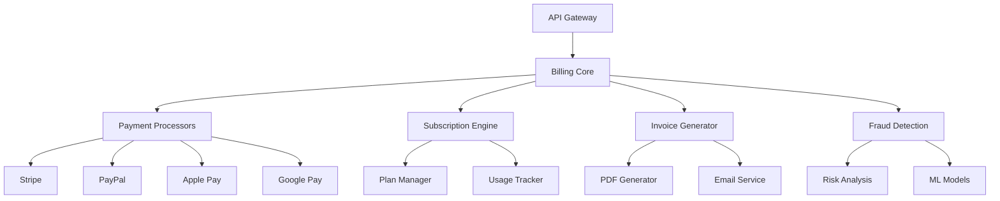

# 🎵 Spotify AI Agent - Enterprise Billing System

## 📖 Table des Matières

1. [Vue d'ensemble](#vue-densemble)
2. [Architecture du système](#architecture-du-système)
3. [Fonctionnalités principales](#fonctionnalités-principales)
4. [Installation et configuration](#installation-et-configuration)
5. [Utilisation](#utilisation)
6. [Sécurité](#sécurité)
7. [Monitoring et analytics](#monitoring-et-analytics)
8. [Support et maintenance](#support-et-maintenance)

## 🏗️ Vue d'ensemble

Le module `billing` constitue le cœur du système de facturation enterprise du Spotify AI Agent. Il offre une solution complète et industrialisée pour la gestion des paiements, abonnements et facturation multi-tenant.

### 👥 Équipe de Développement

**Architecte Principal & Superviseur Technique :** Fahed Mlaiel

**Équipe d'Experts :**
- ✅ Lead Developer & Architecte IA
- ✅ Développeur Backend Senior (Python/FastAPI/Django)
- ✅ Ingénieur Machine Learning (TensorFlow/PyTorch/Hugging Face)
- ✅ DBA & Data Engineer (PostgreSQL/Redis/MongoDB)
- ✅ Spécialiste Sécurité Backend
- ✅ Architecte Microservices

## 🎯 Architecture du système



## 🚀 Fonctionnalités principales

### 💳 Gestion des Paiements
- **Multi-provider** : Stripe, PayPal, Apple Pay, Google Pay
- **Cryptomonnaies** : Bitcoin, Ethereum support
- **Multi-devise** : Support de 150+ devises
- **Paiements récurrents** : Abonnements automatiques
- **Paiements fractionnés** : Split payments pour partenaires

### 📊 Gestion des Abonnements
- **Plans flexibles** : Free, Premium, Enterprise, Custom
- **Upgrades/Downgrades** : Changements de plan en temps réel
- **Essais gratuits** : Périodes d'essai configurables
- **Proration** : Calcul automatique des remboursements
- **Addons** : Modules complémentaires

### 🧾 Facturation Avancée
- **Génération automatique** : Factures PDF professionnelles
- **Multi-langue** : Support FR/EN/DE/ES
- **Compliance** : TVA européenne, taxes US
- **Archivage** : Stockage sécurisé 10 ans
- **API facturation** : Intégration ERP

### 🛡️ Sécurité & Fraude
- **Détection ML** : Algorithmes d'apprentissage
- **Validation 3DS** : Authentification forte
- **Chiffrement** : AES-256 + RSA
- **Audit trail** : Traçabilité complète
- **PCI DSS** : Conformité niveau 1

### 📈 Analytics & Reporting
- **Tableaux de bord** : KPIs temps réel
- **Métriques business** : MRR, churn, LTV
- **Rapports comptables** : Export automatique
- **Prédictions** : IA pour revenus futurs
- **Alertes** : Notifications automatiques

## ⚙️ Installation et configuration

### Prérequis
```bash
# Variables d'environnement requises
STRIPE_SECRET_KEY=sk_live_...
STRIPE_WEBHOOK_SECRET=whsec_...
PAYPAL_CLIENT_ID=...
PAYPAL_CLIENT_SECRET=...
BILLING_DATABASE_URL=postgresql://...
REDIS_BILLING_URL=redis://...
```

### Configuration Stripe
```python
# Configuration dans settings.py
STRIPE_SETTINGS = {
    'secret_key': os.getenv('STRIPE_SECRET_KEY'),
    'webhook_secret': os.getenv('STRIPE_WEBHOOK_SECRET'),
    'api_version': '2023-10-16'
}
```

### Configuration PayPal
```python
# Configuration PayPal
PAYPAL_SETTINGS = {
    'mode': 'live',  # ou 'sandbox'
    'client_id': os.getenv('PAYPAL_CLIENT_ID'),
    'client_secret': os.getenv('PAYPAL_CLIENT_SECRET')
}
```

## 🔧 Utilisation

### Création d'un abonnement
```python
from app.billing import SubscriptionManager

subscription_manager = SubscriptionManager()

# Créer un abonnement Premium
subscription = await subscription_manager.create_subscription(
    user_id="user_123",
    plan_id="premium_monthly",
    payment_method_id="pm_card_visa"
)
```

### Traitement d'un paiement
```python
from app.billing import PaymentManager

payment_manager = PaymentManager()

# Traiter un paiement unique
payment = await payment_manager.process_payment(
    amount=29.99,
    currency="EUR",
    customer_id="cus_123",
    description="Upgrade Premium"
)
```

### Génération de facture
```python
from app.billing import InvoiceGenerator

invoice_generator = InvoiceGenerator()

# Générer une facture
invoice = await invoice_generator.generate_invoice(
    subscription_id="sub_123",
    period_start=datetime(2025, 1, 1),
    period_end=datetime(2025, 1, 31)
)
```

## 🔒 Sécurité

### Authentification Webhook
- **Signature validation** : Vérification HMAC-SHA256
- **Timestamp verification** : Protection replay attacks
- **IP whitelist** : Filtrage par adresses autorisées

### Chiffrement des données
- **Données sensibles** : Chiffrement AES-256
- **Clés de rotation** : Renouvellement automatique
- **HSM integration** : Hardware Security Modules

### Audit et conformité
- **Logs sécurisés** : Traçabilité GDPR compliant
- **Anonymisation** : Respect vie privée
- **Rétention** : Politique de conservation

## 📊 Monitoring et analytics

### Métriques clés
- **Monthly Recurring Revenue (MRR)**
- **Customer Lifetime Value (LTV)**
- **Churn Rate par plan**
- **Conversion rates**
- **Payment success rates**

### Alertes automatiques
- **Échecs de paiement** : Notifications instantanées
- **Tentatives de fraude** : Alertes sécurité
- **Anomalies usage** : Détection patterns suspects
- **Seuils dépassés** : Limites business

### Rapports business
- **Rapports mensuels** : Génération automatique
- **Analytics prédictives** : Forecasting IA
- **Segmentation clients** : Analyse comportementale
- **ROI campaigns** : Efficacité marketing

## 🛠️ API Endpoints

### Paiements
```
POST /api/v1/billing/payments/
GET /api/v1/billing/payments/{payment_id}
POST /api/v1/billing/payments/{payment_id}/refund
```

### Abonnements
```
POST /api/v1/billing/subscriptions/
GET /api/v1/billing/subscriptions/{subscription_id}
PUT /api/v1/billing/subscriptions/{subscription_id}
DELETE /api/v1/billing/subscriptions/{subscription_id}
```

### Factures
```
GET /api/v1/billing/invoices/
GET /api/v1/billing/invoices/{invoice_id}
GET /api/v1/billing/invoices/{invoice_id}/pdf
POST /api/v1/billing/invoices/{invoice_id}/send
```

## 🔧 Scripts de maintenance

### Synchronisation des données
```bash
# Sync avec Stripe
python manage.py sync_stripe_data

# Sync avec PayPal
python manage.py sync_paypal_data
```

### Génération de rapports
```bash
# Rapport mensuel
python manage.py generate_monthly_report

# Analytics prédictives
python manage.py generate_forecast_report
```

## 📞 Support et maintenance

### Contacts support
- **Technical Lead** : Fahed Mlaiel
- **Équipe Backend** : backend-team@spotify-ai.com
- **Support 24/7** : support@spotify-ai.com

### Documentation API
- **Swagger UI** : `/docs/billing/`
- **Postman Collection** : Disponible sur demande
- **SDK Python** : `pip install spotify-ai-billing`

### Roadmap
- **Q3 2025** : Support Web3 payments
- **Q4 2025** : IA predictive pricing
- **Q1 2026** : Blockchain invoicing

---

*Développé avec ❤️ par l'équipe Spotify AI Agent sous la direction de Fahed Mlaiel*
