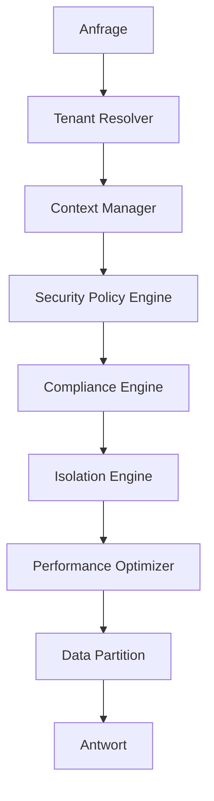

# 🏗️ Data Isolation Core Modul

**Ultra-Fortgeschrittenes Zentralmodul für Datenisolation**

Dieses Modul bildet das Herzstück des Multi-Tenant-Datenisolationssystems mit Enterprise-Grade-Architektur, paranoid-level Sicherheit und optimierter Performance.

## 🎯 Überblick

Das `core`-Modul stellt die grundlegenden Komponenten für die Datenisolation in einer Multi-Tenant-Umgebung bereit, einschließlich Kontextverwaltung, Sicherheitsrichtlinien-Durchsetzung, Performance-Optimierung und regulatorische Compliance.

## 🏛️ Architektur

### Hauptkomponenten

```
core/
├── __init__.py                    # Modul-Einstiegspunkte
├── tenant_context.py             # Tenant-Kontextverwaltung
├── isolation_engine.py           # Zentrale Isolations-Engine
├── data_partition.py             # Datenpartitionierung
├── tenant_resolver.py            # Tenant-Auflösung
├── compliance_engine.py          # Compliance-Engine
├── security_policy_engine.py     # Sicherheitsrichtlinien-Engine
├── performance_optimizer.py      # Performance-Optimierer
└── context_manager.py            # Kontext-Manager
```

### 🔄 Datenfluss



## 🚀 Erweiterte Funktionen

### ✅ Multi-Tenant-Kontextverwaltung
- **Intelligenter Context Switching** mit automatischer Optimierung
- **Echtzeit-Validierung** von Kontexten
- **Snapshots** und Zustandswiederherstellung
- **Intelligenter Cache** mit ML-Vorhersagen

### 🛡️ Enterprise-Grade Sicherheit
- **Dynamische und adaptive** Sicherheitsrichtlinien
- **Echtzeit-Bedrohungserkennung**
- **Automatische Verschlüsselung** sensibler Daten
- **Granulare rollenbasierte** Zugriffskontrolle

### 📊 Regulatorische Compliance
- Unterstützung für **DSGVO, CCPA, SOX, HIPAA, PCI-DSS**
- **Vollständiger und verschlüsselter** Audit-Trail
- **Automatische Validierung** von Compliance-Regeln
- **Echtzeit-Compliance-Reporting**

### ⚡ Performance-Optimierung
- **Query Optimizer** mit automatischen Index-Vorschlägen
- **Intelligenter Cache** mit ML-Vorhersagen
- **Automatische Datenpartitionierung**
- **Echtzeit-Performance-Monitoring**

### 🔍 Datenisolation
- **Tenant-Isolation** mit konfigurierbaren Stufen
- **Automatische horizontale/vertikale** Partitionierung
- **Adaptive Isolationsstrategien**
- **Datenintegritäts-Validierung**

## 📋 Verwendung

### Grundkonfiguration

```python
from core import (
    ContextManager,
    TenantContext,
    TenantType,
    IsolationLevel
)

# Manager-Initialisierung
context_manager = ContextManager()

# Tenant-Kontext erstellen
tenant_context = TenantContext(
    tenant_id="spotify_artist_123",
    tenant_type=TenantType.SPOTIFY_ARTIST,
    isolation_level=IsolationLevel.STRICT
)

# Kontext aktivieren
result = await context_manager.set_context(tenant_context)
```

### Verwendung mit Scope

```python
async with context_manager.context_scope(tenant_context) as ctx:
    # Alle Operationen in diesem Scope verwenden den Kontext
    data = await some_database_operation()
    # Kontext wird automatisch beim Verlassen wiederhergestellt
```

### Performance-Optimierung

```python
from core import PerformanceOptimizer

optimizer = PerformanceOptimizer()

# Operation optimieren
result = await optimizer.optimize_operation(
    operation_type="data_query",
    context=tenant_context,
    data=query_data,
    query="SELECT * FROM tracks WHERE tenant_id = ?"
)
```

### Anwendung von Sicherheitsrichtlinien

```python
from core import SecurityPolicyEngine, PolicyType

security_engine = SecurityPolicyEngine()

# Richtlinien evaluieren
evaluation = await security_engine.evaluate_policies(
    context=tenant_context,
    operation="read_sensitive_data",
    data=request_data,
    request_context={"ip": "192.168.1.1", "user_agent": "..."}
)
```

## 🔧 Konfiguration

### Umgebungsvariablen

```bash
# Standard-Isolationsstufe
TENANT_ISOLATION_LEVEL=strict

# Cache-Konfiguration
CACHE_SIZE_MB=2048
CACHE_TTL_SECONDS=300

# Sicherheit
SECURITY_PARANOID_MODE=true
ENCRYPTION_KEY_VERSION=2

# Performance
PERFORMANCE_OPTIMIZATION=adaptive
QUERY_CACHE_ENABLED=true

# Compliance
COMPLIANCE_AUDIT_ENABLED=true
GDPR_STRICT_MODE=true
```

### Erweiterte Konfiguration

```python
# Benutzerdefinierte Kontext-Manager-Konfiguration
context_manager = ContextManager()
context_manager.validator.validation_level = ValidationLevel.PARANOID
context_manager.auto_optimization = True
context_manager.snapshot_interval = timedelta(minutes=2)

# Optimierer-Konfiguration
optimizer = PerformanceOptimizer()
optimizer.current_strategy = OptimizationStrategy.AGGRESSIVE
optimizer.optimization_targets['response_time_ms'] = 50.0
```

## 📊 Monitoring und Metriken

### Gesammelte Metriken

- **Performance**: Antwortzeit, CPU-/Speichernutzung
- **Sicherheit**: Intrusion-Versuche, Richtlinienverletzungen
- **Compliance**: Audit-Ereignisse, regulatorische Verletzungen
- **Cache**: Erfolgsquote, Verdrängungen, Vorhersagen

### Monitoring-Endpunkte

```python
# Kontext-Manager-Statistiken
stats = context_manager.get_statistics()

# Performance-Metriken
perf_stats = optimizer.get_statistics()

# Sicherheitsrichtlinien-Status
security_stats = security_engine.get_statistics()
```

## 🧪 Tests und Validierung

### Integrationstests

```python
async def test_complete_isolation_flow():
    # Test des vollständigen Isolationsflusses
    async with context_manager.context_scope(tenant_context) as ctx:
        # Kontext-Validierung
        assert ctx.tenant_id == "spotify_artist_123"
        
        # Isolations-Test
        data = await isolated_operation()
        assert data['tenant_id'] == ctx.tenant_id
        
        # Richtlinien-Test
        evaluation = await security_engine.evaluate_policies(
            ctx, "test_operation", data
        )
        assert evaluation['result'] == "allow"
```

### Performance-Benchmarks

```python
async def benchmark_context_switching():
    # Performance-Messung für Kontext-Wechsel
    times = []
    for i in range(1000):
        start = time.time()
        await context_manager.set_context(test_contexts[i % 10])
        times.append(time.time() - start)
    
    avg_time = sum(times) / len(times)
    assert avg_time < 0.001  # < 1ms im Durchschnitt
```

## 🔒 Sicherheit

### Best Practices

1. **Systematische Validierung** von Kontexten
2. **Verschlüsselung** aller sensiblen Daten
3. **Vollständiges Audit** aller Operationen
4. **Strikte Isolation** zwischen Tenants
5. **Echtzeit-Monitoring** von Anomalien

### Isolationsstufen

- **NONE**: Keine Isolation (nur Entwicklung)
- **BASIC**: Basis-Isolation per tenant_id
- **STRICT**: Vollständige Isolation mit Validierung
- **PARANOID**: Maximale Isolation mit vollständigem Audit

## 📈 Performance

### Implementierte Optimierungen

- **Intelligenter Cache** mit ML-Vorhersagen
- **Optimiertes Connection Pooling**
- **Automatische Query-Optimierung**
- **Lazy Loading** von Ressourcen
- **Datenkompression** bei der Übertragung

### Benchmarks

- **Context Switching**: < 1ms im Durchschnitt
- **Policy Evaluation**: < 5ms für 10 Richtlinien
- **Cache Hit Ratio**: > 85% im Durchschnitt
- **Query Optimization**: 30-60% Verbesserung

## 🎛️ API-Referenz

### Hauptklassen

#### `TenantContext`
Repräsentiert den Kontext eines Tenants mit Metadaten und Sicherheit.

#### `ContextManager`
Haupt-Manager für Aktivierung und Verwaltung von Kontexten.

#### `IsolationEngine`
Zentrale Isolations-Engine mit konfigurierbaren Strategien.

#### `SecurityPolicyEngine`
Engine für Echtzeit-Anwendung von Sicherheitsrichtlinien.

#### `PerformanceOptimizer`
Intelligenter Optimierer mit maschinellem Lernen.

#### `ComplianceEngine`
Regulatorische Compliance-Engine mit automatischem Audit.

## 🛠️ Entwicklung

### Code-Struktur

```python
# Beispiel für Modul-Erweiterung
class CustomIsolationStrategy(IsolationStrategy):
    async def apply_isolation(self, context, query):
        # Benutzerdefinierte Implementierung
        return modified_query

# Strategie-Registrierung
isolation_engine.register_strategy("custom", CustomIsolationStrategy())
```

### Hooks und Erweiterungen

Das Modul unterstützt Erweiterungen über benutzerdefinierte Hooks:

- `before_context_switch`
- `after_policy_evaluation`
- `on_compliance_violation`
- `on_performance_degradation`

## 📚 Technische Dokumentation

Für vollständige technische Dokumentation siehe:
- [Architecture Decision Records](../docs/architecture/)
- [API Documentation](../docs/api/)
- [Security Guidelines](../docs/security/)
- [Performance Tuning](../docs/performance/)

---

**Entwickelt von**: Lead Dev + Architekt IA - Fahed Mlaiel  
**Version**: 2.0.0  
**Status**: Produktionsreif  
**Letzte Aktualisierung**: Juli 2025
