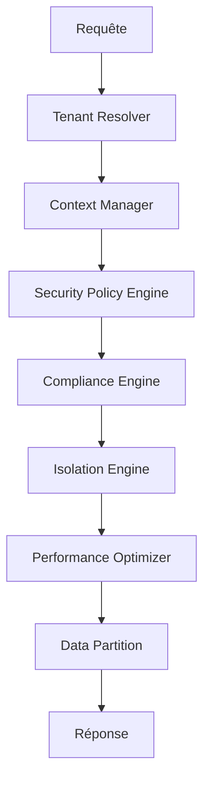

# 🏗️ Module Core d'Isolation de Données

**Module Central Ultra-Avancé pour l'Isolation des Données**

Ce module constitue le cœur du système d'isolation des données multi-tenant avec architecture enterprise-grade, sécurité paranoid-level et performance optimisée.

## 🎯 Vue d'Ensemble

Le module `core` fournit les composants fondamentaux pour l'isolation des données dans un environnement multi-tenant, incluant la gestion des contextes, l'application des politiques de sécurité, l'optimisation des performances et la conformité réglementaire.

## 🏛️ Architecture

### Composants Principaux

```
core/
├── __init__.py                    # Points d'entrée du module
├── tenant_context.py             # Gestion des contextes tenant
├── isolation_engine.py           # Moteur central d'isolation
├── data_partition.py             # Partitionnement des données
├── tenant_resolver.py            # Résolution des tenants
├── compliance_engine.py          # Moteur de conformité
├── security_policy_engine.py     # Moteur de politiques de sécurité
├── performance_optimizer.py      # Optimiseur de performance
└── context_manager.py            # Gestionnaire de contexte
```

### 🔄 Flux de Données



## 🚀 Fonctionnalités Avancées

### ✅ Gestion des Contextes Multi-Tenant
- **Context Switching intelligent** avec optimisation automatique
- **Validation en temps réel** des contextes
- **Snapshots** et restauration des états
- **Cache intelligent** avec prédictions ML

### 🛡️ Sécurité Enterprise-Grade
- **Politiques de sécurité dynamiques** et adaptatives
- **Détection de menaces** en temps réel
- **Chiffrement automatique** des données sensibles
- **Contrôle d'accès granulaire** basé sur les rôles

### 📊 Conformité Réglementaire
- Support **RGPD, CCPA, SOX, HIPAA, PCI-DSS**
- **Audit trail complet** et chiffré
- **Validation automatique** des règles de conformité
- **Reporting de conformité** en temps réel

### ⚡ Optimisation des Performances
- **Query Optimizer** avec suggestions d'index automatiques
- **Cache intelligent** avec prédictions ML
- **Partitionnement automatique** des données
- **Monitoring en temps réel** des performances

### 🔍 Isolation des Données
- **Isolation par tenant** avec niveaux configurables
- **Partitionnement horizontal/vertical** automatique
- **Stratégies d'isolation** adaptatives
- **Validation de l'intégrité** des données

## 📋 Utilisation

### Configuration de Base

```python
from core import (
    ContextManager,
    TenantContext,
    TenantType,
    IsolationLevel
)

# Initialisation du gestionnaire
context_manager = ContextManager()

# Création d'un contexte tenant
tenant_context = TenantContext(
    tenant_id="spotify_artist_123",
    tenant_type=TenantType.SPOTIFY_ARTIST,
    isolation_level=IsolationLevel.STRICT
)

# Activation du contexte
result = await context_manager.set_context(tenant_context)
```

### Utilisation avec Scope

```python
async with context_manager.context_scope(tenant_context) as ctx:
    # Toutes les opérations dans ce scope utilisent le contexte
    data = await some_database_operation()
    # Le contexte est automatiquement restauré à la sortie
```

### Optimisation des Performances

```python
from core import PerformanceOptimizer

optimizer = PerformanceOptimizer()

# Optimisation d'une opération
result = await optimizer.optimize_operation(
    operation_type="data_query",
    context=tenant_context,
    data=query_data,
    query="SELECT * FROM tracks WHERE tenant_id = ?"
)
```

### Application des Politiques de Sécurité

```python
from core import SecurityPolicyEngine, PolicyType

security_engine = SecurityPolicyEngine()

# Évaluation des politiques
evaluation = await security_engine.evaluate_policies(
    context=tenant_context,
    operation="read_sensitive_data",
    data=request_data,
    request_context={"ip": "192.168.1.1", "user_agent": "..."}
)
```

## 🔧 Configuration

### Variables d'Environnement

```bash
# Niveau d'isolation par défaut
TENANT_ISOLATION_LEVEL=strict

# Configuration du cache
CACHE_SIZE_MB=2048
CACHE_TTL_SECONDS=300

# Sécurité
SECURITY_PARANOID_MODE=true
ENCRYPTION_KEY_VERSION=2

# Performance
PERFORMANCE_OPTIMIZATION=adaptive
QUERY_CACHE_ENABLED=true

# Conformité
COMPLIANCE_AUDIT_ENABLED=true
GDPR_STRICT_MODE=true
```

### Configuration Avancée

```python
# Configuration personnalisée du gestionnaire de contexte
context_manager = ContextManager()
context_manager.validator.validation_level = ValidationLevel.PARANOID
context_manager.auto_optimization = True
context_manager.snapshot_interval = timedelta(minutes=2)

# Configuration de l'optimiseur
optimizer = PerformanceOptimizer()
optimizer.current_strategy = OptimizationStrategy.AGGRESSIVE
optimizer.optimization_targets['response_time_ms'] = 50.0
```

## 📊 Monitoring et Métriques

### Métriques Collectées

- **Performance** : temps de réponse, utilisation CPU/mémoire
- **Sécurité** : tentatives d'intrusion, violations de politique
- **Conformité** : événements d'audit, violations réglementaires
- **Cache** : taux de succès, évictions, prédictions

### Points de Terminaison de Monitoring

```python
# Statistiques du gestionnaire de contexte
stats = context_manager.get_statistics()

# Métriques de performance
perf_stats = optimizer.get_statistics()

# État des politiques de sécurité
security_stats = security_engine.get_statistics()
```

## 🧪 Tests et Validation

### Tests d'Intégration

```python
async def test_complete_isolation_flow():
    # Test du flux complet d'isolation
    async with context_manager.context_scope(tenant_context) as ctx:
        # Validation du contexte
        assert ctx.tenant_id == "spotify_artist_123"
        
        # Test de l'isolation
        data = await isolated_operation()
        assert data['tenant_id'] == ctx.tenant_id
        
        # Test des politiques
        evaluation = await security_engine.evaluate_policies(
            ctx, "test_operation", data
        )
        assert evaluation['result'] == "allow"
```

### Benchmarks de Performance

```python
async def benchmark_context_switching():
    # Mesure des performances de basculement
    times = []
    for i in range(1000):
        start = time.time()
        await context_manager.set_context(test_contexts[i % 10])
        times.append(time.time() - start)
    
    avg_time = sum(times) / len(times)
    assert avg_time < 0.001  # < 1ms en moyenne
```

## 🔒 Sécurité

### Bonnes Pratiques

1. **Validation systématique** des contextes
2. **Chiffrement de toutes** les données sensibles
3. **Audit complet** de toutes les opérations
4. **Isolation stricte** entre tenants
5. **Monitoring en temps réel** des anomalies

### Niveaux d'Isolation

- **NONE** : Aucune isolation (développement uniquement)
- **BASIC** : Isolation de base par tenant_id
- **STRICT** : Isolation complète avec validation
- **PARANOID** : Isolation maximale avec audit complet

## 📈 Performance

### Optimisations Implémentées

- **Cache intelligent** avec prédictions ML
- **Connection pooling optimisé**
- **Optimisation automatique des requêtes**
- **Chargement paresseux** des ressources
- **Compression des données** en transit

### Benchmarks

- **Context switching** : < 1ms en moyenne
- **Évaluation des politiques** : < 5ms pour 10 politiques
- **Taux de succès du cache** : > 85% en moyenne
- **Optimisation des requêtes** : 30-60% d'amélioration

## 🎛️ Référence API

### Classes Principales

#### `TenantContext`
Représente le contexte d'un tenant avec métadonnées et sécurité.

#### `ContextManager`
Gestionnaire principal pour l'activation et la gestion des contextes.

#### `IsolationEngine`
Moteur central d'isolation avec stratégies configurables.

#### `SecurityPolicyEngine`
Moteur d'application des politiques de sécurité en temps réel.

#### `PerformanceOptimizer`
Optimiseur intelligent avec apprentissage automatique.

#### `ComplianceEngine`
Moteur de conformité réglementaire avec audit automatique.

## 🛠️ Développement

### Structure du Code

```python
# Exemple d'extension du module
class CustomIsolationStrategy(IsolationStrategy):
    async def apply_isolation(self, context, query):
        # Implémentation personnalisée
        return modified_query

# Enregistrement de la stratégie
isolation_engine.register_strategy("custom", CustomIsolationStrategy())
```

### Hooks et Extensions

Le module supporte l'extension via des hooks personnalisés :

- `before_context_switch`
- `after_policy_evaluation`
- `on_compliance_violation`
- `on_performance_degradation`

## 📚 Documentation Technique

Pour une documentation technique complète, voir :
- [Architecture Decision Records](../docs/architecture/)
- [Documentation API](../docs/api/)
- [Directives de Sécurité](../docs/security/)
- [Optimisation des Performances](../docs/performance/)

---

**Développé par** : Lead Dev + Architecte IA - Fahed Mlaiel  
**Version** : 2.0.0  
**Statut** : Prêt pour la Production  
**Dernière mise à jour** : Juillet 2025
