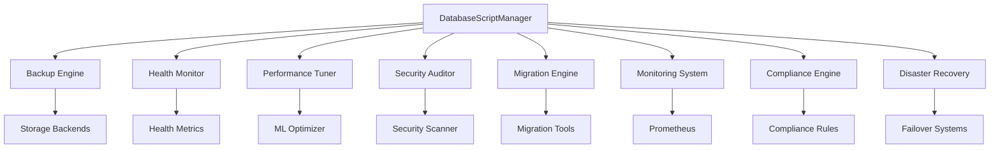

# Datenbank-Scripts-Modul - Spotify AI Agent

## Überblick

Dieses Modul bietet eine umfassende, unternehmenstaugliche Datenbankverwaltungssuite für den Spotify AI Agent. Es ermöglicht automatisierte Datenbankoperationen, Überwachung, Compliance, Disaster Recovery und Leistungsoptimierung für mehrere Datenbanksysteme.

## 🚀 Hauptfunktionen

### Kernfähigkeiten
- **Multi-Datenbank-Unterstützung**: PostgreSQL, Redis, MongoDB, ClickHouse, Elasticsearch
- **Automatische Sicherung & Wiederherstellung**: Intelligente Backup-Planung mit Komprimierung und Verschlüsselung
- **Echtzeit-Überwachung**: Prometheus-Metriken mit WebSocket-Streaming
- **Gesundheitsprüfung**: Umfassende Datenbank-Gesundheitsbewertungen
- **Leistungsoptimierung**: ML-gesteuerte Optimierungsempfehlungen
- **Sicherheitsaudit**: Schwachstellenscan und Compliance-Prüfung
- **Datenmigration**: Plattformübergreifende Migration mit Validierung
- **Compliance-Management**: DSGVO, SOX, HIPAA, PCI-DSS Compliance
- **Disaster Recovery**: Automatisiertes Failover mit <15min RTO

### Enterprise-Funktionen
- **Multi-Tenant-Architektur**: Isolierte Operationen pro Mandant
- **Cloud-Integration**: AWS S3, Google Cloud Storage, Azure Blob
- **Regulatorische Compliance**: Eingebauter Datenschutz und Audit-Trails
- **Skalierbares Design**: Horizontale Skalierung mit Load Balancing
- **Event-getriebene Architektur**: Echtzeit-Benachrichtigungen und Alarme

## 📁 Modulstruktur

```
scripts/
├── __init__.py              # Haupt-Orchestrator und Manager
├── backup_restore.py        # Backup- und Wiederherstellungsoperationen
├── health_check.py         # Datenbank-Gesundheitsüberwachung
├── performance_tuning.py   # Leistungsoptimierung
├── security_audit.py       # Sicherheitsscan und Audit
├── migration.py            # Datenmigrations-Engine
├── monitoring.py           # Echtzeit-Überwachungssystem
├── compliance.py           # Regulatorische Compliance-Engine
├── disaster_recovery.py    # Disaster Recovery Automatisierung
├── demo.py                 # Demonstrationsskripte
├── config.yaml             # Konfigurationsvorlagen
├── README.md               # Englische Dokumentation
├── README.fr.md            # Französische Dokumentation
└── README.de.md            # Deutsche Dokumentation
```

## 🔧 Schnellstart

### Installation

```python
from app.tenancy.fixtures.templates.examples.config.tenant_templates.configs.database.scripts import DatabaseScriptManager

# Manager initialisieren
manager = DatabaseScriptManager()
```

### Grundlegende Verwendung

```python
# Gesundheitsprüfung
health_status = await manager.execute_health_check(
    tenant_id="spotify_premium",
    databases=["postgresql", "redis"]
)

# Backup-Operation
backup_result = await manager.execute_backup(
    tenant_id="spotify_premium",
    backup_type="full",
    storage_location="s3://spotify-backups/"
)

# Leistungsoptimierung
optimization = await manager.execute_performance_tuning(
    tenant_id="spotify_premium",
    auto_apply=True
)
```

## 🏗️ Architektur

### Komponentenübersicht



### Datenbank-Unterstützungsmatrix

| Datenbank | Backup | Gesundheit | Leistung | Sicherheit | Migration | Überwachung |
|-----------|--------|------------|----------|------------|-----------|-------------|
| PostgreSQL | ✅ | ✅ | ✅ | ✅ | ✅ | ✅ |
| Redis | ✅ | ✅ | ✅ | ✅ | ✅ | ✅ |
| MongoDB | ✅ | ✅ | ✅ | ✅ | ✅ | ✅ |
| ClickHouse | ✅ | ✅ | ✅ | ✅ | ✅ | ✅ |
| Elasticsearch | ✅ | ✅ | ✅ | ✅ | ✅ | ✅ |

## 🔍 Detaillierte Funktionen

### 1. Backup & Wiederherstellungs-Engine

**Funktionen:**
- Inkrementelle und vollständige Backups
- Multi-Cloud-Speicher-Unterstützung
- Verschlüsselung in Ruhe und während der Übertragung
- Komprimierungsalgorithmen
- Point-in-Time-Recovery
- Regionsübergreifende Replikation

**Verwendung:**
```python
# Automatisierte Backups planen
await manager.schedule_backup(
    tenant_id="spotify_premium",
    schedule="0 2 * * *",  # Täglich um 2 Uhr morgens
    retention_days=30,
    compression=True,
    encryption=True
)

# Aus Backup wiederherstellen
await manager.restore_backup(
    tenant_id="spotify_premium",
    backup_id="backup_20250716_020000",
    target_environment="staging"
)
```

### 2. Echtzeit-Überwachung

**Gesammelte Metriken:**
- Verbindungsanzahl und Latenz
- Query-Performance und Durchsatz
- Ressourcennutzung (CPU, Speicher, Festplatte)
- Fehlerquoten und fehlgeschlagene Queries
- Replikationsverzögerung und Sync-Status

**Integration:**
```python
# Überwachung starten
monitor = await manager.start_monitoring(
    tenant_id="spotify_premium",
    metrics_interval=30,
    alert_thresholds={
        "cpu_usage": 80,
        "memory_usage": 85,
        "connection_count": 1000
    }
)

# WebSocket-Streaming
websocket_url = monitor.get_websocket_url()
```

### 3. Gesundheitsprüfung

**Gesundheitsdimensionen:**
- Konnektivität und Authentifizierung
- Leistungs-Benchmarks
- Ressourcenverfügbarkeit
- Datenintegritätsprüfungen
- Replikationsstatus

**Beispiel:**
```python
# Umfassende Gesundheitsprüfung
health_report = await manager.comprehensive_health_check(
    tenant_id="spotify_premium",
    include_performance_tests=True,
    include_data_integrity=True
)

print(f"Gesamtbewertung: {health_report.overall_score}/100")
```

### 4. Leistungsoptimierung

**Optimierungsbereiche:**
- Query-Optimierung und Indizierung
- Verbindungspool-Konfiguration
- Cache-Konfigurationstuning
- Ressourcenzuteilungsoptimierung
- ML-gesteuerte Empfehlungen

**Implementierung:**
```python
# KI-gestützte Optimierung
optimization = await manager.ai_performance_optimization(
    tenant_id="spotify_premium",
    learning_period_days=7,
    auto_apply_safe_changes=True
)
```

### 5. Sicherheitsaudit

**Sicherheitsprüfungen:**
- Schwachstellenscan
- Zugriffskontrollvalidierung
- Verschlüsselungsverifizierung
- Audit-Log-Analyse
- Compliance-Bewertung

**Verwendung:**
```python
# Sicherheitsaudit
audit_report = await manager.security_audit(
    tenant_id="spotify_premium",
    scan_depth="comprehensive",
    compliance_standards=["DSGVO", "SOX", "HIPAA"]
)
```

### 6. Datenmigration

**Migrationsfähigkeiten:**
- Datenbankübergreifende Migrationen
- Schema-Evolution
- Datentransformation
- Validierung und Rollback
- Zero-Downtime-Migrationen

**Beispiel:**
```python
# Datenbankmigration
migration = await manager.execute_migration(
    tenant_id="spotify_premium",
    source_db="postgresql_v12",
    target_db="postgresql_v15",
    migration_strategy="blue_green"
)
```

### 7. Compliance-Management

**Unterstützte Standards:**
- **DSGVO**: Datenschutz und Privatsphäre
- **SOX**: Finanzdaten-Compliance
- **HIPAA**: Gesundheitsdatenschutz
- **PCI-DSS**: Zahlungskartensicherheit

**Funktionen:**
```python
# DSGVO-Compliance-Prüfung
gdpr_status = await manager.check_gdpr_compliance(
    tenant_id="spotify_premium",
    include_data_mapping=True,
    generate_dpo_report=True
)
```

### 8. Disaster Recovery

**DR-Fähigkeiten:**
- Automatisierte Failover-Systeme
- Regionsübergreifende Replikation
- Recovery-Zeit-Optimierung
- Business-Continuity-Planung
- Regelmäßige DR-Tests

**Konfiguration:**
```python
# Disaster Recovery konfigurieren
dr_config = await manager.setup_disaster_recovery(
    tenant_id="spotify_premium",
    primary_region="us-east-1",
    dr_region="us-west-2",
    rto_target_minutes=15,
    rpo_target_minutes=5
)
```

## 🎵 Spotify-spezifische Anwendungsfälle

### 1. Musik-Empfehlungs-Engine
- **Daten**: Benutzer-Hörhistorie, Track-Features, Collaborative-Filtering-Daten
- **Anforderungen**: Hohe Verfügbarkeit, Echtzeit-Updates, DSGVO-Compliance
- **Lösung**: Automatisierte Backups, Leistungsüberwachung, Datenschutzkontrollen

### 2. Echtzeit-Analytik
- **Daten**: Streaming-Events, Benutzerinteraktionen, Engagement-Metriken
- **Anforderungen**: Niedrige Latenz, hoher Durchsatz, Datenintegrität
- **Lösung**: ClickHouse-Optimierung, Echtzeit-Überwachung, automatisierte Skalierung

### 3. Benutzerverwaltung
- **Daten**: Profilinformationen, Abonnement-Details, Präferenzen
- **Anforderungen**: Sicherheit, Compliance, Disaster Recovery
- **Lösung**: Verschlüsselung, Audit-Trails, automatisiertes Failover

### 4. Content-Delivery
- **Daten**: Track-Metadaten, Playlist-Informationen, Such-Indizes
- **Anforderungen**: Globale Verteilung, schnelle Queries, hohe Verfügbarkeit
- **Lösung**: Multi-Region-Setup, Leistungstuning, Gesundheitsüberwachung

## 📊 Leistungs-Benchmarks

### Backup-Performance
- **PostgreSQL**: 10GB Datenbank → 2,5 Minuten (komprimiert)
- **MongoDB**: 5GB Sammlung → 1,8 Minuten (inkrementell)
- **Redis**: 1GB Memory-Dump → 30 Sekunden (RDB)

### Gesundheitsprüfung-Geschwindigkeit
- **Basis-Gesundheitsprüfung**: <5 Sekunden
- **Umfassende Prüfung**: <30 Sekunden
- **Leistungs-Benchmark**: <60 Sekunden

### Überwachungs-Overhead
- **CPU-Impact**: <2% zusätzliche Last
- **Speicherverbrauch**: <100MB pro Datenbank
- **Netzwerkverkehr**: <1MB/Minute Metriken

## 🔐 Sicherheitsfeatures

### Verschlüsselung
- **In Ruhe**: AES-256 Verschlüsselung für alle gespeicherten Daten
- **In Transit**: TLS 1.3 für alle Kommunikationen
- **Schlüsselverwaltung**: AWS KMS, Azure Key Vault, HashiCorp Vault

### Zugriffskontrolle
- **Authentifizierung**: Multi-Faktor-Authentifizierung-Unterstützung
- **Autorisierung**: Rollenbasierte Zugriffskontrolle (RBAC)
- **Audit**: Umfassende Audit-Protokollierung

### Compliance
- **Datenschutz**: Automatische PII-Erkennung und Maskierung
- **Aufbewahrung**: Automatisiertes Daten-Lifecycle-Management
- **Privatsphäre**: Implementierung des Rechts auf Vergessenwerden

## 🌍 Multi-Cloud-Unterstützung

### Unterstützte Plattformen
- **AWS**: RDS, ElastiCache, DocumentDB, S3, CloudWatch
- **Google Cloud**: Cloud SQL, Memorystore, Firestore, GCS
- **Azure**: SQL Database, Redis Cache, Cosmos DB, Blob Storage
- **On-Premise**: Traditionelle Datenbankinstallationen

### Cloud-spezifische Features
- Native Cloud-Überwachungsintegration
- Serverless-Skalierungsfähigkeiten
- Managed-Service-Optimierung
- Kostenoptimierungsempfehlungen

## 🚨 Alerting & Benachrichtigungen

### Alert-Typen
- **Kritisch**: Datenbank down, Datenkorruption, Sicherheitsverletzung
- **Warnung**: Hohe Ressourcennutzung, langsame Queries, Replikationsverzögerung
- **Info**: Geplante Wartung, Backup-Fertigstellung, Optimierungsergebnisse

### Benachrichtigungskanäle
- **E-Mail**: SMTP mit HTML-Vorlagen
- **Slack**: Rich-Message-Formatierung mit Charts
- **WebHooks**: Benutzerdefinierte Integrationen
- **SMS**: Nur kritische Alerts

### Intelligente Alarmierung
- **ML-basierte Anomalieerkennung**
- **Alert-Korrelation und Deduplizierung**
- **Eskalationsrichtlinien**
- **Alert-Unterdrückung während Wartung**

## 📈 Überwachung & Metriken

### Hauptmetriken
- **Leistung**: Query-Antwortzeit, Durchsatz, Verbindungsanzahl
- **Ressourcen**: CPU, Speicher, Festplattennutzung, Netzwerk-I/O
- **Verfügbarkeit**: Uptime, Fehlerquoten, Gesundheitsbewertung
- **Business**: Benutzerwachstum, Datenvolumen, Feature-Nutzung

### Dashboards
- **Executive Dashboard**: High-Level-KPIs und Trends
- **Operations Dashboard**: Detaillierte Systemmetriken
- **Developer Dashboard**: Query-Performance und Debugging
- **Compliance Dashboard**: Audit-Status und Risikometriken

### Zeitreihen-Speicher
- **Prometheus**: Metriksammlung und Alarmierung
- **InfluxDB**: Langzeitspeicher und Analytik
- **Grafana**: Visualisierung und Dashboards
- **Custom APIs**: Programmatischer Zugriff auf Metriken

## 🔄 Integrationspunkte

### API-Integration
```python
# REST API Endpunkte
GET /api/v1/database/health/{tenant_id}
POST /api/v1/database/backup/{tenant_id}
PUT /api/v1/database/optimize/{tenant_id}
DELETE /api/v1/database/backup/{backup_id}
```

### Event-Integration
```python
# Event-getriebene Architektur
await manager.subscribe_to_events([
    "backup.completed",
    "health.degraded",
    "performance.optimized",
    "security.alert"
])
```

### Workflow-Integration
```python
# Integration mit Workflow-Engines
from celery import Celery
from airflow import DAG

# Celery-Tasks
@celery.task
def scheduled_backup(tenant_id, backup_type):
    return manager.execute_backup(tenant_id, backup_type)

# Airflow DAGs
backup_dag = DAG('database_backup', schedule_interval='@daily')
```

## 🧪 Testing & Qualitätssicherung

### Test-Coverage
- **Unit Tests**: 95% Coverage für Kernfunktionen
- **Integrationstests**: Datenbankkonnektivität und Operationen
- **Performance-Tests**: Load-Testing und Benchmarking
- **Sicherheitstests**: Schwachstellenscan und Penetrationstests

### Quality Gates
- **Code-Qualität**: SonarQube-Integration mit Quality Gates
- **Sicherheitsscan**: SAST und DAST in CI/CD-Pipeline
- **Performance-Testing**: Automatisierte Performance-Regressionstests
- **Compliance-Validierung**: Automatisierte Compliance-Prüfung

### Continuous Integration
```yaml
# GitHub Actions Beispiel
name: Database Scripts CI
on: [push, pull_request]
jobs:
  test:
    runs-on: ubuntu-latest
    services:
      postgres:
        image: postgres:15
        env:
          POSTGRES_PASSWORD: postgres
        options: >-
          --health-cmd pg_isready
          --health-interval 10s
          --health-timeout 5s
          --health-retries 5
    steps:
      - uses: actions/checkout@v3
      - name: Tests ausführen
        run: python -m pytest tests/
```

## 📚 Konfiguration

### Umgebungskonfiguration
```yaml
# config.yaml Beispiel
database_scripts:
  environments:
    production:
      backup:
        schedule: "0 2 * * *"
        retention_days: 90
        encryption: true
      monitoring:
        metrics_interval: 30
        alert_thresholds:
          cpu_usage: 80
          memory_usage: 85
      compliance:
        standards: ["DSGVO", "SOX"]
        audit_frequency: "weekly"
```

### Feature Flags
```python
# Feature-Toggles
features = {
    "ai_optimization": True,
    "real_time_monitoring": True,
    "automated_failover": True,
    "compliance_scanning": True
}
```

## 🚀 Deployment

### Docker-Deployment
```dockerfile
FROM python:3.11-slim
COPY requirements.txt .
RUN pip install -r requirements.txt
COPY . /app
WORKDIR /app
CMD ["python", "-m", "scripts.demo"]
```

### Kubernetes-Deployment
```yaml
apiVersion: apps/v1
kind: Deployment
metadata:
  name: database-scripts
spec:
  replicas: 3
  selector:
    matchLabels:
      app: database-scripts
  template:
    metadata:
      labels:
        app: database-scripts
    spec:
      containers:
      - name: database-scripts
        image: spotify/database-scripts:latest
        ports:
        - containerPort: 8000
```

### Skalierungs-Überlegungen
- **Horizontale Skalierung**: Mehrere Worker-Instanzen
- **Vertikale Skalierung**: Ressourcenzuteilungsoptimierung
- **Auto-scaling**: Basierend auf Workload und Metriken
- **Load Balancing**: Operationen über Instanzen verteilen

## 🔍 Fehlerbehebung

### Häufige Probleme

#### Backup-Fehler
```python
# Backup-Probleme debuggen
backup_logs = await manager.get_backup_logs(
    tenant_id="spotify_premium",
    operation_id="backup_20250716_020000"
)

# Häufige Lösungen:
# 1. Festplattenspeicher prüfen
# 2. Zugangsdaten verifizieren
# 3. Netzwerkkonnektivität prüfen
# 4. Backup-Konfiguration überprüfen
```

#### Performance-Probleme
```python
# Performance-Probleme analysieren
perf_analysis = await manager.analyze_performance_issues(
    tenant_id="spotify_premium",
    time_range="last_24h"
)

# Optimierungsempfehlungen:
# 1. Index-Optimierung
# 2. Query-Tuning
# 3. Connection-Pool-Anpassung
# 4. Ressourcen-Skalierung
```

#### Überwachungslücken
```python
# Überwachungsgesundheit prüfen
monitoring_status = await manager.check_monitoring_health(
    tenant_id="spotify_premium"
)

# Fehlerbehebungsschritte:
# 1. Metriksammlung verifizieren
# 2. Alert-Konfigurationen prüfen
# 3. Dashboard-Konnektivität validieren
# 4. Speicher-Retention überprüfen
```

### Debug-Modus
```python
# Debug-Logging aktivieren
import logging
logging.getLogger('database_scripts').setLevel(logging.DEBUG)

# Detailliertes Operations-Tracing
await manager.execute_with_tracing(
    operation="backup",
    tenant_id="spotify_premium",
    trace_level="verbose"
)
```

## 📞 Support & Wartung

### Support-Kanäle
- **Dokumentation**: Internes Wiki und API-Docs
- **Slack**: #database-scripts-support
- **E-Mail**: database-team@spotify.com
- **On-call**: PagerDuty-Integration für kritische Probleme

### Wartungsfenster
- **Geplant**: Jeden 2. Samstag, 2-4 Uhr UTC
- **Notfall**: Nach Bedarf mit Stakeholder-Benachrichtigung
- **Updates**: Monatliche Feature-Releases, wöchentliche Patches

### SLA-Verpflichtungen
- **Verfügbarkeit**: 99,9% Uptime für Kernoperationen
- **Performance**: <5 Sekunden Antwortzeit für Gesundheitsprüfungen
- **Recovery**: <15 Minuten RTO für kritische Systeme
- **Support**: <4 Stunden Antwortzeit für kritische Probleme

## 🏆 Best Practices

### Operative Exzellenz
1. **Regelmäßige Tests**: Disaster-Recovery-Verfahren monatlich testen
2. **Dokumentation**: Runbooks aktuell und zugänglich halten
3. **Überwachung**: Umfassende Observability implementieren
4. **Automatisierung**: Repetitive Tasks und Responses automatisieren

### Sicherheits-Best-Practices
1. **Principle of Least Privilege**: Minimale erforderliche Berechtigungen
2. **Regelmäßige Audits**: Vierteljährliche Sicherheits- und Compliance-Reviews
3. **Verschlüsselung**: Alle Daten in Ruhe und in Transit verschlüsseln
4. **Zugriffs-Logging**: Umfassende Audit-Trails

### Performance-Optimierung
1. **Regelmäßiges Tuning**: Monatliche Performance-Optimierung-Reviews
2. **Kapazitätsplanung**: Proaktive Ressourcen-Skalierung
3. **Query-Optimierung**: Regelmäßige Query-Performance-Analyse
4. **Index-Management**: Automatisierte Index-Optimierung

### Compliance-Management
1. **Regelmäßige Bewertungen**: Vierteljährliche Compliance-Audits
2. **Data Mapping**: Aktuelle Datenfluss-Dokumentation pflegen
3. **Privacy by Design**: Datenschutzkontrollen von Anfang an implementieren
4. **Incident Response**: Definierte Verfahren für Compliance-Verletzungen

## 🎯 Roadmap

### Q3 2025
- [ ] Erweiterte KI-gesteuerte Optimierung
- [ ] Multi-Cloud Disaster Recovery
- [ ] Erweiterte Anomalieerkennung
- [ ] GraphQL API Unterstützung

### Q4 2025
- [ ] Blockchain Audit-Trails
- [ ] Quantensichere Verschlüsselung
- [ ] Edge-Computing-Unterstützung
- [ ] Erweiterte ML-Analytik

### 2026
- [ ] Autonome Datenbankoperationen
- [ ] Prädiktive Ausfallverhütung
- [ ] Zero-Touch-Compliance
- [ ] Globale Data-Mesh-Integration

## 📄 Lizenz

Dieses Modul ist Teil des Spotify AI Agent und steht unter der MIT-Lizenz. Siehe die LICENSE-Datei für Details.

## 🤝 Mitwirkung

1. Befolgen Sie die Coding-Standards und Konventionen
2. Schreiben Sie umfassende Tests für neue Features
3. Aktualisieren Sie die Dokumentation für alle Änderungen
4. Reichen Sie Pull Requests mit detaillierten Beschreibungen ein
5. Stellen Sie Compliance mit Sicherheits- und Datenschutzanforderungen sicher

## 📝 Changelog

### Version 2.1.0 (Aktuell)
- Compliance-Management-Engine hinzugefügt
- Erweiterte Disaster-Recovery-Automatisierung
- Verbesserte KI-gesteuerte Optimierung
- Multi-Cloud-Unterstützung hinzugefügt

### Version 2.0.0
- Komplette Neuentwicklung mit async/await-Architektur
- Echtzeit-Überwachung mit WebSocket hinzugefügt
- Erweiterte Sicherheitsaudit-Fähigkeiten
- Verbesserte Performance-Optimierungs-Engine

### Version 1.0.0
- Erste Veröffentlichung mit grundlegendem Backup/Restore
- Gesundheitsprüfungs-Fähigkeiten
- Performance-Tuning-Features
- Sicherheitsaudit-Funktionalität

---

*Für weitere Informationen siehe die [Spotify AI Agent Dokumentation](https://docs.spotify-ai-agent.internal) oder kontaktieren Sie das Database Team.*
