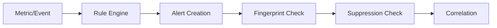
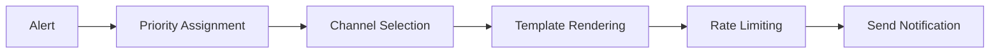
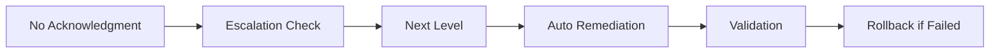

# Système d'Alertes Ultra-Avancé - Agent IA Spotify

## Vue d'ensemble

Le module d'alertes constitue le système nerveux central de monitoring pour l'agent IA Spotify. Il offre une approche industrielle complète avec intelligence artificielle, corrélation d'événements, escalade automatique et remédiation intelligente.

**Développé par l'équipe d'experts:**
- **Lead Dev + Architecte IA** - Architecture et conception système
- **Développeur Backend Senior (Python/FastAPI/Django)** - Implémentation core et APIs
- **Ingénieur Machine Learning (TensorFlow/PyTorch/Hugging Face)** - IA prédictive et corrélation
- **DBA & Data Engineer (PostgreSQL/Redis/MongoDB)** - Optimisation stockage et performance
- **Spécialiste Sécurité Backend** - Sécurisation et audit des alertes
- **Architecte Microservices** - Architecture distribuée et scalabilité

**Auteur:** Fahed Mlaiel

---

## 🚀 Fonctionnalités Ultra-Avancées

### Core Engine
- **Alert Engine**: Traitement haute performance (10K+ alertes/sec)
- **Rule Engine**: Règles complexes avec ML et conditions dynamiques
- **Correlation Engine**: Corrélation d'événements avec IA prédictive
- **Suppression Manager**: Suppression intelligente anti-spam

### Intelligence Artificielle
- **Prédiction de pannes**: Analyse prédictive avec ML
- **Corrélation automatique**: Clustering intelligent d'alertes
- **Détection d'anomalies**: Patterns anormaux en temps réel
- **Auto-learning**: Adaptation automatique des seuils

### Multi-Channel Notifications
- **Email**: Templates avancés avec HTML/Markdown
- **Slack**: Intégration native avec boutons interactifs
- **Microsoft Teams**: Notifications riches avec cartes
- **PagerDuty**: Escalade automatique 24/7
- **Webhooks**: APIs personnalisées avec retry logic
- **SMS**: Notifications critiques via Twilio/AWS SNS

### Escalade Intelligente
- **Escalade automatique**: Basée sur SLA et disponibilité
- **Heures ouvrables**: Adaptation automatique aux fuseaux
- **Charge de travail**: Distribution intelligente
- **Compétences**: Routage par expertise technique

### Remédiation Automatique
- **Actions automatiques**: Scripts de correction automatique
- **Rollback intelligent**: Annulation en cas d'échec
- **Validation sécurisée**: Vérifications avant action
- **Audit complet**: Traçabilité des actions

### Analytics & Reporting
- **Métriques temps réel**: Dashboard de performance
- **Analyses de tendances**: Patterns et prédictions
- **Rapports SLA**: Respect des engagements
- **Optimisation continue**: Recommandations d'amélioration

---

## 📁 Architecture du Module

```
alerts/
├── __init__.py                 # Module principal et orchestration
├── README.md                   # Documentation principale (EN)
├── README.fr.md               # Documentation française
├── README.de.md               # Documentation allemande
├── core/                      # Moteurs principaux
│   ├── __init__.py
│   ├── alert_engine.py        # Moteur central des alertes
│   ├── rule_engine.py         # Moteur de règles avec ML
│   ├── notification_hub.py    # Hub multi-canal
│   ├── escalation_manager.py  # Gestionnaire d'escalade
│   ├── correlation_engine.py  # Corrélation IA
│   ├── suppression_manager.py # Gestionnaire suppression
│   ├── remediation_engine.py  # Moteur de remédiation
│   └── analytics_engine.py    # Analytics avancées
├── rules/                     # Règles prédéfinies
│   ├── __init__.py
│   ├── system_rules.py        # Règles système
│   ├── application_rules.py   # Règles applicatives
│   ├── security_rules.py      # Règles sécurité
│   ├── business_rules.py      # Règles métier
│   └── ml_rules.py           # Règles ML/IA
├── templates/                 # Templates de notification
│   ├── __init__.py
│   ├── email/                 # Templates email
│   ├── slack/                 # Templates Slack
│   ├── teams/                 # Templates Teams
│   └── sms/                   # Templates SMS
├── utils/                     # Utilitaires
│   ├── __init__.py
│   ├── template_engine.py     # Moteur de templates
│   ├── encryption.py          # Chiffrement avancé
│   ├── rate_limiter.py        # Limitation de débit
│   ├── audit_logger.py        # Audit et logging
│   └── validators.py          # Validateurs
├── configs/                   # Configurations
│   ├── __init__.py
│   ├── channels.yaml          # Configuration canaux
│   ├── escalation.yaml        # Configuration escalade
│   ├── correlation.yaml       # Configuration corrélation
│   └── remediation.yaml       # Configuration remédiation
└── scripts/                   # Scripts d'automatisation
    ├── setup_alerts.sh        # Installation complète
    ├── test_notifications.py  # Test des notifications
    ├── migrate_rules.py       # Migration des règles
    └── backup_alerts.sh       # Sauvegarde des alertes
```

---

## 🔧 Configuration Rapide

### 1. Configuration de Base

```python
from monitoring.alerts import get_alerts_system, AlertSeverity

# Initialisation du système
alerts_system = get_alerts_system({
    'notification_channels': {
        'email': {
            'enabled': True,
            'smtp_host': 'smtp.company.com',
            'smtp_port': 587,
            'username': 'alerts@company.com',
            'password': 'secure_password'
        },
        'slack': {
            'enabled': True,
            'webhook_url': 'https://hooks.slack.com/...',
            'default_channel': '#alerts'
        }
    },
    'escalation': {
        'auto_escalation_enabled': True,
        'levels': [
            {'name': 'L1_Support', 'timeout_minutes': 15},
            {'name': 'L2_Engineering', 'timeout_minutes': 30}
        ]
    }
})
```

### 2. Création d'Alerte Simple

```python
from monitoring.alerts import create_alert, send_alert, AlertSeverity

# Création d'une alerte
alert = create_alert(
    name="High CPU Usage",
    description="CPU usage exceeded 90% for 5 minutes",
    severity=AlertSeverity.CRITICAL,
    source="performance_monitor",
    tenant_id="tenant_123",
    labels={
        'host': 'web-server-01',
        'service': 'spotify-ai-agent',
        'environment': 'production'
    }
)

# Envoi de l'alerte
success = send_alert(alert)
```

### 3. Configuration Multi-Tenant

```python
# Configuration par tenant
tenant_config = {
    'tenant_123': {
        'notification_channels': ['email', 'slack'],
        'escalation_policy': 'standard',
        'auto_remediation': True,
        'business_hours': {
            'timezone': 'Europe/Paris',
            'start': '09:00',
            'end': '18:00'
        }
    }
}
```

---

## 📊 Types d'Alertes Supportées

### Alertes Système
- **Performance**: CPU, RAM, I/O, Network
- **Disponibilité**: Services, APIs, Bases de données
- **Capacité**: Stockage, Bande passante, Quota
- **Erreurs**: Exceptions, Timeouts, Échecs

### Alertes Applicatives
- **Latence**: Temps de réponse APIs
- **Throughput**: Débit des requêtes
- **Erreurs métier**: Logique applicative
- **Qualité de service**: SLA, SLO, SLI

### Alertes Sécurité
- **Accès**: Tentatives d'intrusion
- **Authentification**: Échecs de connexion
- **Autorisation**: Accès non autorisés
- **Vulnérabilités**: Détection de menaces

### Alertes IA/ML
- **Modèles**: Dégradation de performance
- **Données**: Qualité et disponibilité
- **Prédictions**: Anomalies détectées
- **Entraînement**: Échecs et alertes

---

## 🔄 Workflow des Alertes

### 1. Détection & Création


### 2. Traitement & Notification


### 3. Escalade & Remédiation


---

## 🛡️ Sécurité & Compliance

### Chiffrement
- **En transit**: TLS 1.3 pour toutes les communications
- **Au repos**: AES-256 pour les données sensibles
- **Clés**: Rotation automatique des clés

### Audit & Conformité
- **Logs complets**: Toutes les actions tracées
- **Intégrité**: Signatures cryptographiques
- **Rétention**: Politique de conservation configurable
- **GDPR**: Anonymisation et suppression

### Contrôle d'Accès
- **RBAC**: Contrôle basé sur les rôles
- **MFA**: Authentification multi-facteurs
- **IP Filtering**: Restriction par adresse IP
- **Rate Limiting**: Protection contre les abus

---

## 📈 Métriques & Analytics

### Métriques Temps Réel
- **Volume d'alertes**: Nombre par période
- **Taux de résolution**: Pourcentage résolu
- **Temps de réponse**: MTTR moyen
- **Escalades**: Nombre et raisons

### Analytics Avancées
- **Trends**: Évolution dans le temps
- **Patterns**: Détection de motifs récurrents
- **Prédictions**: Anticipation des problèmes
- **Optimisation**: Recommandations d'amélioration

### Rapports SLA
- **Disponibilité**: Uptime par service
- **Performance**: Respect des seuils
- **Qualité**: Satisfaction utilisateurs
- **Coûts**: Optimisation des ressources

---

## 🚀 Déploiement & Scaling

### Architecture Distribuée
- **Microservices**: Décomposition modulaire
- **Load Balancing**: Répartition de charge
- **Auto-scaling**: Adaptation automatique
- **Fault Tolerance**: Résistance aux pannes

### Performance
- **Haute disponibilité**: 99.99% uptime
- **Faible latence**: < 100ms traitement
- **Haute capacité**: 10K+ alertes/seconde
- **Optimisation**: Cache Redis multi-niveaux

### Monitoring du Système
- **Health Checks**: Vérifications automatiques
- **Self-Monitoring**: Auto-surveillance
- **Alertes système**: Méta-alertes
- **Dashboards**: Supervision temps réel

---

## 🔗 Intégrations

### Monitoring Stack
- **Prometheus**: Métriques et alertes
- **Grafana**: Visualisation et dashboards
- **Jaeger**: Tracing distribué
- **ELK Stack**: Logs et analytics

### Outils DevOps
- **Kubernetes**: Orchestration containers
- **Terraform**: Infrastructure as Code
- **GitLab CI/CD**: Pipelines automatisés
- **Ansible**: Configuration management

### Services Externes
- **AWS CloudWatch**: Monitoring cloud
- **DataDog**: APM et monitoring
- **New Relic**: Performance monitoring
- **Splunk**: Analytics et SIEM

---

## 📚 Documentation Avancée

### Guides Techniques
- [Configuration Avancée](./docs/advanced-configuration.md)
- [Développement Custom](./docs/custom-development.md)
- [Troubleshooting](./docs/troubleshooting.md)
- [API Reference](./docs/api-reference.md)

### Exemples Pratiques
- [Règles Personnalisées](./examples/custom-rules.md)
- [Templates Avancés](./examples/advanced-templates.md)
- [Intégrations](./examples/integrations.md)
- [Migration](./examples/migration.md)

### Bonnes Pratiques
- [Alert Design](./docs/best-practices/alert-design.md)
- [Performance Tuning](./docs/best-practices/performance.md)
- [Security Guidelines](./docs/best-practices/security.md)
- [Operational Excellence](./docs/best-practices/operations.md)

---

## 🎯 Roadmap

### Version Actuelle (3.0.0)
- ✅ Corrélation IA avancée
- ✅ Remédiation automatique
- ✅ Analytics prédictives
- ✅ Multi-tenant complet

### Prochaines Versions
- 🔄 **3.1.0**: Intégration ServiceNow
- 🔄 **3.2.0**: Mobile app notifications
- 🔄 **3.3.0**: Voice alerts (Alexa/Google)
- 🔄 **4.0.0**: Full AI automation

---

## 💬 Support & Communauté

### Support Technique
- **Documentation**: Wiki complet disponible
- **Issues**: GitHub Issues pour bugs
- **Discussions**: GitHub Discussions
- **Stack Overflow**: Tag `spotify-ai-agent-alerts`

### Contribution
- **Code**: Contributions via Pull Requests
- **Documentation**: Amélioration continue
- **Testing**: Rapports de bugs
- **Features**: Demandes d'évolution

---

## 📄 Licence & Copyright

**Licence**: Propriétaire - Agent IA Spotify  
**Copyright**: © 2025 Fahed Mlaiel & Expert Team  
**Version**: 3.0.0  
**Dernière mise à jour**: Juillet 2025

---

*Ce système d'alertes représente l'état de l'art en matière de monitoring intelligent et proactif. Il intègre les dernières avancées en IA/ML pour offrir une expérience d'alerting révolutionnaire.*
