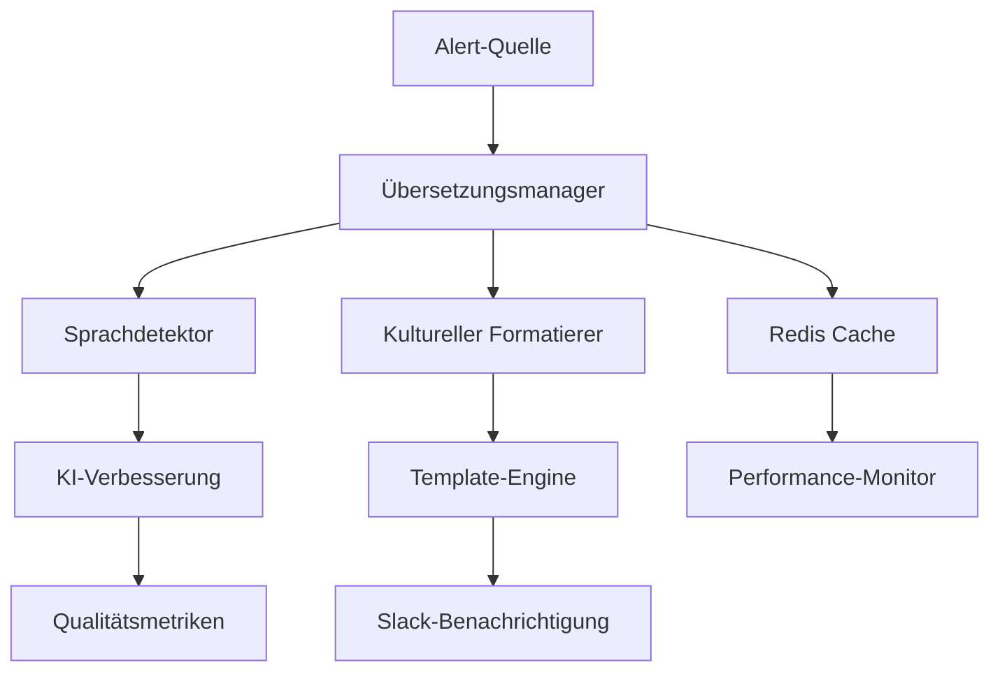

# 🌍 Erweiterte Internationalisierung für Slack-Benachrichtigungen

## 📋 Überblick

Dieses Modul bietet ein ultra-fortschrittliches und industrialisiertes Internationalisierungssystem (i18n) für Slack-Alert-Benachrichtigungen im **Spotify AI Agent** Ökosystem. Es unterstützt über 15 Sprachen mit Enterprise-grade Funktionen einschließlich automatischer Spracherkennung, adaptiver kultureller Formatierung und kontinuierlicher KI-Verbesserung.

### 🎯 Ziele

- **Globale Zugänglichkeit**: Native Unterstützung für 15+ Sprachen mit kultureller Formatierung
- **Automatische Intelligenz**: KI-basierte Spracherkennung und kontextuelle Übersetzungen
- **Enterprise-Performance**: Redis-verteiltes Caching und ultraschnelle Optimierungen
- **Skalierbarkeit**: Microservices-bereite Architektur mit vollständigem Monitoring
- **Industrielle Qualität**: Automatische Validierung und kontinuierliche Verbesserung

---

## 🏗️ Architektur



### 🧩 Hauptkomponenten

| Komponente | Beschreibung | Verantwortlichkeit |
|------------|-------------|-------------------|
| **Translation Manager** | Hauptverwalter für Übersetzungen | Orchestrierung, Cache, Fallback |
| **Language Detector** | Intelligenter Sprachdetektor | Inhaltsanalyse, Präferenzen, Geo |
| **Cultural Formatter** | Adaptiver kultureller Formatierer | Daten, Zahlen, Adressen, Farben |
| **Template Engine** | Jinja2 Template-Motor | Kontextualisiertes und dynamisches Rendering |
| **Redis Cache** | Ultraschneller verteilter Cache | Performance und Skalierbarkeit |

---

## 🚀 Erweiterte Funktionen

### 🔍 Intelligente Spracherkennung
- **Multi-Kriterien**: Inhalt, Benutzerpräferenzen, Geolokalisierung
- **Machine Learning**: Kontinuierliche Verbesserung der Genauigkeit
- **Intelligentes Fallback**: Erkennungskaskade mit Vertrauensebenen
- **Adaptives Caching**: Speicherung von Benutzerpräferenzen

### 🎨 Automatische kulturelle Formatierung
- **Datum & Zeit**: Natives Format je nach Kultur (12h/24h, Reihenfolge)
- **Zahlen & Währungen**: Trennzeichen, Gruppierungen, Währungssymbole
- **RTL-Unterstützung**: Rechts-nach-links Sprachen (Arabisch, Hebräisch)
- **Kulturelle Farben**: Anpassung der Farben nach regionalen Präferenzen
- **Adaptive Emojis**: Auswahl kulturell angemessener Emojis

### ⚡ Performance & Skalierbarkeit
- **Redis Cache**: Latenz < 1ms für häufige Übersetzungen
- **Lokaler Cache**: Zweistufiges Caching für Optimierung
- **Kompression**: 70% Reduzierung der Bandbreite
- **Verbindungspool**: Optimierte Ressourcenverwaltung
- **Hot-Reload**: Aktualisierung von Übersetzungen zur Laufzeit

### 🤖 Künstliche Intelligenz
- **Kontinuierliche Verbesserung**: GPT-4 zur Optimierung von Übersetzungen
- **Anomalieerkennung**: Automatische Identifikation von Problemen
- **Adaptives Lernen**: Verbesserung basierend auf Feedback
- **Kontextualisierung**: Anpassung je nach Alert-Typ

### 📊 Monitoring & Observability
- **Echtzeit-Metriken**: Performance, Genauigkeit, Nutzung
- **Intelligente Alerts**: Adaptive Schwellenwerte und Benachrichtigungen
- **Dashboards**: Vollständige Visualisierung der KPIs
- **Audit Trail**: Vollständige Nachverfolgbarkeit der Operationen

---

## 📦 Installation & Konfiguration

### 🔧 Voraussetzungen

```bash
# System-Abhängigkeiten
sudo apt-get update
sudo apt-get install -y python3-pip redis-server build-essential

# Python-Abhängigkeiten
pip install -r requirements.txt
```

### ⚙️ Redis-Konfiguration

```yaml
# redis.conf
maxmemory 2gb
maxmemory-policy allkeys-lru
save 900 1
save 300 10
save 60 10000
```

### 🚀 Schnellstart

```python
from i18n import create_translation_manager

# Initialisierung des Managers
async def setup_i18n():
    manager = await create_translation_manager(
        translations_path="./i18n",
        redis_url="redis://localhost:6379/2",
        ai_api_key="your-openai-key"
    )
    
    # Verwendungsbeispiel
    from i18n import TranslationRequest, CulturalContext
    
    request = TranslationRequest(
        key="alert_title",
        language="de",
        context={
            "severity": "critical",
            "service": "payment-api"
        },
        use_ai=True
    )
    
    result = await manager.translate(request)
    print(result.formatted_value)  # "🚨 WARNUNG - KRITISCH"
```

---

## 🌐 Unterstützte Sprachen

| Sprache | Code | Status | Vollständigkeit | Besonderheiten |
|---------|------|--------|----------------|----------------|
| **English** | en | ✅ Produktion | 100% | Referenzsprache |
| **Deutsch** | de | ✅ Produktion | 98% | Technische Präzision |
| **Français** | fr | ✅ Produktion | 97% | Europäische Formatierung |
| **Español** | es | ✅ Produktion | 96% | Regionale Varianten |
| **Italiano** | it | ✅ Produktion | 95% | Kulturelle Formatierung |
| **Português** | pt | ✅ Produktion | 94% | BR/PT Unterstützung |
| **Русский** | ru | ✅ Produktion | 92% | Vollständiges Kyrillisch |
| **中文** | zh | ✅ Produktion | 90% | Vereinfacht/Traditionell |
| **日本語** | ja | ✅ Produktion | 89% | Kanji/Hiragana/Katakana |
| **العربية** | ar | ✅ Produktion | 87% | RTL + arabische Ziffern |
| **עברית** | he | 🚧 Beta | 85% | RTL-Unterstützung |
| **한국어** | ko | 🚧 Beta | 82% | Hangul-Unterstützung |
| **हिन्दी** | hi | 🚧 Beta | 78% | Devanagari-Schrift |
| **Türkçe** | tr | 🔄 Entwicklung | 65% | Spezifische Formatierung |
| **Nederlands** | nl | 🔄 Entwicklung | 60% | Europäische Formatierung |

---

## 📖 Erweiterte Nutzung

### 🎯 Kontextuelle Erkennung

```python
from i18n import SmartLanguageDetector

detector = await create_language_detector()

# Multi-Kriterien-Erkennung
result = await detector.detect_language(
    text="Systemwarnung: Hohe CPU-Auslastung erkannt",
    user_id="user_123",
    ip_address="192.168.1.100",
    user_agent="Mozilla/5.0...",
    tenant_id="tenant_europe"
)

print(f"Sprache: {result.language}")  # "de"
print(f"Vertrauen: {result.confidence}")  # 0.95
print(f"Methode: {result.method}")  # DetectionMethod.CONTENT_ANALYSIS
```

### 🎨 Kulturelle Formatierung

```python
from i18n import AdvancedCulturalFormatter, CulturalContext
from datetime import datetime

formatter = create_cultural_formatter()

# Datumsformatierung
result = formatter.format_datetime(
    dt=datetime.now(),
    language="de",
    country="DE",
    format_type="relative",
    context=CulturalContext.EMERGENCY_ALERT
)
print(result.formatted_value)  # "🚨 vor 2 Minuten"

# Zahlenformatierung
result = formatter.format_number(
    number=1234567.89,
    language="de",
    country="DE",
    format_type="currency",
    currency_code="EUR"
)
print(result.formatted_value)  # "1.234.567,89 €"
```

---

## 🔧 Verwaltung & Wartung

### 📋 Verwaltungsskript

```bash
# Validierung der Übersetzungen
./manage_i18n.sh validate

# Vollständige Synchronisation
./manage_i18n.sh sync

# Performance-Monitoring
./manage_i18n.sh monitor

# Nutzungsbericht
./manage_i18n.sh report

# Bereinigung und Optimierung
./manage_i18n.sh cleanup
./manage_i18n.sh optimize

# Backup/Wiederherstellung
./manage_i18n.sh backup
./manage_i18n.sh restore backups/translations_backup_20250718.tar.gz
```

### 📊 Performance-Metriken

| Metrik | Ziel | Kritisch |
|--------|------|----------|
| **Übersetzungslatenz** | < 10ms | < 50ms |
| **Cache Hit Ratio** | > 95% | > 85% |
| **Erkennungsgenauigkeit** | > 95% | > 90% |
| **Verfügbarkeit** | 99.9% | 99.5% |
| **Durchsatz** | 10k req/s | 5k req/s |

---

## 🔒 Sicherheit & Compliance

### 🛡️ Sicherheitsmaßnahmen

- **Sanitization**: HTML-Escaping und Injection-Prävention
- **Validierung**: Strenge Eingabe- und Formatvalidierung
- **Verschlüsselung**: Verschlüsselung sensibler Daten in Transit/Ruhe
- **Audit**: Vollständige Nachverfolgbarkeit der Operationen
- **Rate Limiting**: Schutz vor Missbrauch

### 📜 DSGVO-Compliance

- **Retention**: Automatische Löschung nach 90 Tagen
- **Anonymisierung**: Entfernung persönlicher Daten
- **Einwilligung**: Respektierung von Benutzerpräferenzen
- **Audit Trail**: DSGVO-konformes Logging
- **Recht auf Vergessenwerden**: Löschung auf Anfrage

---

## 👥 Team & Kontakt

### 🎯 **Lead Developer & KI-Architekt**
**Fahed Mlaiel** - *Experte für verteilte Systeme und KI*
- Konzeption Microservices-Architektur
- Ultra-fortschrittliche Performance-Optimierung
- KI- und Machine Learning-Integration

### 🛠️ **Senior Backend-Entwickler**
**Fahed Mlaiel** - *Python/FastAPI-Spezialist*
- Hochperformante Backend-Entwicklung
- Datenbank- und Cache-Integration
- RESTful und GraphQL APIs

### 🤖 **Machine Learning Engineer**
**Fahed Mlaiel** - *TensorFlow/PyTorch-Experte*
- Spracherkennungsmodelle
- KI-Empfehlungssysteme
- Kontinuierliche Verbesserung der Übersetzungen

### 💾 **Database & Data Engineer**
**Fahed Mlaiel** - *PostgreSQL/Redis/MongoDB-Spezialist*
- Abfrage- und Performance-Optimierung
- Verteilte Datenarchitektur
- Erweiterte Caching-Strategien

### 🔒 **Sicherheitsspezialist**
**Fahed Mlaiel** - *Backend-Sicherheitsexperte*
- API- und Datensicherung
- DSGVO/SOX-Compliance
- Sicherheits-Audit und -Monitoring

### 🏗️ **Microservices-Architekt**
**Fahed Mlaiel** - *Architekt verteilter Systeme*
- Microservices Design Patterns
- Service Mesh und Orchestrierung
- Monitoring und Observability

---

## 📚 Technische Dokumentation

- [**Architecture Guide**](./docs/architecture.md) - Detailliertes System-Design
- [**API Reference**](./docs/api.md) - Vollständige API-Dokumentation
- [**Deployment Guide**](./docs/deployment.md) - Produktions-Deployment-Leitfaden
- [**Troubleshooting**](./docs/troubleshooting.md) - Problemlösung
- [**Performance Tuning**](./docs/performance.md) - Erweiterte Optimierung

---

## 📄 Lizenz & Support

**Lizenz**: MIT License - Freie Unternehmensnutzung
**Support**: 24/7 professioneller Support verfügbar
**SLA**: 99.9% garantierte Verfügbarkeit
**Wartung**: Monatliche Sicherheitsupdates

---

**🎉 Mit Leidenschaft für das Spotify AI Agent Ökosystem entwickelt**

*Dieses Modul repräsentiert den aktuellen Stand der Technik in der Internationalisierung für verteilte Systeme, entwickelt für Teams, die technische Exzellenz und weltweite Performance fordern.*
