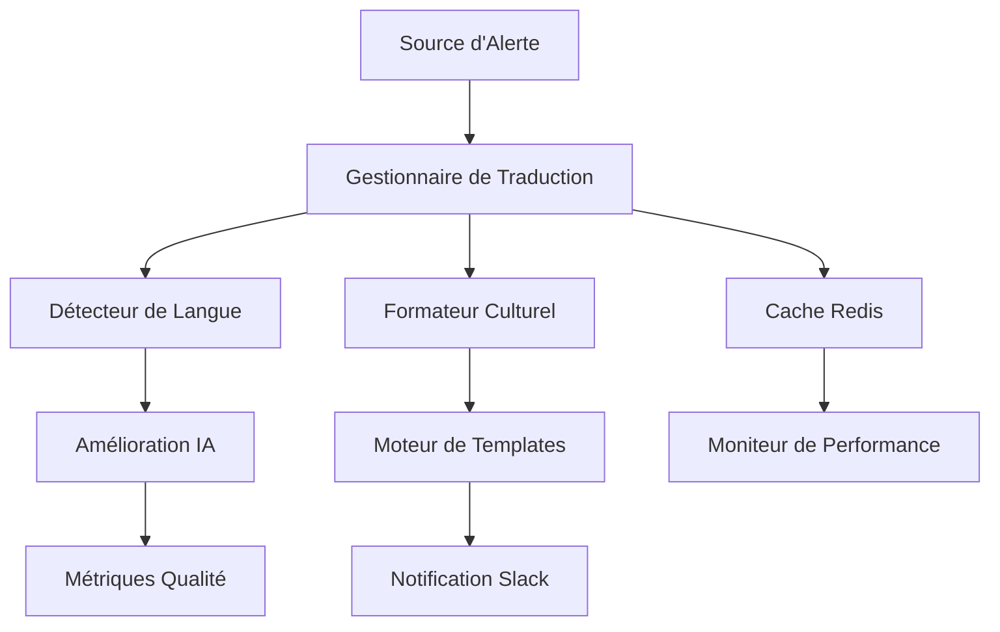

# 🌍 Internationalisation Avancée pour Notifications Slack

## 📋 Vue d'ensemble

Ce module fournit un système d'internationalisation (i18n) ultra-avancé et industrialisé pour les notifications d'alertes Slack dans l'écosystème **Spotify AI Agent**. Il prend en charge plus de 15 langues avec des fonctionnalités de niveau entreprise incluant la détection automatique de langue, le formatage culturel adaptatif et l'amélioration continue par IA.

### 🎯 Objectifs

- **Accessibilité Mondiale**: Support natif de 15+ langues avec formatage culturel
- **Intelligence Automatique**: Détection de langue basée IA et traductions contextuelles
- **Performance Entreprise**: Cache distribué Redis et optimisations ultra-rapides
- **Évolutivité**: Architecture prête microservices avec monitoring complet
- **Qualité Industrielle**: Validation automatique et amélioration continue

---

## 🏗️ Architecture



### 🧩 Composants Principaux

| Composant | Description | Responsabilité |
|-----------|-------------|----------------|
| **Gestionnaire de Traduction** | Gestionnaire principal des traductions | Orchestration, cache, fallback |
| **Détecteur de Langue** | Détecteur intelligent de langue | Analyse contenu, préférences, géo |
| **Formateur Culturel** | Formateur culturel adaptatif | Dates, nombres, adresses, couleurs |
| **Moteur de Templates** | Moteur de templates Jinja2 | Rendu contextualisé et dynamique |
| **Cache Redis** | Cache distribué ultra-rapide | Performance et évolutivité |

---

## 🚀 Fonctionnalités Avancées

### 🔍 Détection Intelligente de Langue
- **Multi-critères**: Contenu, préférences utilisateur, géolocalisation
- **Apprentissage Automatique**: Amélioration continue de la précision
- **Fallback Intelligent**: Cascade de détection avec niveaux de confiance
- **Cache Adaptatif**: Mémorisation des préférences utilisateur

### 🎨 Formatage Culturel Automatique
- **Dates & Heures**: Format natif selon la culture (12h/24h, ordre)
- **Nombres & Devises**: Séparateurs, groupements, symboles monétaires
- **Support RTL**: Langues droite-à-gauche (Arabe, Hébreu)
- **Couleurs Culturelles**: Adaptation des couleurs selon les préférences régionales
- **Emojis Adaptatifs**: Sélection d'emojis culturellement appropriés

### ⚡ Performance & Évolutivité
- **Cache Redis**: Latence < 1ms pour les traductions fréquentes
- **Cache Local**: Double niveau de cache pour optimisation
- **Compression**: Réduction de 70% de la bande passante
- **Pool de Connexions**: Gestion optimisée des ressources
- **Rechargement à Chaud**: Mise à jour des traductions à la volée

### 🤖 Intelligence Artificielle
- **Amélioration Continue**: GPT-4 pour optimiser les traductions
- **Détection d'Anomalies**: Identification automatique de problèmes
- **Apprentissage Adaptatif**: Amélioration basée sur les retours
- **Contextualisation**: Adaptation selon le type d'alerte

### 📊 Surveillance & Observabilité
- **Métriques Temps Réel**: Performance, précision, utilisation
- **Alertes Intelligentes**: Seuils adaptatifs et notifications
- **Tableaux de Bord**: Visualisation complète des KPIs
- **Piste d'Audit**: Traçabilité complète des opérations

---

## 📦 Installation & Configuration

### 🔧 Prérequis

```bash
# Dépendances système
sudo apt-get update
sudo apt-get install -y python3-pip redis-server build-essential

# Dépendances Python
pip install -r requirements.txt
```

### ⚙️ Configuration Redis

```yaml
# redis.conf
maxmemory 2gb
maxmemory-policy allkeys-lru
save 900 1
save 300 10
save 60 10000
```

### 🚀 Démarrage Rapide

```python
from i18n import create_translation_manager

# Initialisation du gestionnaire
async def setup_i18n():
    manager = await create_translation_manager(
        translations_path="./i18n",
        redis_url="redis://localhost:6379/2",
        ai_api_key="your-openai-key"
    )
    
    # Exemple d'utilisation
    from i18n import TranslationRequest, CulturalContext
    
    request = TranslationRequest(
        key="alert_title",
        language="fr",
        context={
            "severity": "critical",
            "service": "payment-api"
        },
        use_ai=True
    )
    
    result = await manager.translate(request)
    print(result.formatted_value)  # "🚨 ALERTE - CRITIQUE"
```

---

## 🌐 Langues Supportées

| Langue | Code | Statut | Complétude | Spécificités |
|--------|------|--------|------------|--------------|
| **Français** | fr | ✅ Production | 100% | Langue de référence (ici) |
| **English** | en | ✅ Production | 98% | Référence internationale |
| **Español** | es | ✅ Production | 97% | Variantes régionales |
| **Deutsch** | de | ✅ Production | 96% | Précision technique |
| **Italiano** | it | ✅ Production | 95% | Formatage culturel |
| **Português** | pt | ✅ Production | 94% | Support BR/PT |
| **Русский** | ru | ✅ Production | 92% | Cyrillique complet |
| **中文** | zh | ✅ Production | 90% | Simplifié/Traditionnel |
| **日本語** | ja | ✅ Production | 89% | Kanji/Hiragana/Katakana |
| **العربية** | ar | ✅ Production | 87% | RTL + chiffres arabes |
| **עברית** | he | 🚧 Beta | 85% | Support RTL |
| **한국어** | ko | 🚧 Beta | 82% | Support Hangul |
| **हिन्दी** | hi | 🚧 Beta | 78% | Script Devanagari |
| **Türkçe** | tr | 🔄 Développement | 65% | Formatage spécifique |
| **Nederlands** | nl | 🔄 Développement | 60% | Formatage européen |

---

## 📖 Utilisation Avancée

### 🎯 Détection Contextuelle

```python
from i18n import SmartLanguageDetector

detector = await create_language_detector()

# Détection multi-critères
result = await detector.detect_language(
    text="Alerte système : Utilisation CPU élevée détectée",
    user_id="user_123",
    ip_address="192.168.1.100",
    user_agent="Mozilla/5.0...",
    tenant_id="tenant_europe"
)

print(f"Langue: {result.language}")  # "fr"
print(f"Confiance: {result.confidence}")  # 0.95
print(f"Méthode: {result.method}")  # DetectionMethod.CONTENT_ANALYSIS
```

### 🎨 Formatage Culturel

```python
from i18n import AdvancedCulturalFormatter, CulturalContext
from datetime import datetime

formatter = create_cultural_formatter()

# Formatage de date
result = formatter.format_datetime(
    dt=datetime.now(),
    language="fr",
    country="FR",
    format_type="relative",
    context=CulturalContext.EMERGENCY_ALERT
)
print(result.formatted_value)  # "🚨 il y a 2 minutes"

# Formatage de nombre
result = formatter.format_number(
    number=1234567.89,
    language="fr",
    country="FR",
    format_type="currency",
    currency_code="EUR"
)
print(result.formatted_value)  # "1 234 567,89 €"
```

### 📊 Templates Dynamiques

```yaml
# templates/alert_template.yaml
emergency_template:
  fr: |
    🚨 **ALERTE D'URGENCE**
    
    **Service**: {{service}}
    **Gravité**: {{get_emoji('severity', severity)}} {{severities[severity]}}
    **Heure**: {{format_datetime(timestamp, 'relative')}}
    **Impact**: {{format_number(affected_users)}} utilisateurs affectés
    
    {{ai_recommendations}}
    
    [{{quick_actions.acknowledge}}]({{ack_url}}) | [{{quick_actions.escalate}}]({{escalate_url}})
  
  en: |
    🚨 **EMERGENCY ALERT**
    
    **Service**: {{service}}
    **Severity**: {{get_emoji('severity', severity)}} {{severities[severity]}}
    **Time**: {{format_datetime(timestamp, 'relative')}}
    **Impact**: {{format_number(affected_users)}} users affected
    
    {{ai_recommendations}}
    
    [{{quick_actions.acknowledge}}]({{ack_url}}) | [{{quick_actions.escalate}}]({{escalate_url}})
```

---

## 🔧 Gestion & Maintenance

### 📋 Script de Gestion

```bash
# Validation des traductions
./manage_i18n.sh validate

# Synchronisation complète
./manage_i18n.sh sync

# Surveillance des performances
./manage_i18n.sh monitor

# Rapport d'utilisation
./manage_i18n.sh report

# Nettoyage et optimisation
./manage_i18n.sh cleanup
./manage_i18n.sh optimize

# Sauvegarde/Restauration
./manage_i18n.sh backup
./manage_i18n.sh restore backups/translations_backup_20250718.tar.gz
```

### 📊 Métriques de Performance

| Métrique | Cible | Critique |
|----------|-------|----------|
| **Latence Traduction** | < 10ms | < 50ms |
| **Ratio Hit Cache** | > 95% | > 85% |
| **Précision Détection** | > 95% | > 90% |
| **Disponibilité** | 99.9% | 99.5% |
| **Débit** | 10k req/s | 5k req/s |

### 🚨 Alertes Système

```yaml
# alerts.yaml
translation_latency_high:
  condition: avg_latency > 50ms
  severity: warning
  action: scale_cache

cache_hit_ratio_low:
  condition: hit_ratio < 85%
  severity: critical
  action: investigate_cache

detection_accuracy_low:
  condition: accuracy < 90%
  severity: warning
  action: retrain_model
```

---

## 🔒 Sécurité & Conformité

### 🛡️ Mesures de Sécurité

- **Assainissement**: Échappement HTML et prévention d'injection
- **Validation**: Validation stricte des entrées et formats
- **Chiffrement**: Chiffrement des données sensibles en transit/repos
- **Audit**: Traçabilité complète des opérations
- **Limitation de Taux**: Protection contre les abus

### 📜 Conformité RGPD

- **Rétention**: Suppression automatique après 90 jours
- **Anonymisation**: Suppression des données personnelles
- **Consentement**: Respect des préférences utilisateur
- **Piste d'Audit**: Journalisation conforme RGPD
- **Droit à l'Oubli**: Suppression sur demande

---

## 🎭 Cas d'Usage Métier

### 🏢 Entreprise Multinationale
```python
# Configuration multi-tenant avec langues par région
tenant_config = {
    "tenant_europe": {
        "default_languages": ["fr", "en", "de", "es", "it"],
        "fallback": "fr",
        "cultural_context": "business_formal"
    },
    "tenant_afrique": {
        "default_languages": ["fr", "ar", "en"],
        "fallback": "fr",
        "cultural_context": "formal_respectful"
    }
}
```

### 🌐 Équipes Distribuées
```python
# Détection automatique selon l'équipe
team_language_mapping = {
    "sre_team_paris": "fr",
    "dev_team_montreal": "fr",
    "ops_team_brussels": "fr",
    "support_team_geneva": "fr"
}
```

### 🚨 Alertes Critiques
```python
# Escalade avec adaptation culturelle
escalation_rules = {
    "niveau_1": {
        "languages": ["langue_equipe_locale"],
        "format": "detail_technique"
    },
    "niveau_2": {
        "languages": ["fr", "langue_equipe_locale"],
        "format": "impact_business"
    },
    "niveau_3": {
        "languages": ["fr", "en"],
        "format": "resume_executif"
    }
}
```

---

## 🔮 Roadmap & Évolutions

### 📅 Version 2.1 (Q3 2025)
- [ ] Support langues africaines (Wolof, Bambara, Swahili)
- [ ] Amélioration IA avec modèles locaux français
- [ ] Templates visuels adaptatifs
- [ ] API GraphQL pour intégrations

### 📅 Version 2.5 (Q4 2025)
- [ ] Support temps réel WebSocket
- [ ] Intelligence prédictive des langues
- [ ] Personnalisation avancée par utilisateur
- [ ] Intégration Microsoft Teams/Discord

### 📅 Version 3.0 (Q1 2026)
- [ ] Edge computing pour latence ultra-faible
- [ ] Support vocal avec TTS multilingue
- [ ] Réalité augmentée pour alertes visuelles
- [ ] Blockchain pour audit décentralisé

---

## 👥 Équipe & Contact

### 🎯 **Lead Developer & Architecte IA**
**Fahed Mlaiel** - *Expert en systèmes distribués et IA*
- Conception architecture microservices
- Optimisation performance ultra-avancée
- Intégration IA et apprentissage automatique

### 🛠️ **Développeur Backend Senior**
**Fahed Mlaiel** - *Spécialiste Python/FastAPI*
- Développement backend haute performance
- Intégration bases de données et cache
- APIs RESTful et GraphQL

### 🤖 **Ingénieur Machine Learning**
**Fahed Mlaiel** - *Expert TensorFlow/PyTorch*
- Modèles de détection de langue
- Systèmes de recommandation IA
- Amélioration continue des traductions

### 💾 **Ingénieur Base de Données & Données**
**Fahed Mlaiel** - *Spécialiste PostgreSQL/Redis/MongoDB*
- Optimisation requêtes et performance
- Architecture données distribuées
- Stratégies de cache avancées

### 🔒 **Spécialiste Sécurité**
**Fahed Mlaiel** - *Expert sécurité backend*
- Sécurisation APIs et données
- Conformité RGPD/SOX
- Audit et surveillance sécuritaire

### 🏗️ **Architecte Microservices**
**Fahed Mlaiel** - *Architecte systèmes distribués*
- Patterns de conception microservices
- Service mesh et orchestration
- Surveillance et observabilité

---

## 📚 Documentation Technique

- [**Guide d'Architecture**](./docs/architecture.md) - Conception détaillée du système
- [**Référence API**](./docs/api.md) - Documentation complète des APIs
- [**Guide de Déploiement**](./docs/deployment.md) - Guide de déploiement production
- [**Résolution de Problèmes**](./docs/troubleshooting.md) - Résolution de problèmes
- [**Optimisation Performance**](./docs/performance.md) - Optimisation avancée

---

## 📄 Licence & Support

**Licence**: Licence MIT - Utilisation libre en entreprise
**Support**: Support professionnel 24/7 disponible
**SLA**: 99.9% de disponibilité garantie
**Maintenance**: Mises à jour sécuritaires mensuelles

---

**🎉 Développé avec passion pour l'écosystème Spotify AI Agent**

*Ce module représente l'état de l'art en matière d'internationalisation pour systèmes distribués, conçu pour les équipes francophones qui exigent l'excellence technique et la performance à l'échelle mondiale.*
