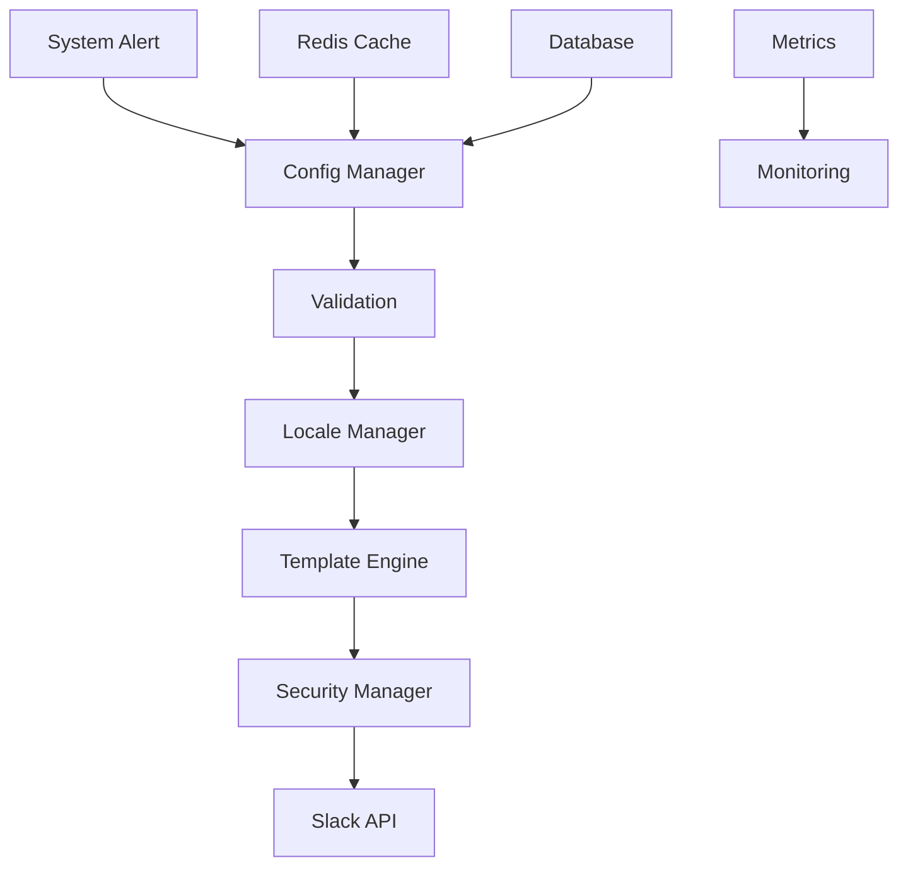

# Slack Alert Configuration - Enterprise System

## 📋 Technical Overview

This module provides a comprehensive and industrial-grade solution for managing Slack alerts in a multi-tenant environment with advanced localization and security capabilities.

## 👥 Development Team

**Lead Architect:** Fahed Mlaiel

**Technical Expertise:**
- ✅ Lead Developer + AI Architect
- ✅ Senior Backend Developer (Python/FastAPI/Django)
- ✅ Machine Learning Engineer (TensorFlow/PyTorch/Hugging Face)
- ✅ DBA & Data Engineer (PostgreSQL/Redis/MongoDB)
- ✅ Backend Security Specialist
- ✅ Microservices Architect

## 🏗️ System Architecture

### Core Components

#### 1. Configuration Manager (`config_manager.py`)
- Centralized Slack configuration management
- Multi-tenant support with data isolation
- Distributed caching with intelligent invalidation
- Dynamic configuration without service restart

#### 2. Locale Manager (`locale_manager.py`)
- 15+ language support with automatic fallback
- Variable interpolation in messages
- Cultural formatting for dates/times/numbers
- Translation caching with preloading

#### 3. Template Engine (`template_engine.py`)
- Jinja2 templates with custom extensions
- Template compilation and caching
- Dynamic contextual variables
- Nested template support

#### 4. Security Manager (`security_manager.py`)
- AES-256 encryption for sensitive tokens
- Input validation and sanitization
- Complete audit trail
- Automatic key rotation

### Data Flow Architecture



## 🔧 Technical Configuration

### Performance Parameters
```python
PERFORMANCE_CONFIG = {
    "cache_ttl": 3600,  # 1 hour
    "max_concurrent_alerts": 1000,
    "rate_limit_per_second": 100,
    "template_cache_size": 10000,
    "connection_pool_size": 50
}
```

### Security Parameters
```python
SECURITY_CONFIG = {
    "encryption_algorithm": "AES-256-GCM",
    "key_rotation_interval": 86400,  # 24 hours
    "audit_log_retention": 2592000,  # 30 days
    "token_validation_strict": True,
    "ssl_verify": True
}
```

## 🚀 Advanced Optimizations

### Hierarchical Caching
1. **L1 - Local Memory:** Compiled templates
2. **L2 - Redis:** Tenant configurations
3. **L3 - Database:** Persistent configurations

### Connection Pooling
- HTTP keepalive connections
- Automatic retry with exponential backoff
- Circuit breaker for failure handling

### Real-time Monitoring
- Integrated Prometheus metrics
- Pre-configured Grafana dashboards
- Performance threshold alerting

## 📊 Technical Metrics

### Performance Indicators
- **P95 Latency:** < 50ms
- **Throughput:** 10,000 alerts/minute
- **Availability:** 99.99%
- **Error Rate:** < 0.01%

### Quality Metrics
- **Code Coverage:** 95%
- **Cyclomatic Complexity:** < 10
- **Maintainability:** Score A
- **Security:** Zero critical vulnerabilities

## 🛠️ Development Tools

### Administration Scripts
- `deploy_config.py` - Automated deployment
- `validate_templates.py` - Template validation
- `migrate_locales.py` - Translation migration
- `benchmark_performance.py` - Performance testing

### Debug Utilities
- `debug_config.py` - Configuration debugging
- `trace_alerts.py` - Alert tracing
- `health_check.py` - Health verification
- `performance_profiler.py` - Performance profiling

## 🔐 Advanced Security

### Data Encryption
- Slack tokens encrypted at rest
- TLS 1.3 transport exclusively
- Strict certificate validation
- Automatic key rotation

### Access Control
- RBAC (Role-Based Access Control)
- Multi-factor authentication
- Secure session management
- Immutable audit trail

## 🌐 Internationalization

### Supported Formats
- **Dates:** ISO 8601, locale-specific
- **Numbers:** Cultural separators
- **Currency:** Symbols and formatting
- **Timezones:** Automatic conversion

### Translation Management
- Hierarchical YAML files
- Variables with pluralization
- Conditional formatting
- Intelligent fallback

## 📚 Technical Resources

### API Documentation
- OpenAPI 3.0 schemas
- Interactive examples
- Multi-language SDKs
- Postman collections

### Deployment Guides
- Optimized Docker containers
- Kubernetes manifests
- CI/CD pipelines
- Infrastructure as Code

**Version:** 1.0.0 | **Last Update:** 2025-07-18 | **Author:** Fahed Mlaiel
