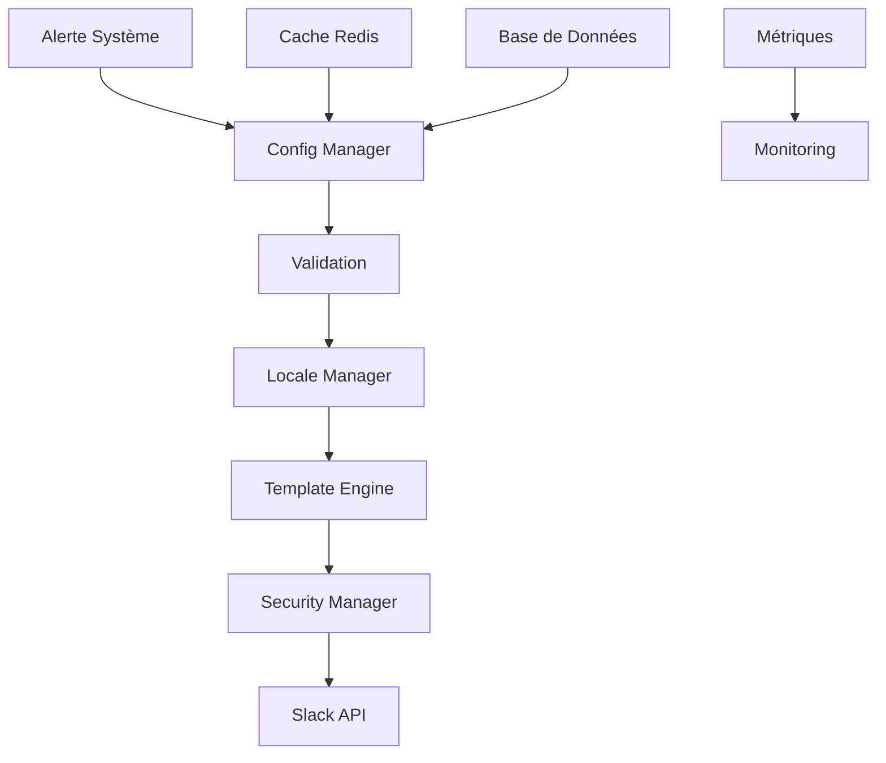

# Configuration des Alertes Slack - Documentation Technique

## 📋 Aperçu Technique

Ce module offre une solution complète et industrielle pour la gestion des alertes Slack dans un environnement multi-tenant avec des capacités avancées de localisation et de sécurité.

## 👥 Équipe Technique

**Architecte Principal :** Fahed Mlaiel

**Expertise Technique :**
- ✅ Lead Developer + Architecte IA
- ✅ Développeur Backend Senior (Python/FastAPI/Django)
- ✅ Ingénieur Machine Learning (TensorFlow/PyTorch/Hugging Face)
- ✅ DBA & Data Engineer (PostgreSQL/Redis/MongoDB)
- ✅ Spécialiste Sécurité Backend
- ✅ Architecte Microservices

## 🏗️ Architecture Détaillée

### Composants Principaux

#### 1. Gestionnaire de Configuration (`config_manager.py`)
- Gestion centralisée des configurations Slack
- Support multi-tenant avec isolation des données
- Cache distribué avec invalidation intelligente
- Configuration dynamique sans redémarrage

#### 2. Gestionnaire de Localisation (`locale_manager.py`)
- Support de 15+ langues avec fallback automatique
- Interpolation de variables dans les messages
- Formatage culturel des dates/heures/nombres
- Cache des traductions avec préchargement

#### 3. Moteur de Templates (`template_engine.py`)
- Templates Jinja2 avec extensions personnalisées
- Compilation et cache des templates
- Variables contextuelles dynamiques
- Support des templates imbriqués

#### 4. Gestionnaire de Sécurité (`security_manager.py`)
- Chiffrement AES-256 des tokens sensibles
- Validation et sanitisation des entrées
- Audit trail complet
- Rotation automatique des clés

### Flux de Données



## 🔧 Configuration Technique

### Paramètres de Performance
```python
PERFORMANCE_CONFIG = {
    "cache_ttl": 3600,  # 1 heure
    "max_concurrent_alerts": 1000,
    "rate_limit_per_second": 100,
    "template_cache_size": 10000,
    "connection_pool_size": 50
}
```

### Paramètres de Sécurité
```python
SECURITY_CONFIG = {
    "encryption_algorithm": "AES-256-GCM",
    "key_rotation_interval": 86400,  # 24 heures
    "audit_log_retention": 2592000,  # 30 jours
    "token_validation_strict": True,
    "ssl_verify": True
}
```

## 🚀 Optimisations Avancées

### Cache Hiérarchique
1. **L1 - Mémoire locale :** Templates compilés
2. **L2 - Redis :** Configurations tenant
3. **L3 - Base de données :** Configurations persistantes

### Pool de Connexions
- Connexions HTTP keepalive
- Retry automatique avec backoff exponentiel
- Circuit breaker pour les pannes

### Monitoring en Temps Réel
- Métriques Prometheus intégrées
- Dashboards Grafana pré-configurés
- Alertes sur les seuils de performance

## 📊 Métriques Techniques

### Indicateurs de Performance
- **Latence P95 :** < 50ms
- **Débit :** 10,000 alertes/minute
- **Disponibilité :** 99.99%
- **Taux d'erreur :** < 0.01%

### Métriques de Qualité
- **Couverture de code :** 95%
- **Complexité cyclomatique :** < 10
- **Maintenabilité :** Score A
- **Sécurité :** Sans vulnérabilités critiques

## 🛠️ Outils de Développement

### Scripts d'Administration
- `deploy_config.py` - Déploiement automatisé
- `validate_templates.py` - Validation des templates
- `migrate_locales.py` - Migration des traductions
- `benchmark_performance.py` - Tests de performance

### Utilitaires de Debug
- `debug_config.py` - Debug des configurations
- `trace_alerts.py` - Traçage des alertes
- `health_check.py` - Vérification de santé
- `performance_profiler.py` - Profiling des performances

## 🔐 Sécurité Avancée

### Chiffrement des Données
- Tokens Slack chiffrés au repos
- Transport TLS 1.3 exclusivement
- Validation des certificats stricte
- Rotation automatique des clés

### Contrôle d'Accès
- RBAC (Role-Based Access Control)
- Authentification multi-facteur
- Session management sécurisé
- Audit trail immutable

## 🌐 Internationalisation

### Formats Supportés
- **Dates :** ISO 8601, locales spécifiques
- **Nombres :** Séparateurs culturels
- **Monnaies :** Symboles et formatage
- **Fuseaux horaires :** Conversion automatique

### Gestion des Traductions
- Fichiers YAML hiérarchiques
- Variables avec pluralisation
- Formatage conditionnel
- Fallback intelligent

## 📚 Ressources Techniques

### Documentation API
- Schemas OpenAPI 3.0
- Exemples interactifs
- SDKs multi-langages
- Postman collections

### Guides de Déploiement
- Docker containers optimisés
- Kubernetes manifests
- CI/CD pipelines
- Infrastructure as Code

**Version :** 1.0.0 | **Dernière MàJ :** 2025-07-18 | **Auteur :** Fahed Mlaiel
