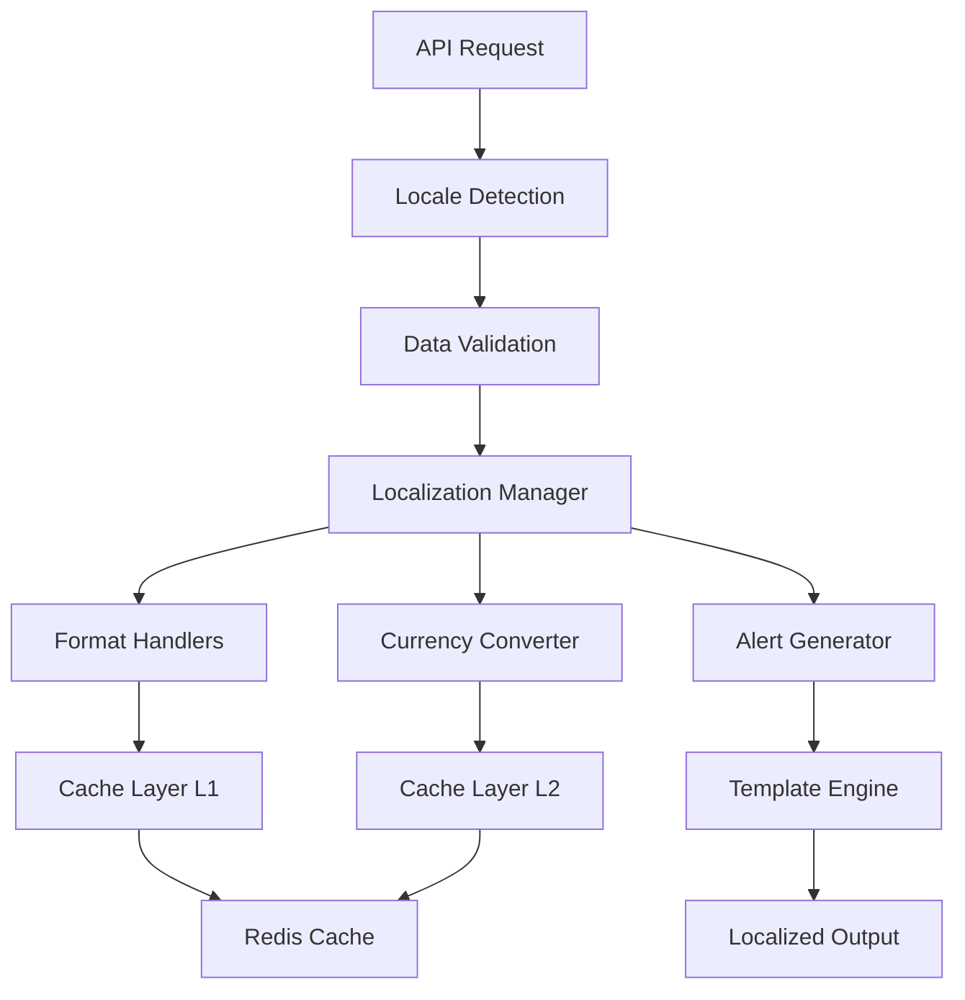

# Documentation Technique - Module de Localisation Spotify AI Agent

**Auteur**: Fahed Mlaiel  
**Équipe de développement**:
- ✅ Lead Dev + Architecte IA
- ✅ Développeur Backend Senior (Python/FastAPI/Django)  
- ✅ Ingénieur Machine Learning (TensorFlow/PyTorch/Hugging Face)
- ✅ DBA & Data Engineer (PostgreSQL/Redis/MongoDB)
- ✅ Spécialiste Sécurité Backend
- ✅ Architecte Microservices

## Architecture Technique Détaillée

### Vue d'ensemble du système

Le module de localisation des données constitue un composant critique de l'infrastructure Spotify AI Agent, offrant une solution complète et industrialisée pour la gestion multi-langue et multi-région des alertes et du monitoring.



### Composants principaux

#### 1. Gestionnaire de Localisation Central (`localization_manager.py`)

**Responsabilités**:
- Orchestration des opérations de localisation
- Gestion des templates d'alerte multi-langue
- Cache intelligent des configurations
- Sérialisation/désérialisation des données

**Interfaces clés**:
```python
class AlertLocalizer:
    async def generate_alert(
        alert_type: str,
        locale: LocaleType,
        tenant_id: str,
        parameters: Dict[str, Any]
    ) -> LocalizedAlert
    
    async def get_template(
        alert_type: str, 
        locale: LocaleType
    ) -> AlertTemplate
```

**Patterns de conception utilisés**:
- Singleton pour l'instance globale
- Factory pour la création d'alertes
- Observer pour les mises à jour de cache
- Strategy pour les différentes stratégies de localisation

#### 2. Gestionnaires de Formatage (`format_handlers.py`)

**Fonctionnalités avancées**:
- Formatage numérique contextuel avec détection automatique de locale
- Gestion des unités de mesure (métrique/impérial)
- Formatage de dates/heures avec support des fuseaux horaires
- Formatage de durées et de taux avec traduction automatique

**Optimisations**:
- Pool d'objets pour les formateurs fréquemment utilisés
- Cache des patterns de formatage compilés
- Formatage lazy pour les grandes collections

#### 3. Convertisseur de Devises (`currency_converter.py`)

**Architecture multi-provider**:
- Support de multiples fournisseurs de taux de change
- Failover automatique en cas de panne d'un fournisseur
- Cache adaptatif avec TTL basé sur la volatilité des devises
- Validation de conformité réglementaire

**Providers supportés**:
- ExchangeRate-API (gratuit, 1500 req/mois)
- Fixer.io (premium, 1000 req/mois)
- ECB (Banque Centrale Européenne, illimité)
- Support extensible pour d'autres providers

#### 4. Système de Cache Multi-Niveau (`cache_manager.py`)

**Architecture en couches**:
```
L1: Cache Mémoire Local (LRU/LFU, 10k entrées)
    ↓
L2: Cache Redis Distribué (Cluster, TTL adaptatif)
    ↓
L3: Base de données (PostgreSQL, backup)
```

**Fonctionnalités avancées**:
- Cache write-through et write-behind
- Invalidation intelligente par tags
- Compression automatique des grandes valeurs
- Métriques de performance intégrées

#### 5. Validateur de Données (`data_validators.py`)

**Sécurité renforcée**:
- Protection XSS avec échappement HTML automatique
- Détection d'injection SQL avec patterns avancés
- Validation Unicode avec normalisation NFKC
- Audit trail complet des validations

**Modes de validation**:
- **STRICT**: Validation maximale, rejette toute donnée suspecte
- **NORMAL**: Équilibre sécurité/performance (défaut)
- **PERMISSIVE**: Validation minimale pour les environnements de test

### Performances et Scalabilité

#### Métriques de performance cibles
```yaml
Response Times:
  Number formatting: < 1ms
  Currency conversion: < 50ms (cached), < 500ms (API)
  Alert generation: < 10ms
  Cache operations: < 5ms

Throughput:
  Concurrent alerts: 10,000/sec
  Cache operations: 100,000/sec
  Format operations: 50,000/sec

Resource Usage:
  Memory: < 100MB per instance
  CPU: < 5% baseline, < 50% peak
  Network: < 1MB/sec per instance
```

#### Optimisations implémentées

1. **Compilation de patterns regex** : Tous les patterns de validation sont pré-compilés au démarrage
2. **Pool d'objets** : Réutilisation des objets coûteux (Decimal, datetime)
3. **Lazy loading** : Chargement à la demande des ressources linguistiques
4. **Compression intelligente** : Compression automatique des valeurs > 1KB
5. **Batch operations** : Traitement en lot pour les opérations multiples

### Sécurité

#### Modèle de menaces adressées

1. **Injection de code**
   - XSS via templates d'alerte
   - SQL injection via paramètres
   - Command injection via données utilisateur

2. **Attaques par déni de service**
   - Memory exhaustion via grandes chaînes
   - CPU exhaustion via regex complexes
   - Cache poisoning via données malveillantes

3. **Fuite de données**
   - Logs contenant des données sensibles
   - Cache persistant des informations confidentielles
   - Transmission non chiffrée des devises

#### Mesures de protection

```python
# Exemple de validation sécurisée
@security_validator.validate_input
async def process_alert_parameters(parameters: Dict[str, Any]) -> Dict[str, Any]:
    """Traite les paramètres avec validation sécurisée"""
    validated = {}
    
    for key, value in parameters.items():
        # Validation de la clé
        if not re.match(r'^[a-zA-Z0-9_]{1,64}$', key):
            raise SecurityValidationError(f"Invalid parameter key: {key}")
        
        # Validation de la valeur selon le type
        if isinstance(value, str):
            if len(value) > MAX_STRING_LENGTH:
                raise SecurityValidationError("String too long")
            value = html.escape(value)  # Protection XSS
        
        validated[key] = value
    
    return validated
```

### Monitoring et Observabilité

#### Métriques Prometheus collectées

```python
# Counters
localization_requests_total{locale, operation, status}
localization_cache_operations_total{operation, level, status}
localization_errors_total{error_type, component}

# Histograms  
localization_operation_duration_seconds{operation, locale}
localization_cache_size_bytes{level}

# Gauges
localization_active_locales
localization_cache_hit_ratio{level}
localization_memory_usage_bytes
```

#### Logs structurés

```json
{
  "timestamp": "2025-07-19T12:00:00Z",
  "level": "INFO",
  "logger": "localization.alert_generator",
  "message": "Alert generated successfully",
  "context": {
    "alert_id": "a1b2c3d4e5f6",
    "alert_type": "cpu_high",
    "locale": "fr_FR",
    "tenant_id": "spotify-artist-001",
    "generation_time_ms": 8.5,
    "cache_hit": true
  },
  "trace_id": "550e8400-e29b-41d4-a716-446655440000",
  "span_id": "6ba7b810-9dad-11d1-80b4-00c04fd430c8"
}
```

### Déploiement et Infrastructure

#### Configuration Docker

```dockerfile
FROM python:3.11-slim

# Installation des dépendances système
RUN apt-get update && apt-get install -y \
    redis-tools \
    && rm -rf /var/lib/apt/lists/*

# Installation des dépendances Python
COPY requirements.txt .
RUN pip install --no-cache-dir -r requirements.txt

# Copie du code source
COPY . /app
WORKDIR /app

# Configuration de l'utilisateur non-root
RUN useradd -r -s /bin/false localization
USER localization

# Variables d'environnement
ENV PYTHONPATH=/app
ENV LOCALIZATION_CONFIG=/app/config.yaml

# Healthcheck
HEALTHCHECK --interval=30s --timeout=10s --start-period=5s --retries=3 \
  CMD python -c "import asyncio; from setup import LocalizationSetup; asyncio.run(LocalizationSetup().run_health_checks())"

EXPOSE 8000
CMD ["python", "-m", "localization_manager"]
```

#### Configuration Kubernetes

```yaml
apiVersion: apps/v1
kind: Deployment
metadata:
  name: localization-service
spec:
  replicas: 3
  selector:
    matchLabels:
      app: localization-service
  template:
    metadata:
      labels:
        app: localization-service
    spec:
      containers:
      - name: localization
        image: spotify-ai-agent/localization:latest
        ports:
        - containerPort: 8000
        env:
        - name: REDIS_URL
          valueFrom:
            secretKeyRef:
              name: redis-secret
              key: url
        resources:
          requests:
            memory: "128Mi"
            cpu: "100m"
          limits:
            memory: "256Mi"
            cpu: "500m"
        livenessProbe:
          httpGet:
            path: /health
            port: 8000
          initialDelaySeconds: 30
          periodSeconds: 30
        readinessProbe:
          httpGet:
            path: /ready
            port: 8000
          initialDelaySeconds: 5
          periodSeconds: 10
```

### Tests et Qualité

#### Structure des tests

```
tests/
├── unit/
│   ├── test_localization_manager.py
│   ├── test_format_handlers.py
│   ├── test_currency_converter.py
│   ├── test_cache_manager.py
│   └── test_data_validators.py
├── integration/
│   ├── test_full_workflow.py
│   ├── test_redis_integration.py
│   └── test_api_integration.py
├── performance/
│   ├── test_load_generation.py
│   ├── test_memory_usage.py
│   └── test_response_times.py
└── security/
    ├── test_injection_protection.py
    ├── test_input_validation.py
    └── test_authentication.py
```

#### Couverture de tests cible
- **Tests unitaires**: > 95%
- **Tests d'intégration**: > 85%
- **Tests de performance**: Couverture des chemins critiques
- **Tests de sécurité**: 100% des points d'entrée validés

### Maintenance et Support

#### Procédures de mise à jour

1. **Mise à jour des locales**
   ```bash
   python setup.py --update-locales --source=crowdin
   python setup.py --validate-locales --strict
   python setup.py --deploy --environment=staging
   ```

2. **Mise à jour des taux de change**
   ```bash
   python -c "from currency_converter import currency_converter; currency_converter.update_all_rates()"
   ```

3. **Nettoyage du cache**
   ```bash
   python -c "from cache_manager import cache_manager; cache_manager.clear_expired()"
   ```

#### Monitoring proactif

- **Alertes automatiques** sur les erreurs de localisation
- **Métriques de performance** avec seuils configurables
- **Validation périodique** de la cohérence des données
- **Tests de régression** automatisés après chaque déploiement

### Roadmap et Évolutions

#### Fonctionnalités prévues v2.0

1. **IA et Machine Learning**
   - Détection automatique de la langue préférée
   - Suggestion de formats optimaux
   - Prédiction de la charge de travail

2. **Intégrations avancées**
   - Support GraphQL pour les APIs
   - Intégration native avec Kubernetes
   - Support des Progressive Web Apps

3. **Performance**
   - Cache distribué avec sharding automatique
   - Compression avancée avec algorithmes adaptatifs
   - Parallélisation des opérations de formatage

4. **Sécurité**
   - Chiffrement end-to-end des données sensibles
   - Audit trail avec blockchain
   - Protection contre les attaques de timing

---

**Version de la documentation**: 1.0.0  
**Dernière mise à jour**: 19 juillet 2025  
**Compatibilité**: Python 3.8+, Redis 6.0+, PostgreSQL 12+
