# Documentation Technique - Système de Monitoring Ultra-Avancé
## Spotify AI Agent - Architecture Industrielle

### 📋 Table des Matières

1. [Vue d'Ensemble](#vue-densemble)
2. [Architecture Technique](#architecture-technique)
3. [Modules Fonctionnels](#modules-fonctionnels)
4. [Configuration Avancée](#configuration-avancée)
5. [Déploiement](#déploiement)
6. [API et Intégrations](#api-et-intégrations)
7. [Monitoring et Observabilité](#monitoring-et-observabilité)
8. [Sécurité et Conformité](#sécurité-et-conformité)
9. [Maintenance et Support](#maintenance-et-support)

---

## 🔍 Vue d'Ensemble

### Objectif Stratégique
Ce système de monitoring ultra-avancé a été conçu spécifiquement pour l'écosystème **Spotify AI Agent** avec pour objectif de fournir une observabilité complète, prédictive et intelligente de tous les aspects critiques de l'infrastructure.

### Caractéristiques Clés
- **Intelligence Artificielle Intégrée** : Détection d'anomalies ML, prédictions proactives
- **Monitoring 360°** : Business, technique, sécurité, conformité, ML/IA
- **Multi-Tenant Natif** : Isolation stricte, quotas intelligents, SLA différenciés
- **Compliance Automatisée** : GDPR, SOC2, ISO27001, HIPAA
- **Scalabilité Extreme** : Architecture cloud-native, auto-scaling
- **Observabilité Temps Réel** : Métriques haute fréquence, alertes intelligentes

### Metrics de Performance
```yaml
Capacité de Traitement:
  - Métriques/sec: 1,000,000+
  - Cardinalité max: 50,000,000
  - Latence P95: <50ms
  - Disponibilité: 99.99%

Intelligence ML:
  - Modèles actifs: 25+
  - Précision anomalies: 94.5%
  - Faux positifs: <2%
  - Temps prédiction: <100ms
```

---

## 🏗️ Architecture Technique

### Stack Technologique

```mermaid
graph TB
    subgraph "Data Layer"
        A[Prometheus] --> B[InfluxDB]
        B --> C[ClickHouse OLAP]
        C --> D[Redis Cache]
    end
    
    subgraph "ML Layer"
        E[TensorFlow Serving] --> F[MLflow Registry]
        F --> G[Kubeflow Pipelines]
        G --> H[Feature Store]
    end
    
    subgraph "API Layer"
        I[FastAPI Gateway] --> J[GraphQL]
        J --> K[gRPC Services]
        K --> L[WebSocket Real-time]
    end
    
    subgraph "UI Layer"
        M[Grafana Enterprise] --> N[Custom React Dashboards]
        N --> O[Mobile Apps]
        O --> P[Slack/Teams Integration]
    end
```


### Composants Core

#### 1. Data Ingestion Pipeline
```python
# Pipeline de traitement haute performance
class AdvancedDataPipeline:
    def __init__(self):
        self.kafka_producer = KafkaProducer(
            batch_size=50000,
            compression_type='snappy',
            max_in_flight_requests_per_connection=20
        )
        self.processors = [
            ValidationProcessor(),
            EnrichmentProcessor(),
            AnomalyDetectionProcessor(),
            RoutingProcessor()
        ]
    
    async def process_metrics_batch(self, metrics: List[MetricPoint]):
        """Process 100K+ metrics per second"""
        # Validation parallèle
        validated = await asyncio.gather(*[
            self.validate_metric(m) for m in metrics
        ])
        
        # Enrichissement contextuel
        enriched = await self.enrich_with_context(validated)
        
        # Détection d'anomalies ML
        anomalies = await self.detect_anomalies(enriched)
        
        # Routage intelligent
        await self.route_to_storage(enriched, anomalies)
```

#### 2. ML Anomaly Detection Engine
```python
class MLAnomalyDetectionEngine:
    """Moteur de détection d'anomalies multi-modèles"""
    
    def __init__(self):
        self.models = {
            'isolation_forest': IsolationForestDetector(),
            'lstm_autoencoder': LSTMAutoencoderDetector(),
            'prophet_forecast': ProphetDetector(),
            'ensemble': EnsembleDetector()
        }
        self.feature_store = FeatureStore()
    
    async def detect_anomalies(self, metrics: List[MetricPoint]) -> List[Anomaly]:
        """Détection temps réel avec précision 94.5%"""
        features = await self.extract_features(metrics)
        
        # Inférence parallèle sur tous les modèles
        results = await asyncio.gather(*[
            model.predict(features) for model in self.models.values()
        ])
        
        # Ensemble voting avec pondération intelligente
        ensemble_result = self.ensemble_voting(results)
        
        # Post-traitement et contextualisation
        return await self.contextualize_anomalies(ensemble_result)
```

---

## 📊 Modules Fonctionnels

### 1. Metric Schemas (metric_schemas.py)
**Fonctionnalités Avancées** :
- Métriques multi-dimensionnelles avec cardinalité optimisée
- Types spécialisés : Business KPIs, SLIs, métriques ML
- Configuration ML intégrée pour détection d'anomalies
- Seuils adaptatifs basés sur historique

**Exemple d'Usage** :
```python
# Métrique business critique avec ML
revenue_metric = MetricSchema(
    name="spotify_revenue_per_user_hour",
    metric_type=MetricType.BUSINESS_KPI,
    ml_config=MLAnomalyConfig(
        model_type="prophet",
        sensitivity=0.85,
        features=["user_engagement", "content_quality"]
    ),
    business_impact="Critical revenue measurement",
    slo_target=85.0
)
```

### 2. Alert Schemas (alert_schemas.py)
**Capacités Intelligentes** :
- Corrélation ML entre événements
- Escalation automatique basée sur impact business
- Templates de notification contextuels
- Auto-remediation avec approbation conditionnelle

**Workflow d'Alerte** :
```python
# Alerte intelligente avec ML
critical_alert = AlertRule(
    name="revenue_anomaly_ml",
    use_ml_prediction=True,
    anomaly_detection=True,
    business_impact_score=9.5,
    auto_remediation=AutoRemediationRule(
        action=RemediationAction.SCALE_UP,
        requires_approval=False
    ),
    escalation_policy=EscalationPolicy(
        levels=[
            EscalationLevel(delay="5m", target="on_call_engineer"),
            EscalationLevel(delay="15m", target="team_lead"),
            EscalationLevel(delay="30m", target="vp_engineering")
        ]
    )
)
```

### 3. Dashboard Schemas (dashboard_schemas.py)
**Expérience Utilisateur Avancée** :
- Dashboards adaptatifs par rôle (C-Level, Tech, Ops)
- Visualisations ML avec prédictions temps réel
- Drill-down interactif avec contexte métier
- Export automatisé de rapports

**Dashboard Exécutif** :
```python
executive_dashboard = Dashboard(
    dashboard_type=DashboardType.EXECUTIVE,
    ml_insights_enabled=True,
    predictive_analytics=True,
    widgets=[
        revenue_kpi_widget,
        user_growth_widget,
        ml_predictions_widget
    ]
)
```

### 4. Tenant Monitoring (tenant_monitoring.py)
**Multi-Tenancy Avancée** :
- Isolation stricte des données et compute
- Quotas dynamiques avec auto-scaling
- SLA différenciés par tier client
- Chiffrement per-tenant

**Configuration Enterprise** :
```python
enterprise_tenant = TenantConfig(
    tier=TenantTier.ENTERPRISE,
    isolation_level=IsolationLevel.STRICT,
    sla=TenantSLA(
        availability_target=99.99,
        response_time_p95=50.0
    ),
    security=TenantSecurityConfig(
        encryption_at_rest=True,
        mfa_required=True,
        compliance_frameworks=["GDPR", "SOC2"]
    )
)
```

### 5. Compliance Monitoring (compliance_monitoring.py)
**Conformité Automatisée** :
- Contrôles GDPR, SOC2, ISO27001, HIPAA
- Audit trails automatiques
- Violation detection temps réel
- Rapports de compliance automatisés

### 6. ML Monitoring (ml_monitoring.py)
**MLOps Avancé** :
- Model drift detection multi-types
- Performance tracking en production
- A/B testing intégré
- Model governance et lineage

### 7. Security Monitoring (security_monitoring.py)
**Cybersécurité Intelligente** :
- MITRE ATT&CK framework intégré
- Threat intelligence feeds
- Behavioral analytics
- Incident response automatisé

### 8. Performance Monitoring (performance_monitoring.py)
**APM Enterprise** :
- SLO tracking avec error budgets
- Distributed tracing
- Synthetic monitoring
- Capacity planning prédictif

---

## ⚙️ Configuration Avancée

### Variables d'Environnement
```bash
# Configuration Core
MONITORING_CLUSTER_NAME="spotify-monitoring-prod"
MONITORING_NAMESPACE="monitoring"
MONITORING_LOG_LEVEL="INFO"

# ML Configuration
ML_MODEL_REGISTRY_URL="https://mlflow.spotify.internal"
ML_FEATURE_STORE_URL="https://feast.spotify.internal"
ML_ANOMALY_THRESHOLD="0.85"

# Security
VAULT_URL="https://vault.spotify.internal"
ENCRYPTION_KEY_ID="monitoring-key-v2"
TLS_CERT_PATH="/etc/ssl/certs/monitoring.crt"

# Performance
METRICS_RETENTION_DAYS="90"
HIGH_CARDINALITY_LIMIT="10000000"
QUERY_TIMEOUT_SECONDS="30"
```

### Configuration Files
```yaml
# monitoring-config.yaml
apiVersion: v1
kind: ConfigMap
metadata:
  name: monitoring-config
data:
  monitoring.yaml: |
    metrics:
      retention: "90d"
      cardinality_limit: 10000000
      compression: "snappy"
    
    ml:
      anomaly_detection:
        enabled: true
        models: ["isolation_forest", "lstm", "prophet"]
        threshold: 0.85
      
    alerting:
      correlation_window: "5m"
      max_notifications_per_hour: 10
      escalation_enabled: true
    
    security:
      encryption_at_rest: true
      audit_logging: true
      compliance_frameworks: ["GDPR", "SOC2"]
```

---

## 🚀 Déploiement

### Prérequis Infrastructure
```yaml
Kubernetes Cluster:
  - Version: 1.28+
  - Nodes: 12+ (4 vCPU, 16GB RAM min)
  - Storage: 10TB+ SSD NVMe
  - Network: 10Gbps+

External Dependencies:
  - Prometheus: 2.45+
  - Grafana: 10.0+
  - Redis: 7.0+
  - PostgreSQL: 15+
  - ClickHouse: 23.0+
```

### Déploiement Kubernetes
```bash
# 1. Namespace et RBAC
kubectl apply -f kubernetes/namespace.yaml
kubectl apply -f kubernetes/rbac.yaml

# 2. Secrets et ConfigMaps
kubectl apply -f kubernetes/secrets.yaml
kubectl apply -f kubernetes/configmaps.yaml

# 3. Storage Classes
kubectl apply -f kubernetes/storage.yaml

# 4. Core Services
kubectl apply -f kubernetes/prometheus/
kubectl apply -f kubernetes/grafana/
kubectl apply -f kubernetes/alertmanager/

# 5. ML Services
kubectl apply -f kubernetes/ml-services/

# 6. Monitoring Applications
kubectl apply -f kubernetes/monitoring-apps/

# 7. Verification
python monitoring_orchestrator.py --action=health --environment=production
```

### Docker Compose (Développement)
```bash
# Setup complet en une commande
make setup

# Ou étape par étape
make config      # Generate configurations
make validate    # Validate settings
make deploy      # Deploy stack
make health      # Health check
```

---

## 🔌 API et Intégrations

### API REST
```python
# Endpoints principaux
GET    /api/v1/metrics                 # Liste métriques
POST   /api/v1/metrics                 # Ingestion métriques
GET    /api/v1/metrics/{id}/anomalies  # Anomalies détectées
GET    /api/v1/alerts                  # Alertes actives
POST   /api/v1/alerts/{id}/acknowledge # Acknowledge alerte
GET    /api/v1/dashboards              # Dashboards disponibles
GET    /api/v1/tenants/{id}/health     # Santé tenant
```

### GraphQL Schema
```graphql
type Query {
  metrics(filter: MetricFilter): [Metric]
  anomalies(timeRange: TimeRange): [Anomaly]
  alerts(status: AlertStatus): [Alert]
  dashboards(type: DashboardType): [Dashboard]
  tenants: [Tenant]
}

type Mutation {
  acknowledgeAlert(id: ID!): Alert
  createDashboard(input: DashboardInput!): Dashboard
  updateTenantConfig(id: ID!, config: TenantConfigInput!): Tenant
}

type Subscription {
  metricsStream(filter: MetricFilter): Metric
  alertsStream: Alert
  anomaliesStream: Anomaly
}
```

### Webhooks
```python
# Configuration webhooks entrants
webhook_configs = {
    'pagerduty': {
        'url': 'https://events.pagerduty.com/v2/enqueue',
        'events': ['critical_alert', 'sla_breach'],
        'auth': 'integration_key'
    },
    'slack': {
        'url': 'https://hooks.slack.com/services/...',
        'events': ['anomaly_detected', 'model_drift'],
        'format': 'slack_markdown'
    },
    'microsoft_teams': {
        'url': 'https://outlook.office.com/webhook/...',
        'events': ['compliance_violation', 'security_incident']
    }
}
```

---

## 📈 Monitoring et Observabilité

### Métriques Système Clés
```yaml
Application Metrics:
  - monitoring_metrics_ingested_total: Counter
  - monitoring_anomalies_detected_total: Counter  
  - monitoring_alerts_fired_total: Counter
  - monitoring_api_request_duration_seconds: Histogram
  - monitoring_ml_inference_duration_seconds: Histogram

Business Metrics:
  - spotify_active_users_total: Gauge
  - spotify_revenue_usd_total: Counter
  - spotify_recommendation_ctr: Gauge
  - spotify_user_engagement_score: Gauge
  - spotify_content_quality_score: Gauge

Infrastructure Metrics:
  - monitoring_cpu_usage_percent: Gauge
  - monitoring_memory_usage_bytes: Gauge
  - monitoring_disk_usage_percent: Gauge
  - monitoring_network_bytes_total: Counter
```

### Alertes Critiques
```yaml
System Health:
  - HighErrorRate: >5% error rate for 5m
  - HighLatency: P95 latency >500ms for 10m
  - LowDiskSpace: <10% disk space remaining
  - MemoryLeak: Memory usage growth >20% per hour

Business Impact:
  - RevenueDrop: Revenue <80% of 7-day average
  - UserEngagementDrop: Engagement <70% of baseline
  - RecommendationAccuracyDrop: Accuracy <85%
  - HighUserChurn: Churn rate >5% daily increase

Security:
  - SuspiciousActivity: Anomalous access patterns
  - ComplianceViolation: GDPR/SOC2 control failure
  - SecurityIncident: Confirmed security event
  - UnauthorizedAccess: Failed auth >100/min
```

### Dashboards Stratégiques
```yaml
C-Level Executive:
  - Real-time revenue impact
  - User growth trends
  - System availability
  - Security posture

Engineering Leadership:
  - System performance overview
  - SLA compliance
  - Error rates and latency
  - Capacity planning

Operations:
  - Real-time system health
  - Active alerts
  - Infrastructure metrics
  - Deployment status

Data Science:
  - ML model performance
  - Data pipeline health
  - Experiment results
  - Feature drift detection
```

---

## 🔒 Sécurité et Conformité

### Chiffrement
```yaml
At Rest:
  - AES-256 encryption pour toutes les données
  - Key rotation automatique (90 jours)
  - HSM backend pour clés critiques

In Transit:
  - TLS 1.3 pour toutes communications
  - Mutual TLS pour services internes
  - Certificate auto-renewal

In Use:
  - Application-level encryption
  - Field-level encryption pour PII
  - Secure enclaves pour processing
```

### Contrôles d'Accès
```yaml
Authentication:
  - OAuth 2.0 / OpenID Connect
  - SAML SSO integration
  - Multi-factor authentication required

Authorization:
  - Role-Based Access Control (RBAC)
  - Attribute-Based Access Control (ABAC)
  - Just-In-Time access pour admin

Audit:
  - Tous accès logged
  - Immutable audit trail
  - Real-time access monitoring
```

### Conformité Réglementaire
```yaml
GDPR:
  - Right to be forgotten implementation
  - Data minimization controls
  - Consent management
  - Cross-border transfer controls

SOC 2:
  - Security controls monitoring
  - Availability tracking
  - Confidentiality controls
  - Processing integrity

ISO 27001:
  - Information security management
  - Risk assessment automation
  - Incident management
  - Business continuity
```

---

## 🛠️ Maintenance et Support

### Opérations Routine
```bash
# Backup quotidien
./scripts/backup_monitoring_data.sh

# Health check complet
python monitoring_orchestrator.py --action=health --comprehensive

# Nettoyage métriques anciennes
python cleanup_old_metrics.py --older-than=90d

# Update ML models
python update_ml_models.py --environment=production

# Vérification conformité
python compliance_audit.py --frameworks=all
```

### Troubleshooting Guides
```yaml
High Memory Usage:
  1. Check metric cardinality: kubectl top nodes
  2. Review retention settings
  3. Verify compression is enabled
  4. Scale up if needed

ML Model Drift:
  1. Check drift detection logs
  2. Compare feature distributions
  3. Validate training data quality
  4. Retrain model if confirmed

Alert Fatigue:
  1. Review alert frequency
  2. Adjust thresholds
  3. Implement intelligent grouping
  4. Update escalation policies
```

### Support et Escalation
```yaml
Level 1 (Monitoring Team):
  - System alerts response
  - Basic troubleshooting
  - Configuration changes
  - Performance optimization

Level 2 (Platform Engineering):
  - Infrastructure issues
  - Complex debugging
  - Architecture changes
  - Capacity planning

Level 3 (Architects):
  - System design issues
  - Strategic decisions
  - Technology evaluation
  - Vendor relationships
```

---

## 📞 Contact et Ressources

### Équipe Développement
- **Architecte Principal** : Fahed Mlaiel (fahed.mlaiel@spotify.com)
- **Tech Lead** : [Nom] (email@spotify.com)
- **ML Engineer Lead** : [Nom] (email@spotify.com)
- **Security Lead** : [Nom] (email@spotify.com)

### Ressources Techniques
- **Documentation API** : https://monitoring-api.spotify.internal/docs
- **Runbooks** : https://runbooks.spotify.internal/monitoring
- **Status Page** : https://status.spotify.internal
- **Grafana** : https://grafana.spotify.internal

### Support
- **Slack** : #monitoring-support
- **PagerDuty** : Monitoring Team
- **Jira** : MONITOR project
- **Confluence** : Monitoring Space

---

**Version** : 3.0.0  
**Dernière Mise à Jour** : 2024-01-15  
**Prochaine Révision** : 2024-04-15
