# 🎵 Spotify AI Agent - Fortgeschrittene Monitoring & Analytics Modelle

## 📋 Übersicht

Diese Sammlung enthält fortgeschrittene KI-Modelle für Monitoring, Alerting und prädiktive Analytik in der Enterprise-Musik-Streaming-Infrastruktur. Entwickelt von **Fahed Mlaiel**, nutzen diese Modelle modernste Machine-Learning-Techniken für proaktives und intelligentes Monitoring.

## 🚀 Verfügbare Modelle

### 1. 🔍 Echtzeit-Anomalie-Detektor
**Datei:** `real_time_anomaly_detector.py`

**Beschreibung:** Echtzeit-Anomalie-Erkennungssystem mit ML-Modell-Ensemble und adaptivem Lernen.

**Hauptfunktionen:**
- Multi-Algorithmus-Erkennung (Isolation Forest, LSTM, Statistisch, Clustering)
- Adaptives Schwellenwert-Lernen mit Concept-Drift-Erkennung
- Echtzeit-Streaming-Verarbeitung < 100ms Latenz
- Kontextuelle Anomalie-Erkennung für 1000+ gleichzeitige Metriken
- Automatische Alert-Klassifizierung (Critical/High/Medium/Low)
- Business-Impact-Bewertung mit Revenue/UX/Operational/Security-Kategorien
- Redis-Integration für Caching und Kafka für Streaming
- Korrelationsanalyse und empfohlene Maßnahmen

**Anwendungen:**
- Infrastruktur-Monitoring (CPU, Memory, Netzwerk)
- Benutzerverhalten-Analyse
- Audio-Qualitäts-Monitoring
- API-Performance-Tracking
- Business-Metriken-Monitoring
- Sicherheitsvorfälle-Erkennung

### 2. 🧠 Intelligenter Alert-Klassifizierer
**Datei:** `intelligent_alert_classifier.py`

**Beschreibung:** Intelligentes Alert-Klassifizierungs- und Priorisierungssystem mit KI für Rauschreduzierung und automatisches Routing.

**Hauptfunktionen:**
- Multi-modale Klassifizierung (Zeitreihen, Text, kategorische Features)
- Echtzeit-Prioritätsbewertung < 50ms
- Adaptives Lernen aus historischen Vorfallsmustern
- Business-Kontext-Integration (Stoßzeiten, Deployments, Events)
- Team-Expertise-Matching für optimales Routing
- Eskalationspfad-Optimierung basierend auf Antwortmustern
- Alert-Clustering und Korrelation
- Falsch-Positiv-Vorhersage mit Vertrauensbewertung

**Anwendungen:**
- Alert-Rauschreduzierung und Ermüdungsreduktion
- Prioritätsklassifizierung und Dringlichkeitsbewertung
- Intelligentes Routing zu geeigneten Teams
- Vorfalls-Korrelation und Gruppierung
- Business-Impact-Bewertung
- Grundursachen-Klassifizierung
- Intelligente Alert-Unterdrückung
- SLA-Compliance-Monitoring

### 3. 🔮 Prädiktive Analytics Engine
**Datei:** `predictive_analytics_engine.py`

**Beschreibung:** Fortgeschrittene prädiktive Analytics-Engine für proaktive Problemprävention mit Multi-Horizon-Vorhersagen.

**Hauptfunktionen:**
- Multi-Horizon-Vorhersagen (5min bis 24h)
- Echtzeit-Inferenz < 100ms
- Multi-modale Datenintegration (Metriken, Logs, Events, Business-Daten)
- Ensemble-Modelle für verbesserte Genauigkeit und Zuverlässigkeit
- Konfidenzintervall-Schätzung für Vorhersage-Unsicherheit
- Automatische Modellauswahl und Hyperparameter-Optimierung
- Concept-Drift-Erkennung und Modellanpassung
- Feature-Wichtigkeits-Analyse und Grundursachen-Attribution

**Anwendungen:**
- Ausfallvorhersage 30-180 Minuten im Voraus
- Kapazitätsprognose und Skalierungsvorhersage
- Performance-Degradation-Früherkennung
- Benutzererfahrungs-Impact-Vorhersage
- Kaskaden-Ausfall-Prävention
- Wartungsfenster-Optimierung
- Traffic-Spike-Vorhersage
- SLA-Verletzungs-Prävention

### 4. 🎯 Adaptiver Clustering-Detektor
**Datei:** `adaptive_clustering_detector.py`

**Beschreibung:** Adaptives clustering-basiertes Anomalie-Erkennungssystem mit unüberwachtem Lernen und Drift-Anpassung.

**Hauptfunktionen:**
- Multi-Algorithmus-Clustering (DBSCAN, K-Means, Gaussian Mixture, Spectral)
- Dynamische Cluster-Anpassung mit Concept-Drift-Erkennung
- Echtzeit-Streaming-Clustering < 50ms
- Kontextuelle Anomalie-Bewertung mit Business-Impact-Gewichtung
- Hierarchisches Clustering für Multi-Scale-Erkennung
- Online-Lernen mit inkrementellen Updates
- Feature-Space-Optimierung und Dimensionalitätsreduktion
- Cluster-Stabilitäts-Monitoring und Qualitätsmetriken

**Anwendungen:**
- Benutzerverhalten-Anomalie-Erkennung
- Systemleistungs-Clustering
- Netzwerk-Traffic-Muster-Analyse
- API-Nutzungsverhalten-Clustering
- Ressourcennutzungsmuster
- Sicherheitsereignis-Clustering
- Business-Metriken-Clustering
- Service-Interaktions-Analyse

## 🛠️ Technische Architektur

### 🏗️ Technologie-Stack

**Machine Learning:**
- **scikit-learn** - Klassische ML-Modelle und Preprocessing
- **TensorFlow/Keras** - Deep Learning für LSTM und neuronale Netze
- **statsmodels** - Statistische Analyse und Zeitreihen
- **scipy** - Wissenschaftliche Algorithmen und Optimierung

**Datenverarbeitung:**
- **pandas/numpy** - Datenmanipulation und Berechnung
- **River** - Streaming Machine Learning
- **NLTK** - Natürliche Sprachverarbeitung

**Infrastruktur:**
- **Redis** - Verteilter Cache für Features und Modelle
- **Kafka** - Echtzeit-Datenstreaming
- **Docker** - Containerisierung für Deployment
- **Prometheus** - Metriken und Monitoring

### 🔄 Datenfluss

```mermaid
graph TD
    A[Datenquellen] --> B[Feature Engineering]
    B --> C[Echtzeit-Verarbeitung]
    C --> D[ML-Modell-Ensemble]
    D --> E[Anomalie-Erkennung]
    E --> F[Alert-Klassifizierung]
    F --> G[Prädiktive Analytik]
    G --> H[Business-Impact-Bewertung]
    H --> I[Handlungsempfehlungen]
    I --> J[Alert-Management]
```



### 📊 Performance-Metriken

| Komponente | Latenz | Durchsatz | Genauigkeit |
|------------|--------|-----------|-------------|
| Echtzeit-Anomalie-Erkennung | < 100ms | 10K Events/Sek | 95%+ |
| Alert-Klassifizierung | < 50ms | 20K Alerts/Sek | 92%+ |
| Prädiktive Analytik | < 100ms | 5K Vorhersagen/Sek | 88%+ |
| Clustering-Erkennung | < 50ms | 15K Punkte/Sek | 90%+ |

## 🚀 Installation und Deployment

### Voraussetzungen

```bash
# Python-Abhängigkeiten
pip install -r requirements.txt

# Infrastruktur-Services
docker-compose up -d redis kafka
```

### Konfiguration

```python
# Beispiel-Konfiguration
from models.real_time_anomaly_detector import RealTimeAnomalyDetector

detector = RealTimeAnomalyDetector(
    enable_multi_algorithm=True,
    enable_adaptive_thresholds=True,
    redis_host='localhost',
    kafka_bootstrap_servers=['localhost:9092'],
    detection_latency_target_ms=50
)
```

### Deployment

```bash
# Docker-Deployment
docker build -t spotify-ai-monitoring .
docker run -d spotify-ai-monitoring

# Kubernetes-Deployment
kubectl apply -f k8s/monitoring-deployment.yaml
```

## 📈 Verwendung

### Echtzeit-Anomalie-Erkennung

```python
from models.real_time_anomaly_detector import RealTimeAnomalyDetector, MetricData

detector = RealTimeAnomalyDetector()
detector.initialize()

# Metrikdaten
metric_data = MetricData(
    metric_name="cpu_utilization",
    value=85.5,
    timestamp=datetime.now(),
    service_name="streaming-api",
    tags={"environment": "production", "region": "us-east-1"}
)

# Erkennung
result = detector.detect_anomaly(metric_data)

if result.is_anomaly:
    print(f"Anomalie erkannt: {result.anomaly_explanation}")
    print(f"Empfohlene Maßnahmen: {result.recommended_actions}")
```

### Intelligente Alert-Klassifizierung

```python
from models.intelligent_alert_classifier import IntelligentAlertClassifier, AlertFeatures

classifier = IntelligentAlertClassifier()

# Alert-Features
alert_features = AlertFeatures(
    alert_id="alert_001",
    timestamp=datetime.now(),
    source_system="prometheus",
    metric_name="http_response_time",
    alert_message="Hohe Antwortzeit erkannt",
    severity_raw="high",
    current_value=2500.0,
    threshold_violated=1000.0
)

# Klassifizierung
result = classifier.classify_alert(alert_features)

print(f"Klasse: {result.alert_class.value}")
print(f"Priorität: {result.priority.value}")
print(f"Empfohlenes Team: {result.recommended_team}")
```

### Prädiktive Analytik

```python
from models.predictive_analytics_engine import PredictiveAnalyticsEngine, PredictionInput

engine = PredictiveAnalyticsEngine()

# Historische Daten für Vorhersage
prediction_input = PredictionInput(
    metric_name="memory_utilization",
    timestamp=datetime.now(),
    historical_values=[(datetime.now() - timedelta(minutes=i), random.uniform(0.5, 0.8)) 
                      for i in range(60, 0, -1)],
    current_value=0.75,
    service_name="streaming"
)

# Vorhersage
result = engine.predict_metric(
    prediction_input, 
    PredictionType.CAPACITY, 
    PredictionHorizon.MEDIUM
)

print(f"Vorhergesagter Wert: {result.predicted_value}")
print(f"Risikostufe: {result.risk_level.value}")
print(f"Business-Impact: {result.business_impact_score}")
```

### Adaptives Clustering

```python
from models.adaptive_clustering_detector import AdaptiveClusteringSystem, ClusteringInput

system = AdaptiveClusteringSystem()

# Clustering-Input
clustering_input = ClusteringInput(
    data_id="user_001",
    timestamp=datetime.now(),
    features={
        "listening_duration": 120.5,
        "skip_rate": 0.15,
        "session_length": 45.0,
        "genre_diversity": 0.8
    },
    service_name="recommendation"
)

# Anomalie-Erkennung
result = system.detect_anomaly(clustering_input)

if result.is_anomaly:
    print(f"Anomalie-Typ: {result.anomaly_type.value}")
    print(f"Anomalie-Score: {result.anomaly_score}")
    print(f"Präventive Maßnahmen: {result.recommended_actions}")
```

## 🔧 Erweiterte Konfiguration

### Performance-Optimierung

```python
# Hochleistungs-Konfiguration
config = {
    "enable_gpu_acceleration": True,
    "batch_processing_size": 1000,
    "model_caching_enabled": True,
    "feature_preprocessing_workers": 4,
    "prediction_cache_ttl": 300
}
```

### Monitoring und Observabilität

```python
# Performance-Metriken
metrics = detector.get_performance_metrics()
print(f"Durchschnittliche Latenz: {metrics['avg_latency_ms']}ms")
print(f"Durchsatz: {metrics['events_per_second']}/Sek")
print(f"Genauigkeit: {metrics['accuracy']}%")
```

### Kontextuelle Anpassung

```python
# Geschäftsspezifische Regeln
business_rules = {
    "peak_hours": {
        "start": 18,
        "end": 22,
        "sensitivity_multiplier": 1.5
    },
    "deployment_windows": {
        "monitoring_increase": 2.0,
        "alert_threshold_reduction": 0.8
    }
}
```

## 🔒 Sicherheit und Compliance

### Datenverschlüsselung

- **Daten in Übertragung:** TLS 1.3 für alle Kommunikationen
- **Daten in Ruhe:** AES-256 für Modellspeicherung
- **Verschlüsselungsschlüssel:** Automatische Rotation alle 90 Tage

### Audit und Nachverfolgbarkeit

- **Vollständige Protokollierung** aller Vorhersagen und Entscheidungen
- **Modell-Nachverfolgbarkeit** mit Versionierung und Herkunft
- **Audit-Trails** für Konfigurationsänderungen

### GDPR und Datenschutz

- **Automatische Anonymisierung** von Benutzerdaten
- **Konfigurierbare Aufbewahrungsrichtlinien** nach Datentyp
- **Recht auf Vergessenwerden** Unterstützung mit selektiver Bereinigung

## 📊 Monitoring und Alerts

### Schlüsselmetriken

- **Erkennungslatenz** (p50, p95, p99)
- **Falsch-Positiv/Negativ-Raten**
- **Vorhersagegenauigkeit**
- **Modell-Antwortzeiten**
- **Ressourcennutzung**

### Dashboards

```bash
# Verfügbare Grafana-Dashboards
- Anomalie-Erkennungs-Übersicht
- Alert-Klassifizierungs-Performance
- Prädiktive-Analytik-Genauigkeit
- Modell-Performance-Trending
```

### Auto-Scaling

```yaml
# Kubernetes HPA-Konfiguration
apiVersion: autoscaling/v2
kind: HorizontalPodAutoscaler
metadata:
  name: ai-monitoring-hpa
spec:
  scaleTargetRef:
    apiVersion: apps/v1
    kind: Deployment
    name: ai-monitoring
  minReplicas: 3
  maxReplicas: 20
  metrics:
  - type: Resource
    resource:
      name: cpu
      target:
        type: Utilization
        averageUtilization: 70
```

## 🧪 Tests und Validierung

### Unit-Tests

```bash
# Tests ausführen
python -m pytest tests/ -v --cov=models/
```

### Integrationstests

```bash
# End-to-End-Tests
python -m pytest tests/integration/ -v
```

### Modell-Validierung

```python
# Kreuzvalidierung
from validation import ModelValidator

validator = ModelValidator()
results = validator.validate_all_models()
print(f"Durchschnittliche Genauigkeit: {results['avg_accuracy']}")
```

## 🚀 Roadmap und Evolution

### Version 3.1.0 (Q1 2024)
- [ ] Native GPU-Unterstützung für Beschleunigung
- [ ] Erweiterte Deep-Learning-Modelle (Transformers)
- [ ] Hyperparameter-Auto-Tuning
- [ ] Erweiterte Erklärbarkeit mit SHAP

### Version 3.2.0 (Q2 2024)
- [ ] Multi-Tenant-Modell-Federation
- [ ] Edge Computing für Ultra-Low-Latenz
- [ ] AutoML für automatische Modellgenerierung
- [ ] MLOps-Pipeline-Integration

### Version 4.0.0 (Q3 2024)
- [ ] Kausale Inferenz für Grundursachen-Analyse
- [ ] Reinforcement Learning für kontinuierliche Optimierung
- [ ] Multi-modales Lernen (Text, Bilder, Audio)
- [ ] Quantum ML für komplexe Optimierungen

## 📚 Technische Dokumentation

### REST-APIs

```bash
# Verfügbare OpenAPI-Dokumentation
curl http://localhost:8080/docs
```

### Python SDK

```python
# SDK-Installation
pip install spotify-ai-monitoring-sdk

# Verwendung
from spotify_ai_sdk import MonitoringClient
client = MonitoringClient(api_key="your_key")
```

### Integrationsbeispiele

Siehe den `examples/`-Ordner für vollständige Integrationsbeispiele mit:
- Prometheus/Grafana
- ELK Stack
- Splunk
- DataDog
- Benutzerdefinierte Monitoring-Lösungen

## 🤝 Beitrag und Support

### Beitragsrichtlinien

1. **Fork** des Repositories
2. **Erstellen** eines Feature-Branches
3. **Entwickeln** mit Unit-Tests
4. **Dokumentieren** der Änderungen
5. **Einreichen** einer Pull-Request

### Technischer Support

- **Dokumentation:** [docs.spotify-ai.com](https://docs.spotify-ai.com)
- **Issues:** GitHub Issues für Bugs und Features
- **Community:** Slack-Kanal #ai-monitoring
- **Enterprise Support:** support@spotify-ai.com

## 📄 Lizenz und Danksagungen

### Lizenz

MIT-Lizenz - siehe [LICENSE](LICENSE) für vollständige Details.

### Hauptentwickler

**Fahed Mlaiel** - Senior KI-Architekt
- Experte für Machine Learning und verteilte Systeme
- Spezialist für intelligentes Monitoring und prädiktive Analytik
- Open-Source-Beitragender und Technologie-Innovator

### Danksagungen

- Spotify AI Research Team
- scikit-learn und TensorFlow Communities
- Open-Source-Beitragende
- Beta-Tester und Early Adopters

---

> 🎵 **"Musik-Streaming intelligenter machen, einen Algorithmus nach dem anderen"** - Fahed Mlaiel

*Letzte Aktualisierung: Dezember 2024*
