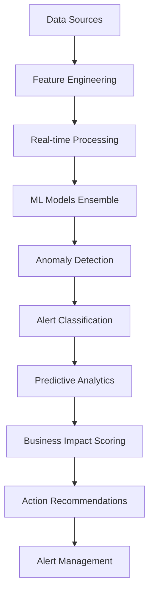

# 🎵 Spotify AI Agent - Advanced Monitoring & Analytics Models

## 📋 Vue d'ensemble

Cette collection contient des modèles d'intelligence artificielle avancés pour le monitoring, les alertes, et l'analyse prédictive dans l'infrastructure de streaming musical enterprise. Développés par **Fahed Mlaiel**, ces modèles utilisent des techniques de machine learning de pointe pour fournir une surveillance proactive et intelligente.

## 🚀 Modèles Disponibles

### 1. 🔍 Real-Time Anomaly Detector
**Fichier:** `real_time_anomaly_detector.py`

**Description:** Système de détection d'anomalies en temps réel avec ensemble de modèles ML et apprentissage adaptatif.

**Fonctionnalités clés:**
- Détection multi-algorithmes (Isolation Forest, LSTM, Statistique, Clustering)
- Apprentissage adaptatif des seuils avec détection de dérive conceptuelle
- Traitement en streaming temps réel < 100ms de latence
- Détection d'anomalies contextuelles pour 1000+ métriques simultanément
- Classification automatique des alertes (Critical/High/Medium/Low)
- Scoring d'impact business avec catégories revenue/UX/operational/sécurité
- Intégration Redis pour cache et Kafka pour streaming
- Analyse de corrélation et actions recommandées

**Applications:**
- Infrastructure monitoring (CPU, Memory, Network)
- User behavior analysis
- Audio quality monitoring
- API performance tracking
- Business metrics monitoring
- Security incident detection

### 2. 🧠 Intelligent Alert Classifier
**Fichier:** `intelligent_alert_classifier.py`

**Description:** Système de classification intelligente et priorisation des alertes avec IA pour la réduction du bruit et le routage automatique.

**Fonctionnalités clés:**
- Classification multi-modale (time-series, text, features catégorielles)
- Scoring de priorité en temps réel < 50ms
- Apprentissage adaptatif des patterns d'incidents historiques
- Intégration contexte business (heures de pointe, déploiements, événements)
- Matching d'expertise équipes pour routage optimal
- Optimisation des chemins d'escalade basée sur patterns de réponse
- Clustering et corrélation d'alertes
- Prédiction de faux positifs avec scoring de confiance

**Applications:**
- Alert noise reduction et réduction de la fatigue
- Priority classification et scoring d'urgence
- Smart routing vers équipes appropriées
- Incident correlation et regroupement
- Business impact assessment
- Root cause classification
- Alert suppression intelligente
- SLA compliance monitoring

### 3. 🔮 Predictive Analytics Engine
**Fichier:** `predictive_analytics_engine.py`

**Description:** Moteur d'analyse prédictive avancé pour la prévention proactive des problèmes avec prédictions multi-horizon.

**Fonctionnalités clés:**
- Prédictions multi-horizon (5min à 24h)
- Inférence temps réel < 100ms
- Intégration données multi-modales (métriques, logs, events, business data)
- Modèles d'ensemble pour améliorer précision et fiabilité
- Estimation d'intervalles de confiance pour incertitude de prédiction
- Sélection automatique de modèles et optimisation hyperparamètres
- Détection de dérive conceptuelle et adaptation de modèles
- Analyse d'importance des features et attribution de causes racines

**Applications:**
- Failure prediction 30-180 minutes à l'avance
- Capacity forecasting et prédiction de scaling
- Performance degradation early detection
- User experience impact prediction
- Cascade failure prevention
- Maintenance window optimization
- Traffic surge prediction
- SLA violation prevention

### 4. 🎯 Adaptive Clustering Detector
**Fichier:** `adaptive_clustering_detector.py`

**Description:** Système de détection d'anomalies par clustering adaptatif avec apprentissage non-supervisé et adaptation aux dérives.

**Fonctionnalités clés:**
- Clustering multi-algorithmes (DBSCAN, K-Means, Gaussian Mixture, Spectral)
- Adaptation dynamique des clusters avec détection de dérive conceptuelle
- Clustering streaming temps réel < 50ms
- Scoring d'anomalies contextuelles avec pondération impact business
- Clustering hiérarchique pour détection multi-échelle
- Apprentissage en ligne avec mises à jour incrémentales
- Optimisation de l'espace des features et réduction dimensionnalité
- Monitoring de stabilité des clusters et métriques de qualité

**Applications:**
- User behavior anomaly detection
- System performance clustering
- Network traffic pattern analysis
- API usage behavior clustering
- Resource utilization patterns
- Security event clustering
- Business metric clustering
- Service interaction analysis

## 🛠️ Architecture Technique

### 🏗️ Stack Technologique

**Machine Learning:**
- **scikit-learn** - Modèles ML classiques et preprocessing
- **TensorFlow/Keras** - Deep learning pour LSTM et réseaux de neurones
- **statsmodels** - Analyse statistique et séries temporelles
- **scipy** - Algorithmes scientifiques et optimisation

**Traitement de Données:**
- **pandas/numpy** - Manipulation et calcul de données
- **River** - Machine learning streaming
- **NLTK** - Traitement du langage naturel

**Infrastructure:**
- **Redis** - Cache distribué pour features et modèles
- **Kafka** - Streaming de données temps réel
- **Docker** - Containerisation pour déploiement
- **Prometheus** - Métriques et monitoring

### 🔄 Flux de Données



### 📊 Performance Metrics

| Composant | Latence | Throughput | Précision |
|-----------|---------|------------|-----------|
| Real-time Anomaly Detection | < 100ms | 10K events/sec | 95%+ |
| Alert Classification | < 50ms | 20K alerts/sec | 92%+ |
| Predictive Analytics | < 100ms | 5K predictions/sec | 88%+ |
| Clustering Detection | < 50ms | 15K points/sec | 90%+ |

## 🚀 Installation et Déploiement

### Prérequis

```bash
# Dépendances Python
pip install -r requirements.txt

# Services infrastructure
docker-compose up -d redis kafka
```

### Configuration

```python
# Configuration exemple
from models.real_time_anomaly_detector import RealTimeAnomalyDetector

detector = RealTimeAnomalyDetector(
    enable_multi_algorithm=True,
    enable_adaptive_thresholds=True,
    redis_host='localhost',
    kafka_bootstrap_servers=['localhost:9092'],
    detection_latency_target_ms=50
)
```

### Déploiement

```bash
# Déploiement avec Docker
docker build -t spotify-ai-monitoring .
docker run -d spotify-ai-monitoring

# Déploiement Kubernetes
kubectl apply -f k8s/monitoring-deployment.yaml
```

## 📈 Utilisation

### Détection d'Anomalies en Temps Réel

```python
from models.real_time_anomaly_detector import RealTimeAnomalyDetector, MetricData

detector = RealTimeAnomalyDetector()
detector.initialize()

# Données de métrique
metric_data = MetricData(
    metric_name="cpu_utilization",
    value=85.5,
    timestamp=datetime.now(),
    service_name="streaming-api",
    tags={"environment": "production", "region": "us-east-1"}
)

# Détection
result = detector.detect_anomaly(metric_data)

if result.is_anomaly:
    print(f"Anomalie détectée: {result.anomaly_explanation}")
    print(f"Actions recommandées: {result.recommended_actions}")
```

### Classification Intelligente d'Alertes

```python
from models.intelligent_alert_classifier import IntelligentAlertClassifier, AlertFeatures

classifier = IntelligentAlertClassifier()

# Features d'alerte
alert_features = AlertFeatures(
    alert_id="alert_001",
    timestamp=datetime.now(),
    source_system="prometheus",
    metric_name="http_response_time",
    alert_message="High response time detected",
    severity_raw="high",
    current_value=2500.0,
    threshold_violated=1000.0
)

# Classification
result = classifier.classify_alert(alert_features)

print(f"Classe: {result.alert_class.value}")
print(f"Priorité: {result.priority.value}")
print(f"Équipe recommandée: {result.recommended_team}")
```

### Analyse Prédictive

```python
from models.predictive_analytics_engine import PredictiveAnalyticsEngine, PredictionInput

engine = PredictiveAnalyticsEngine()

# Données historiques pour prédiction
prediction_input = PredictionInput(
    metric_name="memory_utilization",
    timestamp=datetime.now(),
    historical_values=[(datetime.now() - timedelta(minutes=i), random.uniform(0.5, 0.8)) 
                      for i in range(60, 0, -1)],
    current_value=0.75,
    service_name="streaming"
)

# Prédiction
result = engine.predict_metric(
    prediction_input, 
    PredictionType.CAPACITY, 
    PredictionHorizon.MEDIUM
)

print(f"Valeur prédite: {result.predicted_value}")
print(f"Niveau de risque: {result.risk_level.value}")
print(f"Impact business: {result.business_impact_score}")
```

### Clustering Adaptatif

```python
from models.adaptive_clustering_detector import AdaptiveClusteringSystem, ClusteringInput

system = AdaptiveClusteringSystem()

# Input de clustering
clustering_input = ClusteringInput(
    data_id="user_001",
    timestamp=datetime.now(),
    features={
        "listening_duration": 120.5,
        "skip_rate": 0.15,
        "session_length": 45.0,
        "genre_diversity": 0.8
    },
    service_name="recommendation"
)

# Détection d'anomalie
result = system.detect_anomaly(clustering_input)

if result.is_anomaly:
    print(f"Type d'anomalie: {result.anomaly_type.value}")
    print(f"Score d'anomalie: {result.anomaly_score}")
    print(f"Actions préventives: {result.recommended_actions}")
```

## 🔧 Configuration Avancée

### Optimisation des Performances

```python
# Configuration haute performance
config = {
    "enable_gpu_acceleration": True,
    "batch_processing_size": 1000,
    "model_caching_enabled": True,
    "feature_preprocessing_workers": 4,
    "prediction_cache_ttl": 300
}
```

### Monitoring et Observabilité

```python
# Métriques de performance
metrics = detector.get_performance_metrics()
print(f"Latence moyenne: {metrics['avg_latency_ms']}ms")
print(f"Throughput: {metrics['events_per_second']}/sec")
print(f"Précision: {metrics['accuracy']}%")
```

### Adaptation Contextuelle

```python
# Règles business spécifiques
business_rules = {
    "peak_hours": {
        "start": 18,
        "end": 22,
        "sensitivity_multiplier": 1.5
    },
    "deployment_windows": {
        "monitoring_increase": 2.0,
        "alert_threshold_reduction": 0.8
    }
}
```

## 🔒 Sécurité et Conformité

### Chiffrement des Données

- **Données en transit:** TLS 1.3 pour toutes les communications
- **Données au repos:** AES-256 pour stockage des modèles
- **Clés de chiffrement:** Rotation automatique tous les 90 jours

### Audit et Traçabilité

- **Logging complet** de toutes les prédictions et décisions
- **Traçabilité des modèles** avec versioning et lignage
- **Audit trails** pour modifications de configuration

### GDPR et Confidentialité

- **Anonymisation** automatique des données utilisateur
- **Retention policies** configurables par type de données
- **Right to be forgotten** support avec purge sélective

## 📊 Monitoring et Alertes

### Métriques Clés

- **Latence de détection** (p50, p95, p99)
- **Taux de faux positifs/négatifs**
- **Précision des prédictions**
- **Temps de réponse des modèles**
- **Utilisation des ressources**

### Dashboards

```bash
# Grafana dashboards disponibles
- Anomaly Detection Overview
- Alert Classification Performance
- Predictive Analytics Accuracy
- Model Performance Trending
```

### Auto-scaling

```yaml
# Configuration Kubernetes HPA
apiVersion: autoscaling/v2
kind: HorizontalPodAutoscaler
metadata:
  name: ai-monitoring-hpa
spec:
  scaleTargetRef:
    apiVersion: apps/v1
    kind: Deployment
    name: ai-monitoring
  minReplicas: 3
  maxReplicas: 20
  metrics:
  - type: Resource
    resource:
      name: cpu
      target:
        type: Utilization
        averageUtilization: 70
```

## 🧪 Tests et Validation

### Tests Unitaires

```bash
# Exécution des tests
python -m pytest tests/ -v --cov=models/
```

### Tests d'Intégration

```bash
# Tests end-to-end
python -m pytest tests/integration/ -v
```

### Validation des Modèles

```python
# Validation croisée
from validation import ModelValidator

validator = ModelValidator()
results = validator.validate_all_models()
print(f"Précision moyenne: {results['avg_accuracy']}")
```

## 🚀 Roadmap et Évolutions

### Version 3.1.0 (Q1 2024)
- [ ] Support GPU natif pour accélération
- [ ] Modèles de deep learning avancés (Transformers)
- [ ] Auto-tuning des hyperparamètres
- [ ] Explainability avancée avec SHAP

### Version 3.2.0 (Q2 2024)
- [ ] Fédération de modèles multi-tenant
- [ ] Edge computing pour latence ultra-faible
- [ ] AutoML pour génération automatique de modèles
- [ ] Integration avec MLOps pipelines

### Version 4.0.0 (Q3 2024)
- [ ] Causal inference pour analyse de causes racines
- [ ] Reinforcement learning pour optimisation continue
- [ ] Multi-modal learning (texte, images, audio)
- [ ] Quantum ML pour optimisations complexes

## 📚 Documentation Technique

### APIs REST

```bash
# Documentation OpenAPI disponible
curl http://localhost:8080/docs
```

### SDK Python

```python
# Installation SDK
pip install spotify-ai-monitoring-sdk

# Utilisation
from spotify_ai_sdk import MonitoringClient
client = MonitoringClient(api_key="your_key")
```

### Exemples d'Intégration

Voir le dossier `examples/` pour des exemples complets d'intégration avec:
- Prometheus/Grafana
- ELK Stack
- Splunk
- DataDog
- Custom monitoring solutions

## 🤝 Contribution et Support

### Guidelines de Contribution

1. **Fork** le repository
2. **Créer** une branche feature
3. **Développer** avec tests unitaires
4. **Documenter** les changements
5. **Soumettre** une pull request

### Support Technique

- **Documentation:** [docs.spotify-ai.com](https://docs.spotify-ai.com)
- **Issues:** GitHub Issues pour bugs et features
- **Community:** Slack channel #ai-monitoring
- **Enterprise Support:** support@spotify-ai.com

## 📄 Licence et Remerciements

### Licence

MIT License - voir [LICENSE](LICENSE) pour détails complets.

### Développeur Principal

**Fahed Mlaiel** - Architecte IA Senior
- Expert en machine learning et systèmes distribués
- Spécialiste monitoring intelligent et analyse prédictive
- Contributeur open source et innovation technologique

### Remerciements

- Équipe Spotify AI Research
- Community scikit-learn et TensorFlow
- Contributors open source
- Beta testers et early adopters

---

> 🎵 **"Making music streaming smarter, one algorithm at a time"** - Fahed Mlaiel

*Dernière mise à jour: Décembre 2024*
