# 🚀 Automatisierungsmodul - Spotify AI Agent

## 📋 Inhaltsverzeichnis

- [Übersicht](#übersicht)
- [Architektur](#architektur)
- [Funktionen](#funktionen)
- [Installation & Konfiguration](#installation--konfiguration)
- [Benutzerhandbuch](#benutzerhandbuch)
- [Implementierungsbeispiele](#implementierungsbeispiele)
- [Monitoring & Observability](#monitoring--observability)
- [Sicherheit](#sicherheit)
- [Performance](#performance)
- [API-Referenz](#api-referenz)
- [Fehlerbehebung](#fehlerbehebung)
- [Mitwirkende](#mitwirkende)

## 🎯 Übersicht

Das **Ultra-Advanced Automatisierungsmodul** für Spotify AI Agent ist eine vollständige Enterprise-Lösung, die intelligente Automatisierungsfähigkeiten, prädiktive Überwachung und autonome Incident-Management für groß angelegte Musik-Streaming-Infrastrukturen bereitstellt.

### 🏗️ Architektur

```mermaid
graph TB
    A[Event-Quellen] --> B[Event-Trigger-Engine]
    B --> C[Workflow-Manager]
    C --> D[Action-Executor]
    D --> E[Benachrichtigungs-Manager]
    
    F[Schedule-Manager] --> C
    G[Überwachungssystem] --> B
    H[ML-Prediction-Engine] --> C
    
    I[Redis Cache] --> C
    J[PostgreSQL] --> C
    K[Prometheus-Metriken] --> G
```



### ✨ Hauptfunktionen

#### 🤖 Intelligente Automatisierung
- **Workflow-Orchestrierung** : Verwaltung komplexer Workflows mit Abhängigkeiten
- **Event-gesteuerte Automatisierung** : Echtzeit-Reaktion auf Systemereignisse
- **Prädiktive Automatisierung** : Proaktive Aktionen basierend auf ML-Analyse
- **Adaptive Terminplanung** : Dynamische Planung mit Ressourcenoptimierung

#### 📊 Erweiterte Überwachung & Alarmierung
- **Echtzeit-Überwachung** : Kontinuierliche Überwachung kritischer Metriken
- **Intelligente Alarmierung** : Kontextuelle Alarme mit Geräuschunterdrückung
- **Eskalations-Management** : Automatische Verwaltung der Incident-Eskalation
- **Root-Cause-Analyse** : Automatisierte Ursachenanalyse

#### 🔧 Incident-Management
- **Auto-Remediation** : Automatische Lösung häufiger Incidents
- **Incident Response** : Orchestrierung von Response-Teams
- **Recovery-Automatisierung** : Automatisierte Wiederherstellungsverfahren
- **Post-Incident-Analyse** : Automatisierte Post-Mortem-Analyse

#### 📈 Performance-Optimierung
- **Auto-Scaling** : Automatische Skalierung basierend auf Nachfrage
- **Ressourcen-Optimierung** : Kontinuierliche Ressourcenoptimierung
- **Performance-Tuning** : Automatische Parameteranpassung
- **Kapazitätsplanung** : Prädiktive Kapazitätsplanung

## 🛠️ Installation & Konfiguration

### Voraussetzungen

```bash
# System-Abhängigkeiten
python >= 3.9
redis >= 6.0
postgresql >= 13.0
prometheus >= 2.30

# Python-Abhängigkeiten
pip install -r requirements.txt
```

### Basis-Konfiguration

```python
from automation import AutomationEngine, AutomationConfig

# Konfiguration für Produktionsumgebung
config = AutomationConfig(
    level=AutomationLevel.AUTONOMOUS,
    max_concurrent_actions=50,
    retry_attempts=5,
    timeout_seconds=900,
    monitoring_interval=15,
    enable_predictive_scaling=True,
    enable_ml_optimization=True
)

# Initialisierung der Automatisierungs-Engine
engine = AutomationEngine(config)
```

### Redis-Konfiguration

```yaml
# redis.yml
redis:
  host: "redis-cluster.internal"
  port: 6379
  db: 0
  password: "${REDIS_PASSWORD}"
  ssl: true
  cluster_mode: true
  sentinel_mode: false
  max_connections: 100
  retry_on_timeout: true
```

### Prometheus-Konfiguration

```yaml
# prometheus.yml
global:
  scrape_interval: 15s
  evaluation_interval: 15s

scrape_configs:
  - job_name: 'automation-engine'
    static_configs:
      - targets: ['localhost:8080']
    metrics_path: '/metrics'
    scrape_interval: 10s
```

## 🎮 Benutzerhandbuch

### 1. Erstellung eines einfachen Workflows

```python
from automation import WorkflowDefinition, ActionDefinition

# Definition einer Neustart-Aktion
restart_action = ActionDefinition(
    name="restart_service",
    action_type="infrastructure",
    parameters={
        "service_name": "spotify-api",
        "graceful": True,
        "wait_for_health": True
    },
    timeout_seconds=300,
    retry_attempts=3
)

# Workflow-Definition
workflow = WorkflowDefinition(
    name="service_restart_workflow",
    description="Startet einen Service mit Gesundheitsprüfungen neu",
    actions=[restart_action],
    conditions=["service_health_check_failed"],
    priority=Priority.HIGH
)

# Workflow-Registrierung
engine.workflow_manager.register_workflow(workflow)
```

### 2. Konfiguration intelligenter Alarme

```python
# Konfiguration eines Alarms mit automatischer Aktion
alert_config = {
    "name": "high_cpu_usage",
    "condition": "cpu_usage > 80 AND duration > 5m",
    "severity": AlertSeverity.HIGH,
    "actions": [
        {
            "type": "scale_infrastructure",
            "parameters": {
                "service_name": "recommendation-engine",
                "scale_factor": 1.5,
                "max_instances": 20
            }
        },
        {
            "type": "notify_slack",
            "parameters": {
                "channel": "#ops-alerts",
                "message": "Auto-Scaling für hohe CPU-Auslastung ausgelöst"
            }
        }
    ],
    "cooldown_period": 600  # 10 Minuten
}

engine.register_alert_workflow(alert_config)
```

### 3. Prädiktive Automatisierung

```python
# Konfiguration der prädiktiven Automatisierung
predictive_config = {
    "name": "traffic_prediction_scaling",
    "model": "lstm_traffic_predictor",
    "prediction_window": 3600,  # 1 Stunde
    "confidence_threshold": 0.85,
    "actions": [
        {
            "condition": "predicted_traffic_increase > 50%",
            "action": "preemptive_scaling",
            "parameters": {
                "scale_factor": 1.3,
                "warmup_time": 300
            }
        }
    ]
}

engine.configure_predictive_automation(predictive_config)
```

## 📊 Implementierungsbeispiele

### Beispiel 1: ML-Deployment-Automatisierung

```python
# Automatisierter Deployment-Workflow für ML-Modelle
ml_deployment_workflow = WorkflowDefinition(
    name="ml_model_deployment",
    description="Automatisiertes Deployment mit A/B-Validierung",
    actions=[
        ActionDefinition(
            name="validate_model",
            action_type="ml",
            parameters={
                "model_path": "${model_path}",
                "validation_dataset": "${validation_dataset}",
                "acceptance_threshold": 0.92
            }
        ),
        ActionDefinition(
            name="deploy_canary",
            action_type="deployment",
            parameters={
                "deployment_type": "canary",
                "traffic_percentage": 5,
                "monitoring_duration": 1800
            }
        )
    ]
)
```

## 📈 Monitoring & Observability

### Schlüssel-Metriken

```python
# Performance-Metriken der Automatisierungs-Engine
AUTOMATION_METRICS = {
    "workflow_executions_total": Counter,
    "workflow_execution_duration_seconds": Histogram,
    "active_workflows": Gauge,
    "failed_workflows_total": Counter,
    "automation_efficiency_ratio": Gauge
}
```

## 🔐 Sicherheit

### Zugriffskontrolle

```python
# RBAC-Konfiguration für Automatisierung
AUTOMATION_ROLES = {
    "automation_admin": {
        "permissions": [
            "workflows:create",
            "workflows:execute",
            "workflows:delete",
            "system:admin"
        ]
    },
    "automation_operator": {
        "permissions": [
            "workflows:execute",
            "workflows:view",
            "alerts:acknowledge"
        ]
    }
}
```

## ⚡ Performance

### Erweiterte Optimierungen

```python
# Performance-Konfiguration
PERFORMANCE_CONFIG = {
    "async_execution": True,
    "thread_pool_size": 50,
    "process_pool_size": 8,
    "cache_strategy": "redis_cluster",
    "batch_processing": {
        "enabled": True,
        "batch_size": 100,
        "max_wait_time": 5
    }
}
```

### Benchmarks

| Metrik | Wert | Ziel |
|--------|------|------|
| Durchschnittliche Ausführungslatenz | 150ms | < 200ms |
| Durchsatz (Aktionen/Sek) | 1000 | > 500 |
| P99 Antwortzeit | 500ms | < 1s |
| Verfügbarkeit | 99.95% | > 99.9% |

## 🔧 API-Referenz

### Kern-Klassen

#### AutomationEngine

```python
class AutomationEngine:
    async def start(self) -> None
    async def stop(self) -> None
    async def execute_workflow(self, workflow_name: str, context: ExecutionContext) -> ExecutionResult
```

## 🆘 Fehlerbehebung

### Häufige Probleme

#### 1. Workflows werden nicht ausgeführt

```bash
# Logs überprüfen
tail -f /var/log/automation/engine.log | grep ERROR

# Redis-Konfiguration überprüfen
redis-cli ping
```

#### 2. Performance-Verschlechterung

```bash
# System-Metriken überprüfen
htop
iostat -x 1
```

## 👥 Mitwirkende

### 🏆 Haupt-Team

**Fahed Mlaiel** - *Lead Developer & AI Architect*
- Entwicklung der globalen Architektur
- Entwicklung der intelligenten Automatisierungs-Engine
- Integration prädiktiver ML-Algorithmen
- Enterprise-Performance-Optimierung

### 🎯 Technische Expertise

- **Lead Dev + AI-Architekt** : Verteilte Architektur und ML/AI
- **Senior Backend-Entwickler** : Python/FastAPI/Django Expertise
- **Machine Learning Engineer** : TensorFlow/PyTorch/Hugging Face
- **DBA & Data Engineer** : PostgreSQL/Redis/MongoDB Optimierung
- **Backend-Sicherheitsspezialist** : Security by Design
- **Microservices-Architekt** : Skalierbare verteilte Systeme

### 📞 Kontakt & Support

- **E-Mail**: fahed.mlaiel@spotify-ai-agent.com
- **Slack**: #automation-support
- **Dokumentation**: https://docs.spotify-ai-agent.com/automation
- **Issues**: https://github.com/spotify-ai-agent/automation/issues

---

**Version**: 2.1.0 | **Letzte Aktualisierung**: 2025-01-20 | **Status**: Produktionsbereit

*Dieses Modul ist Teil des Spotify AI Agent Ökosystems - Eine Enterprise-Lösung für intelligente Automatisierung von Musik-Streaming-Plattformen.*
