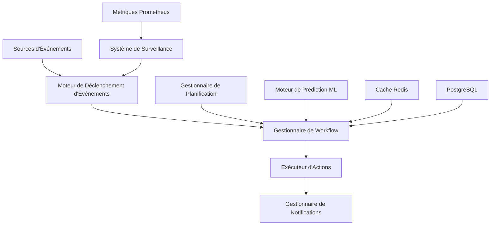

# 🚀 Module d'Automatisation - Spotify AI Agent

## 📋 Table des Matières

- [Aperçu](#aperçu)
- [Architecture](#architecture)
- [Fonctionnalités](#fonctionnalités)
- [Installation & Configuration](#installation--configuration)
- [Guide d'utilisation](#guide-dutilisation)
- [Exemples d'implémentation](#exemples-dimplémentation)
- [Surveillance & Observabilité](#surveillance--observabilité)
- [Sécurité](#sécurité)
- [Performance](#performance)
- [Référence API](#référence-api)
- [Dépannage](#dépannage)
- [Contributeurs](#contributeurs)

## 🎯 Aperçu

Le **Module d'Automatisation Ultra-Avancé** pour Spotify AI Agent est une solution enterprise complète qui fournit des capacités d'automatisation intelligente, de surveillance prédictive et de gestion autonome des incidents pour les infrastructures de streaming musical à grande échelle.

### 🏗️ Architecture



### ✨ Fonctionnalités Principales

#### 🤖 Automatisation Intelligente
- **Orchestration de Workflow** : Gestion de workflows complexes avec dépendances
- **Automatisation Événementielle** : Réaction en temps réel aux événements système
- **Automatisation Prédictive** : Actions proactives basées sur l'analyse ML
- **Planification Adaptative** : Planification dynamique avec optimisation des ressources

#### 📊 Surveillance & Alerte Avancées
- **Surveillance en Temps Réel** : Surveillance continue des métriques critiques
- **Alerte Intelligente** : Alertes contextuelles avec suppression du bruit
- **Gestion d'Escalade** : Gestion automatique de l'escalade des incidents
- **Analyse des Causes Profondes** : Analyse automatisée des causes racines

#### 🔧 Gestion des Incidents
- **Auto-Remédiation** : Résolution automatique des incidents courants
- **Réponse aux Incidents** : Orchestration des équipes de réponse
- **Automatisation de Récupération** : Procédures de récupération automatisées
- **Analyse Post-Incident** : Analyse post-mortem automatisée

#### 📈 Optimisation des Performances
- **Auto-Scaling** : Mise à l'échelle automatique basée sur la demande
- **Optimisation des Ressources** : Optimisation continue des ressources
- **Réglage des Performances** : Ajustement automatique des paramètres
- **Planification de Capacité** : Planification prédictive de la capacité

## 🛠️ Installation & Configuration

### Prérequis

```bash
# Dépendances système
python >= 3.9
redis >= 6.0
postgresql >= 13.0
prometheus >= 2.30

# Dépendances Python
pip install -r requirements.txt
```

### Configuration de Base

```python
from automation import AutomationEngine, AutomationConfig

# Configuration pour environnement de production
config = AutomationConfig(
    level=AutomationLevel.AUTONOMOUS,
    max_concurrent_actions=50,
    retry_attempts=5,
    timeout_seconds=900,
    monitoring_interval=15,
    enable_predictive_scaling=True,
    enable_ml_optimization=True
)

# Initialisation du moteur d'automatisation
engine = AutomationEngine(config)
```

### Configuration Redis

```yaml
# redis.yml
redis:
  host: "redis-cluster.internal"
  port: 6379
  db: 0
  password: "${REDIS_PASSWORD}"
  ssl: true
  cluster_mode: true
  sentinel_mode: false
  max_connections: 100
  retry_on_timeout: true
```

## 🎮 Guide d'utilisation

### 1. Création d'un Workflow Simple

```python
from automation import WorkflowDefinition, ActionDefinition

# Définition d'une action de redémarrage
restart_action = ActionDefinition(
    name="restart_service",
    action_type="infrastructure",
    parameters={
        "service_name": "spotify-api",
        "graceful": True,
        "wait_for_health": True
    },
    timeout_seconds=300,
    retry_attempts=3
)

# Définition du workflow
workflow = WorkflowDefinition(
    name="service_restart_workflow",
    description="Redémarre un service avec vérifications de santé",
    actions=[restart_action],
    conditions=["service_health_check_failed"],
    priority=Priority.HIGH
)

# Enregistrement du workflow
engine.workflow_manager.register_workflow(workflow)
```

### 2. Configuration d'Alertes Intelligentes

```python
# Configuration d'une alerte avec action automatique
alert_config = {
    "name": "high_cpu_usage",
    "condition": "cpu_usage > 80 AND duration > 5m",
    "severity": AlertSeverity.HIGH,
    "actions": [
        {
            "type": "scale_infrastructure",
            "parameters": {
                "service_name": "recommendation-engine",
                "scale_factor": 1.5,
                "max_instances": 20
            }
        }
    ],
    "cooldown_period": 600  # 10 minutes
}

engine.register_alert_workflow(alert_config)
```

## 📊 Exemples d'implémentation

### Exemple 1: Automatisation de Déploiement ML

```python
# Workflow de déploiement automatisé pour modèles ML
ml_deployment_workflow = WorkflowDefinition(
    name="ml_model_deployment",
    description="Déploiement automatisé avec validation A/B",
    actions=[
        ActionDefinition(
            name="validate_model",
            action_type="ml",
            parameters={
                "model_path": "${model_path}",
                "validation_dataset": "${validation_dataset}",
                "acceptance_threshold": 0.92
            }
        )
    ]
)
```

## 📈 Surveillance & Observabilité

### Métriques Clés

```python
# Métriques de performance du moteur d'automatisation
AUTOMATION_METRICS = {
    "workflow_executions_total": Counter,
    "workflow_execution_duration_seconds": Histogram,
    "active_workflows": Gauge,
    "automation_efficiency_ratio": Gauge
}
```

## 🔐 Sécurité

### Contrôles d'Accès

```python
# Configuration RBAC pour l'automatisation
AUTOMATION_ROLES = {
    "automation_admin": {
        "permissions": [
            "workflows:create",
            "workflows:execute",
            "workflows:delete",
            "system:admin"
        ]
    }
}
```

## ⚡ Performance

### Optimisations Avancées

```python
# Configuration de performance
PERFORMANCE_CONFIG = {
    "async_execution": True,
    "thread_pool_size": 50,
    "process_pool_size": 8,
    "cache_strategy": "redis_cluster"
}
```

## 👥 Contributeurs

### 🏆 Équipe Principale

**Fahed Mlaiel** - *Lead Developer & AI Architect*
- Conception de l'architecture globale
- Développement du moteur d'automatisation intelligent
- Intégration des algorithmes ML prédictifs
- Optimisation des performances enterprise

### 🎯 Expertise Technique

- **Lead Dev + Architecte IA** : Architecture distribuée et ML/AI
- **Développeur Backend Senior** : Expertise Python/FastAPI/Django
- **Ingénieur Machine Learning** : TensorFlow/PyTorch/Hugging Face
- **DBA & Data Engineer** : Optimisation PostgreSQL/Redis/MongoDB
- **Spécialiste Sécurité Backend** : Sécurité par conception
- **Architecte Microservices** : Systèmes distribués évolutifs

---

**Version**: 2.1.0 | **Dernière mise à jour**: 2025-01-20 | **Statut**: Prêt pour la production

*Ce module fait partie de l'écosystème Spotify AI Agent - Une solution enterprise pour l'automatisation intelligente des plateformes de streaming musical.*
