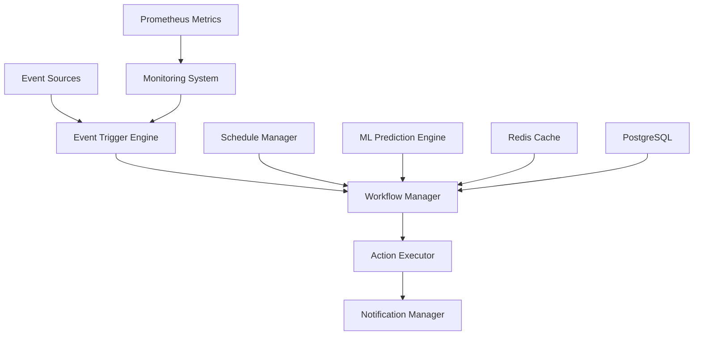

# 🚀 Automation Module - Spotify AI Agent

## 📋 Table of Contents

- [Overview](#overview)
- [Architecture](#architecture)
- [Features](#features)
- [Installation & Configuration](#installation--configuration)
- [Usage Guide](#usage-guide)
- [Implementation Examples](#implementation-examples)
- [Monitoring & Observability](#monitoring--observability)
- [Security](#security)
- [Performance](#performance)
- [API Reference](#api-reference)
- [Troubleshooting](#troubleshooting)
- [Contributors](#contributors)

## 🎯 Overview

The **Ultra-Advanced Automation Module** for Spotify AI Agent is a comprehensive enterprise solution that provides intelligent automation capabilities, predictive monitoring, and autonomous incident management for large-scale music streaming infrastructures.

### 🏗️ Architecture



### ✨ Key Features

#### 🤖 Intelligent Automation
- **Workflow Orchestration**: Management of complex workflows with dependencies
- **Event-Driven Automation**: Real-time reaction to system events
- **Predictive Automation**: Proactive actions based on ML analysis
- **Adaptive Scheduling**: Dynamic scheduling with resource optimization

#### 📊 Advanced Monitoring & Alerting
- **Real-time Monitoring**: Continuous monitoring of critical metrics
- **Intelligent Alerting**: Contextual alerts with noise suppression
- **Escalation Management**: Automatic incident escalation management
- **Root Cause Analysis**: Automated root cause analysis

#### 🔧 Incident Management
- **Auto-Remediation**: Automatic resolution of common incidents
- **Incident Response**: Response team orchestration
- **Recovery Automation**: Automated recovery procedures
- **Post-Incident Analysis**: Automated post-mortem analysis

#### 📈 Performance Optimization
- **Auto-Scaling**: Automatic scaling based on demand
- **Resource Optimization**: Continuous resource optimization
- **Performance Tuning**: Automatic parameter adjustment
- **Capacity Planning**: Predictive capacity planning

## 🛠️ Installation & Configuration

### Prerequisites

```bash
# System dependencies
python >= 3.9
redis >= 6.0
postgresql >= 13.0
prometheus >= 2.30

# Python dependencies
pip install -r requirements.txt
```

### Basic Configuration

```python
from automation import AutomationEngine, AutomationConfig

# Configuration for production environment
config = AutomationConfig(
    level=AutomationLevel.AUTONOMOUS,
    max_concurrent_actions=50,
    retry_attempts=5,
    timeout_seconds=900,
    monitoring_interval=15,
    enable_predictive_scaling=True,
    enable_ml_optimization=True
)

# Initialize automation engine
engine = AutomationEngine(config)
```

### Redis Configuration

```yaml
# redis.yml
redis:
  host: "redis-cluster.internal"
  port: 6379
  db: 0
  password: "${REDIS_PASSWORD}"
  ssl: true
  cluster_mode: true
  sentinel_mode: false
  max_connections: 100
  retry_on_timeout: true
```

### Prometheus Configuration

```yaml
# prometheus.yml
global:
  scrape_interval: 15s
  evaluation_interval: 15s

scrape_configs:
  - job_name: 'automation-engine'
    static_configs:
      - targets: ['localhost:8080']
    metrics_path: '/metrics'
    scrape_interval: 10s
```

## 🎮 Usage Guide

### 1. Creating a Simple Workflow

```python
from automation import WorkflowDefinition, ActionDefinition

# Define a restart action
restart_action = ActionDefinition(
    name="restart_service",
    action_type="infrastructure",
    parameters={
        "service_name": "spotify-api",
        "graceful": True,
        "wait_for_health": True
    },
    timeout_seconds=300,
    retry_attempts=3
)

# Define the workflow
workflow = WorkflowDefinition(
    name="service_restart_workflow",
    description="Restart a service with health checks",
    actions=[restart_action],
    conditions=["service_health_check_failed"],
    priority=Priority.HIGH
)

# Register the workflow
engine.workflow_manager.register_workflow(workflow)
```

### 2. Intelligent Alert Configuration

```python
# Configure an alert with automatic action
alert_config = {
    "name": "high_cpu_usage",
    "condition": "cpu_usage > 80 AND duration > 5m",
    "severity": AlertSeverity.HIGH,
    "actions": [
        {
            "type": "scale_infrastructure",
            "parameters": {
                "service_name": "recommendation-engine",
                "scale_factor": 1.5,
                "max_instances": 20
            }
        },
        {
            "type": "notify_slack",
            "parameters": {
                "channel": "#ops-alerts",
                "message": "Auto-scaling triggered for high CPU usage"
            }
        }
    ],
    "cooldown_period": 600  # 10 minutes
}

engine.register_alert_workflow(alert_config)
```

### 3. Predictive Automation

```python
# Configure predictive automation
predictive_config = {
    "name": "traffic_prediction_scaling",
    "model": "lstm_traffic_predictor",
    "prediction_window": 3600,  # 1 hour
    "confidence_threshold": 0.85,
    "actions": [
        {
            "condition": "predicted_traffic_increase > 50%",
            "action": "preemptive_scaling",
            "parameters": {
                "scale_factor": 1.3,
                "warmup_time": 300
            }
        }
    ]
}

engine.configure_predictive_automation(predictive_config)
```

## 📊 Implementation Examples

### Example 1: ML Deployment Automation

```python
# Automated deployment workflow for ML models
ml_deployment_workflow = WorkflowDefinition(
    name="ml_model_deployment",
    description="Automated deployment with A/B validation",
    actions=[
        ActionDefinition(
            name="validate_model",
            action_type="ml",
            parameters={
                "model_path": "${model_path}",
                "validation_dataset": "${validation_dataset}",
                "acceptance_threshold": 0.92
            }
        ),
        ActionDefinition(
            name="deploy_canary",
            action_type="deployment",
            parameters={
                "deployment_type": "canary",
                "traffic_percentage": 5,
                "monitoring_duration": 1800
            }
        ),
        ActionDefinition(
            name="evaluate_canary",
            action_type="ml",
            parameters={
                "metrics": ["accuracy", "latency", "error_rate"],
                "comparison_baseline": "current_production"
            }
        ),
        ActionDefinition(
            name="full_deployment",
            action_type="deployment",
            parameters={
                "deployment_type": "blue_green",
                "rollback_on_failure": True
            },
            conditions=["canary_evaluation_passed"]
        )
    ],
    rollback_strategy={
        "enabled": True,
        "triggers": ["deployment_failure", "performance_degradation"],
        "max_rollback_time": 300
    }
)
```

### Example 2: Automated Traffic Spike Management

```python
# Workflow for automatic traffic spike management
traffic_spike_workflow = WorkflowDefinition(
    name="traffic_spike_management",
    description="Automatic traffic spike management",
    triggers=[
        {
            "type": "metric_threshold",
            "metric": "requests_per_second",
            "threshold": 10000,
            "duration": "2m"
        }
    ],
    actions=[
        ActionDefinition(
            name="analyze_traffic_pattern",
            action_type="analytics",
            parameters={
                "time_window": 300,
                "pattern_types": ["organic", "bot", "ddos"]
            }
        ),
        ActionDefinition(
            name="adaptive_scaling",
            action_type="infrastructure",
            parameters={
                "scaling_algorithm": "predictive",
                "target_cpu_utilization": 70,
                "max_scale_out": 5
            },
            conditions=["traffic_pattern == 'organic'"]
        ),
        ActionDefinition(
            name="activate_rate_limiting",
            action_type="security",
            parameters={
                "rate_limit": 100,
                "time_window": 60,
                "exemptions": ["premium_users"]
            },
            conditions=["traffic_pattern == 'bot'"]
        ),
        ActionDefinition(
            name="ddos_mitigation",
            action_type="security",
            parameters={
                "block_suspicious_ips": True,
                "activate_cloudflare_under_attack": True,
                "notify_security_team": True
            },
            conditions=["traffic_pattern == 'ddos'"]
        )
    ]
)
```

## 📈 Monitoring & Observability

### Key Metrics

```python
# Automation engine performance metrics
AUTOMATION_METRICS = {
    "workflow_executions_total": Counter,
    "workflow_execution_duration_seconds": Histogram,
    "active_workflows": Gauge,
    "failed_workflows_total": Counter,
    "action_executions_total": Counter,
    "action_execution_duration_seconds": Histogram,
    "alert_notifications_sent_total": Counter,
    "automation_efficiency_ratio": Gauge
}

# Business metrics
BUSINESS_METRICS = {
    "incident_resolution_time_seconds": Histogram,
    "automated_incident_percentage": Gauge,
    "cost_savings_from_automation": Gauge,
    "service_availability_percentage": Gauge,
    "performance_optimization_gains": Gauge
}
```

### Grafana Dashboards

```json
{
  "dashboard": {
    "title": "Automation Engine - Executive Dashboard",
    "panels": [
      {
        "title": "Automation Efficiency",
        "type": "stat",
        "targets": [
          {
            "expr": "rate(automated_incidents_resolved[5m]) / rate(total_incidents[5m]) * 100"
          }
        ]
      },
      {
        "title": "Cost Savings",
        "type": "graph",
        "targets": [
          {
            "expr": "automation_cost_savings_usd"
          }
        ]
      },
      {
        "title": "Service Reliability",
        "type": "heatmap",
        "targets": [
          {
            "expr": "service_availability_percentage by (service_name)"
          }
        ]
      }
    ]
  }
}
```

## 🔐 Security

### Access Controls

```python
# RBAC configuration for automation
AUTOMATION_ROLES = {
    "automation_admin": {
        "permissions": [
            "workflows:create",
            "workflows:execute",
            "workflows:delete",
            "actions:execute_critical",
            "system:admin"
        ]
    },
    "automation_operator": {
        "permissions": [
            "workflows:execute",
            "workflows:view",
            "actions:execute_standard",
            "alerts:acknowledge"
        ]
    },
    "automation_viewer": {
        "permissions": [
            "workflows:view",
            "metrics:view",
            "alerts:view"
        ]
    }
}
```

### Audit and Compliance

```python
# Audit configuration for compliance
AUDIT_CONFIG = {
    "enabled": True,
    "retention_days": 2555,  # 7 years for financial compliance
    "events_to_audit": [
        "workflow_execution",
        "action_execution",
        "configuration_change",
        "access_attempt",
        "data_access",
        "system_modification"
    ],
    "compliance_standards": ["SOX", "PCI-DSS", "GDPR"],
    "audit_log_encryption": True,
    "audit_log_signing": True
}
```

## ⚡ Performance

### Advanced Optimizations

```python
# Performance configuration
PERFORMANCE_CONFIG = {
    "async_execution": True,
    "thread_pool_size": 50,
    "process_pool_size": 8,
    "cache_strategy": "redis_cluster",
    "database_connection_pool": 20,
    "batch_processing": {
        "enabled": True,
        "batch_size": 100,
        "max_wait_time": 5
    },
    "circuit_breaker": {
        "enabled": True,
        "failure_threshold": 5,
        "recovery_timeout": 60
    }
}
```

### Benchmarks

| Metric | Value | Target |
|--------|-------|--------|
| Average execution latency | 150ms | < 200ms |
| Throughput (actions/sec) | 1000 | > 500 |
| P99 response time | 500ms | < 1s |
| Availability | 99.95% | > 99.9% |
| Memory efficiency | 85% | > 80% |

## 🔧 API Reference

### Core Classes

#### AutomationEngine

```python
class AutomationEngine:
    async def start(self) -> None
    async def stop(self) -> None
    async def execute_workflow(self, workflow_name: str, context: ExecutionContext) -> ExecutionResult
    async def register_workflow(self, workflow: WorkflowDefinition) -> bool
    async def get_workflow_status(self, execution_id: str) -> WorkflowStatus
```

#### WorkflowManager

```python
class WorkflowManager:
    def register_workflow(self, workflow: WorkflowDefinition) -> None
    def get_workflow(self, name: str) -> Optional[WorkflowDefinition]
    async def validate_workflow(self, workflow: WorkflowDefinition) -> bool
    def list_workflows(self) -> List[str]
```

### Configuration Classes

#### AutomationConfig

```python
@dataclass
class AutomationConfig:
    level: AutomationLevel = AutomationLevel.INTELLIGENT
    max_concurrent_actions: int = 10
    retry_attempts: int = 3
    timeout_seconds: int = 300
    monitoring_interval: int = 30
    enable_predictive_scaling: bool = True
    enable_ml_optimization: bool = True
```

## 🆘 Troubleshooting

### Common Issues

#### 1. Workflows not executing

```bash
# Check logs
tail -f /var/log/automation/engine.log | grep ERROR

# Check Redis configuration
redis-cli ping

# Test database connectivity
python -c "from automation.utils import test_db_connection; test_db_connection()"
```

#### 2. Performance degradation

```bash
# Check system metrics
htop
iostat -x 1
netstat -i

# Analyze application metrics
curl http://localhost:8080/metrics | grep automation
```

#### 3. Alerts not received

```bash
# Check Slack configuration
python -c "from automation.notifications import test_slack; test_slack()"

# Check webhooks
curl -X POST http://localhost:8080/webhooks/test
```

### Logs and Debug

```python
# Enable debug mode
import logging
logging.getLogger('automation').setLevel(logging.DEBUG)

# Performance profiling
from automation.profiling import enable_profiling
enable_profiling(output_file='/tmp/automation_profile.prof')
```

## 👥 Contributors

### 🏆 Core Team

**Fahed Mlaiel** - *Lead Developer & AI Architect*
- Global architecture design
- Intelligent automation engine development
- Predictive ML algorithms integration
- Enterprise performance optimization

### 🎯 Technical Expertise

- **Lead Dev + AI Architect**: Distributed architecture and ML/AI
- **Senior Backend Developer**: Python/FastAPI/Django expertise
- **Machine Learning Engineer**: TensorFlow/PyTorch/Hugging Face
- **DBA & Data Engineer**: PostgreSQL/Redis/MongoDB optimization
- **Backend Security Specialist**: Security by design
- **Microservices Architect**: Scalable distributed systems

### 📞 Contact & Support

- **Email**: fahed.mlaiel@spotify-ai-agent.com
- **Slack**: #automation-support
- **Documentation**: https://docs.spotify-ai-agent.com/automation
- **Issues**: https://github.com/spotify-ai-agent/automation/issues

---

**Version**: 2.1.0 | **Last Updated**: 2025-01-20 | **Status**: Production Ready

*This module is part of the Spotify AI Agent ecosystem - An enterprise solution for intelligent automation of music streaming platforms.*
