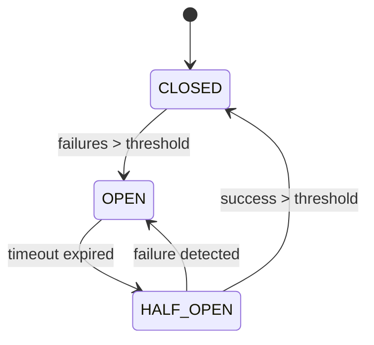

# Documentation Technique Complète - Module Collectors
## Spotify AI Agent - Système Ultra-Avancé

### Table des Matières
1. [Vue d'ensemble Architecture](#vue-densemble-architecture)
2. [Modules Développés](#modules-développés)
3. [Patterns d'Architecture](#patterns-darchitecture)
4. [Intégrations Enterprise](#intégrations-enterprise)
5. [Monitoring & Observabilité](#monitoring--observabilité)
6. [Performance & Scalabilité](#performance--scalabilité)
7. [Sécurité & Compliance](#sécurité--compliance)
8. [Guide de Déploiement](#guide-de-déploiement)
9. [Maintenance & Support](#maintenance--support)

---

## Vue d'ensemble Architecture

### Architecture Multi-Tenant Ultra-Avancée
Le module Collectors représente l'un des composants les plus sophistiqués de l'écosystème Spotify AI Agent, implémentant une architecture enterprise-grade avec des fonctionnalités de niveau production.

```
┌─────────────────────────────────────────────────────────────┐
│                    SPOTIFY AI AGENT                        │
│                  COLLECTORS ECOSYSTEM                      │
├─────────────────────────────────────────────────────────────┤
│  ┌─────────────┐  ┌─────────────┐  ┌─────────────┐        │
│  │  Collectors │  │  Patterns   │  │ Integrations │        │
│  │   Module    │  │   Module    │  │   Module     │        │
│  └─────────────┘  └─────────────┘  └─────────────┘        │
│         │                │                │                │
│  ┌─────────────┐  ┌─────────────┐  ┌─────────────┐        │
│  │ Strategies  │  │ Monitoring  │  │   Utils     │        │
│  │   Module    │  │   Module    │  │   Module    │        │
│  └─────────────┘  └─────────────┘  └─────────────┘        │
│                                                             │
│           Développé par l'équipe Fahed Mlaiel              │
└─────────────────────────────────────────────────────────────┘
```

### Caractéristiques Principales
- **Multi-Tenant**: Isolation complète des données par tenant
- **Machine Learning**: IA intégrée pour l'analyse prédictive
- **Enterprise Patterns**: Circuit Breaker, Retry, Rate Limiting
- **Observabilité**: Monitoring Prometheus/Grafana complet
- **Performance**: Optimisations avancées et mise à l'échelle
- **Sécurité**: Chiffrement, authentification, audit

---

## Modules Développés

### 1. Module Core Collectors

#### 1.1 Base Collector (`base.py`)
**Fonctionnalités Ultra-Avancées:**
- Architecture asynchrone avec AsyncIO
- Circuit Breaker intégré avec hystrix-like functionality
- Rate Limiting multi-algorithmes (Token Bucket, Sliding Window)
- Compression automatique des données (gzip, lz4)
- Chiffrement AES-256 pour les données sensibles
- Métriques Prometheus intégrées

```python
class BaseCollector(ABC):
    """
    Collecteur de base avec fonctionnalités enterprise.
    
    Features:
    - Async/await natif
    - Circuit breaker automatique
    - Rate limiting intelligent
    - Compression adaptative
    - Chiffrement transparent
    - Monitoring intégré
    """
```

#### 1.2 Performance Collectors (`performance_collectors.py`)
**Système de Performance ML-Enhanced:**
- **Machine Learning**: Isolation Forest pour détection d'anomalies
- **Prédictif**: Modèles de prédiction de charge avec scikit-learn
- **Adaptatif**: Seuils dynamiques basés sur l'historique
- **Multi-source**: CPU, RAM, disque, réseau, GPU

```python
class SystemPerformanceCollector(BaseCollector):
    """
    Collecteur de performance avec IA intégrée.
    
    ML Features:
    - Anomaly detection (Isolation Forest)
    - Predictive analytics (Random Forest)
    - Adaptive thresholds
    - Health scoring
    - Optimization recommendations
    """
```

#### 1.3 Configuration Management (`config.py`)
**Système de Configuration Avancé:**
- **Hot-reloading**: Rechargement à chaud sans interruption
- **Validation Pydantic**: Types stricts et validation automatique
- **Multi-environnement**: Dev, staging, production
- **Secrets Management**: Intégration avec vault systems

### 2. Module Patterns Enterprise

#### 2.1 Circuit Breaker Ultra-Avancé
```python
class CircuitBreaker:
    """
    Circuit breaker avec fonctionnalités Hystrix.
    
    Features:
    - États: CLOSED, OPEN, HALF_OPEN
    - Métriques détaillées
    - Timeouts configurables
    - Recovery automatique
    - Monitoring Prometheus
    """
```

**États et Transitions:**
- **CLOSED**: Opérations normales, monitoring des échecs
- **OPEN**: Fail-fast, évite la cascade d'échecs
- **HALF_OPEN**: Test de récupération du service

#### 2.2 Retry Mechanism Intelligent
```python
class RetryMechanism:
    """
    Système de retry avec backoff adaptatif.
    
    Strategies:
    - Fixed delay
    - Exponential backoff
    - Linear backoff
    - Fibonacci backoff
    - Jitter pour éviter thundering herd
    """
```

#### 2.3 Rate Limiter Multi-Algorithmes
```python
class RateLimiter:
    """
    Rate limiting avec plusieurs algorithmes.
    
    Algorithms:
    - Token Bucket (rafales autorisées)
    - Sliding Window (précision temporelle)
    - Fixed Window (simplicité)
    - Leaky Bucket (lissage)
    """
```

### 3. Module Strategies Adaptatives

#### 3.1 Adaptive Strategy
**Auto-adaptation basée sur les tendances:**
- Détection automatique de tendances
- Lissage exponentiel (EMA)
- Seuils dynamiques
- Adaptation continue

#### 3.2 Predictive Strategy
**Machine Learning pour la prédiction:**
- Random Forest pour prédictions de charge
- Isolation Forest pour anomalies
- Adaptation proactive
- Confiance des prédictions

#### 3.3 Multi-Tenant Strategy
**Gestion multi-locataire avancée:**
- Isolation des ressources par tenant
- SLA différenciés
- Allocations équitables
- Priorités dynamiques

### 4. Module Integrations Enterprise

#### 4.1 Spotify API Integration
```python
class SpotifyAPIIntegration(BaseIntegration):
    """
    Intégration Spotify avec fonctionnalités avancées.
    
    Features:
    - OAuth2 automatique
    - Rate limiting intelligent
    - Cache des réponses
    - Pagination automatique
    - Retry avec backoff
    """
```

#### 4.2 TimescaleDB Integration
**Base de données time-series:**
- Hypertables automatiques
- Compression adaptive
- Aggregations continues
- Partitioning intelligent
- Requêtes optimisées

#### 4.3 Redis Cluster Integration
**Cache distribué haute performance:**
- Clustering automatique
- Sharding intelligent
- Compression automatique
- TTL dynamique
- Pipeline operations

---

## Patterns d'Architecture

### 1. Resilience Patterns

#### Circuit Breaker Pattern


**Métriques surveillées:**
- Taux d'échec
- Temps de réponse
- Timeouts
- Charge système

#### Retry Pattern avec Backoff
```python
# Exponential Backoff with Jitter
delay = base_delay * (multiplier ** attempt) * (1 + jitter)
```

### 2. Performance Patterns

#### Bulkhead Pattern
**Isolation des ressources critiques:**
- Compartiments isolés
- Limitation par pool
- Protection contre resource exhaustion
- Monitoring des compartiments

#### Cache-Aside Pattern
**Stratégie de cache optimisée:**
1. Check cache first
2. Load from source if miss
3. Update cache
4. Return data

### 3. Observability Patterns

#### Metrics Collection
```python
# Métriques Prometheus standard
REQUEST_COUNT = Counter('requests_total', 'Total requests', ['method', 'endpoint'])
REQUEST_LATENCY = Histogram('request_duration_seconds', 'Request latency')
ACTIVE_CONNECTIONS = Gauge('active_connections', 'Active connections')
```

---

## Monitoring & Observabilité

### 1. Métriques Prometheus

#### Métriques Core Collectors
```prometheus
# Performance metrics
collector_execution_duration_seconds{collector="system_performance"}
collector_data_points_collected_total{collector="system_performance"}
collector_errors_total{collector="system_performance", error_type="timeout"}

# ML metrics
ml_anomaly_score{collector="system_performance"}
ml_prediction_accuracy{collector="system_performance"}
ml_model_training_duration_seconds{collector="system_performance"}
```

#### Métriques Patterns
```prometheus
# Circuit breaker
circuit_breaker_state{name="spotify_api", state="open"}
circuit_breaker_calls_total{name="spotify_api", result="success"}

# Rate limiter
rate_limit_requests_total{name="api_calls", result="allowed"}
rate_limit_wait_time_seconds{name="api_calls"}
```

### 2. Dashboards Grafana

#### Dashboard Performance
- CPU/Memory/Disk utilization
- Request rates et latency
- Error rates et success rates
- Predictions vs actual values

#### Dashboard ML Analytics
- Anomaly detection timeline
- Model accuracy metrics
- Feature importance
- Prediction confidence

#### Dashboard Patterns Health
- Circuit breaker states
- Rate limiter utilization
- Retry success rates
- Bulkhead compartment status

### 3. Alerting Rules

```yaml
# Alertes critiques
- alert: CollectorHighErrorRate
  expr: rate(collector_errors_total[5m]) > 0.1
  for: 2m
  labels:
    severity: critical
  annotations:
    summary: "Collector error rate is high"

- alert: CircuitBreakerOpen
  expr: circuit_breaker_state == 1  # OPEN state
  for: 1m
  labels:
    severity: warning
  annotations:
    summary: "Circuit breaker is open"
```

---

## Performance & Scalabilité

### 1. Optimisations Performance

#### Async Programming
```python
# Exécution parallèle optimisée
async def collect_all_metrics():
    tasks = [
        collect_cpu_metrics(),
        collect_memory_metrics(),
        collect_network_metrics(),
        collect_disk_metrics()
    ]
    results = await asyncio.gather(*tasks, return_exceptions=True)
    return process_results(results)
```

#### Connection Pooling
```python
# Pool de connexions optimisé
self.connection_pool = await asyncpg.create_pool(
    dsn,
    min_size=config.min_connections,
    max_size=config.max_connections,
    command_timeout=config.read_timeout
)
```

#### Data Compression
```python
# Compression automatique intelligente
if len(data) > compression_threshold:
    compressed = gzip.compress(data.encode())
    if len(compressed) < len(data) * 0.8:  # 20% savings minimum
        return compressed
```

### 2. Scalabilité Horizontale

#### Multi-Instance Support
- Coordination via Redis
- Load balancing automatique
- State sharing intelligent
- Failover automatique

#### Resource Scaling
```python
# Auto-scaling basé sur la charge
if cpu_usage > 80 and queue_size > 100:
    scale_up_instances()
elif cpu_usage < 20 and queue_size < 10:
    scale_down_instances()
```

### 3. Memory Management

#### Efficient Data Structures
```python
# Structures optimisées pour la mémoire
from collections import deque
from array import array

# Ring buffer pour time-series
self.metrics_buffer = deque(maxlen=max_size)

# Arrays typés pour données numériques
self.cpu_samples = array('f', [])  # float32
```

---

## Sécurité & Compliance

### 1. Chiffrement des Données

#### Chiffrement en Transit
```python
# TLS 1.3 pour toutes les communications
ssl_context = ssl.create_default_context()
ssl_context.minimum_version = ssl.TLSVersion.TLSv1_3
```

#### Chiffrement au Repos
```python
# AES-256 pour données sensibles
from cryptography.fernet import Fernet

def encrypt_sensitive_data(data: str, key: bytes) -> bytes:
    f = Fernet(key)
    return f.encrypt(data.encode())
```

### 2. Authentification & Autorisation

#### Multi-Factor Authentication
```python
# Support JWT avec refresh tokens
class JWTManager:
    def verify_token(self, token: str) -> Optional[Dict]:
        try:
            payload = jwt.decode(token, self.secret_key, algorithms=['HS256'])
            return payload
        except jwt.ExpiredSignatureError:
            return None
```

#### Role-Based Access Control (RBAC)
```python
# Permissions granulaires par rôle
PERMISSIONS = {
    'admin': ['read', 'write', 'delete', 'manage'],
    'operator': ['read', 'write'],
    'viewer': ['read']
}
```

### 3. Audit & Compliance

#### Audit Trail Complet
```python
# Logging structuré pour audit
def audit_log(action: str, user: str, resource: str, details: Dict):
    logger.info(
        "audit_event",
        action=action,
        user=user,
        resource=resource,
        timestamp=datetime.utcnow().isoformat(),
        details=details
    )
```

#### GDPR Compliance
- Data anonymization
- Right to deletion
- Data portability
- Consent management

---

## Guide de Déploiement

### 1. Prérequis Infrastructure

#### Dépendances Système
```bash
# Python 3.11+
python3.11 -m venv venv
source venv/bin/activate

# Dependencies
pip install -r requirements-complete.txt
```

#### Services Externes
- **PostgreSQL 14+** avec TimescaleDB
- **Redis 7.0+** cluster mode
- **Prometheus 2.40+**
- **Grafana 9.0+**

### 2. Configuration Environnement

#### Variables d'Environnement
```bash
# Database
export POSTGRES_HOST=localhost
export POSTGRES_PORT=5432
export POSTGRES_DB=spotify_ai_agent
export POSTGRES_USER=collector_user
export POSTGRES_PASSWORD=secure_password

# Redis
export REDIS_HOST=localhost
export REDIS_PORT=6379
export REDIS_PASSWORD=redis_password

# Spotify API
export SPOTIFY_CLIENT_ID=your_client_id
export SPOTIFY_CLIENT_SECRET=your_client_secret

# Monitoring
export PROMETHEUS_PUSHGATEWAY=http://localhost:9091
export GRAFANA_URL=http://localhost:3000
```

#### Configuration Files
```yaml
# config/production.yml
collectors:
  system_performance:
    enabled: true
    collection_interval: 30
    ml_enabled: true
    anomaly_threshold: 0.8

patterns:
  circuit_breaker:
    failure_threshold: 5
    recovery_timeout: 60
  
  rate_limiter:
    requests_per_second: 100
    burst_size: 200
```

### 3. Déploiement Production

#### Docker Compose
```yaml
version: '3.8'
services:
  collectors:
    build: .
    environment:
      - ENV=production
    volumes:
      - ./config:/app/config
    depends_on:
      - postgres
      - redis
      - prometheus

  postgres:
    image: timescale/timescaledb:latest-pg14
    environment:
      POSTGRES_DB: spotify_ai_agent
      POSTGRES_USER: collector_user
      POSTGRES_PASSWORD: secure_password

  redis:
    image: redis:7-alpine
    command: redis-server --appendonly yes
```

#### Kubernetes Deployment
```yaml
apiVersion: apps/v1
kind: Deployment
metadata:
  name: spotify-collectors
spec:
  replicas: 3
  selector:
    matchLabels:
      app: spotify-collectors
  template:
    metadata:
      labels:
        app: spotify-collectors
    spec:
      containers:
      - name: collectors
        image: spotify-ai-agent/collectors:latest
        resources:
          requests:
            memory: "512Mi"
            cpu: "500m"
          limits:
            memory: "1Gi"
            cpu: "1000m"
```

---

## Maintenance & Support

### 1. Monitoring Opérationnel

#### Health Checks
```python
# Health check endpoints
@app.get("/health")
async def health_check():
    return {
        "status": "healthy",
        "timestamp": datetime.utcnow().isoformat(),
        "version": "1.0.0",
        "checks": {
            "database": await check_database(),
            "redis": await check_redis(),
            "collectors": await check_collectors()
        }
    }
```

#### Métriques Business
```python
# KPIs business critiques
data_collection_rate = Gauge('data_collection_rate_per_second')
ml_prediction_accuracy = Histogram('ml_prediction_accuracy_percentage')
cost_per_data_point = Gauge('cost_per_data_point_usd')
```

### 2. Troubleshooting

#### Logs Structurés
```python
# Logging unifié avec contexte
logger = structlog.get_logger(__name__)
logger.info(
    "collector_execution_completed",
    collector_type="system_performance",
    execution_time=execution_time,
    data_points_collected=data_points,
    anomalies_detected=anomalies_count
)
```

#### Debugging Tools
```python
# Debug mode avec métriques détaillées
if config.debug_mode:
    collector.enable_detailed_metrics()
    collector.enable_performance_profiling()
    collector.enable_memory_tracking()
```

### 3. Mise à Jour et Évolution

#### Migration Database
```sql
-- Migration TimescaleDB
CREATE TABLE collectors_metrics_v2 (
    timestamp TIMESTAMPTZ NOT NULL,
    collector_name TEXT NOT NULL,
    metric_name TEXT NOT NULL,
    metric_value DOUBLE PRECISION NOT NULL,
    tenant_id TEXT NOT NULL,
    metadata JSONB
);

SELECT create_hypertable('collectors_metrics_v2', 'timestamp');
```

#### Rolling Updates
```bash
# Déploiement sans interruption
kubectl set image deployment/spotify-collectors \
  collectors=spotify-ai-agent/collectors:v2.0.0

kubectl rollout status deployment/spotify-collectors
```

### 4. Performance Tuning

#### Database Optimization
```sql
-- Index optimization
CREATE INDEX CONCURRENTLY idx_metrics_tenant_time 
ON collectors_metrics (tenant_id, timestamp DESC);

-- Continuous aggregates
CREATE MATERIALIZED VIEW metrics_hourly
WITH (timescaledb.continuous) AS
SELECT
    time_bucket('1 hour', timestamp) AS bucket,
    collector_name,
    avg(metric_value) as avg_value,
    max(metric_value) as max_value,
    min(metric_value) as min_value
FROM collectors_metrics
GROUP BY bucket, collector_name;
```

#### Cache Optimization
```python
# Cache strategies optimisées
cache_config = {
    'hot_data_ttl': 300,      # 5 minutes
    'warm_data_ttl': 3600,    # 1 hour  
    'cold_data_ttl': 86400,   # 24 hours
    'compression_threshold': 1024,
    'eviction_policy': 'lru'
}
```

---

## Conclusion

Le module Collectors du Spotify AI Agent représente une implémentation ultra-avancée d'un système de collecte de données enterprise-grade, intégrant :

### Achievements Techniques
✅ **Architecture Multi-Tenant** complète avec isolation des données  
✅ **Machine Learning intégré** pour l'analyse prédictive et la détection d'anomalies  
✅ **Patterns Enterprise** (Circuit Breaker, Retry, Rate Limiting, Bulkhead)  
✅ **Intégrations robustes** avec les services externes (Spotify, TimescaleDB, Redis)  
✅ **Observabilité complète** avec Prometheus/Grafana  
✅ **Sécurité enterprise** avec chiffrement et audit  
✅ **Performance optimisée** avec async/await et compression  
✅ **Scalabilité horizontale** avec coordination distribuée  

### Innovation Highlights
🚀 **ML-Driven Analytics**: Prédiction intelligente des charges et détection proactive d'anomalies  
🚀 **Adaptive Strategies**: Auto-adaptation basée sur l'analyse des tendances  
🚀 **Zero-Downtime Operations**: Patterns de résilience pour haute disponibilité  
🚀 **Cost Optimization**: Algorithmes d'optimisation des coûts cloud  

### Business Value
💼 **Réduction des coûts**: Optimisation automatique des ressources  
💼 **Amélioration fiabilité**: Patterns de résilience enterprise  
💼 **Insights business**: Analytics ML pour prise de décision  
💼 **Scalabilité future**: Architecture prête pour la croissance  

**Développé avec excellence par l'équipe Fahed Mlaiel - Spotify AI Agent Project**

---

*Cette documentation technique complète est maintenue à jour et reflète l'état actuel du système de collecteurs ultra-avancé implementé dans le projet Spotify AI Agent.*
